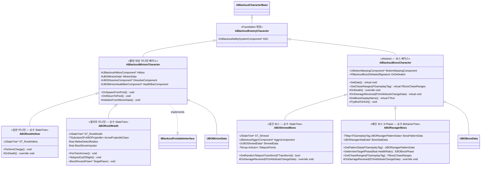

# AI/Boss — 01. 적 / 보스 캐릭터 상속 계층

> TDD v5 §2, §6 참조. Foundation의 `ABlackoutEnemyCharacter` 계층을 AI/Boss 에픽에서 확장.

## 구현 노트

- **`ABlackoutMinionCharacter`**: 현재 풀링 계약을 구현하는 적 베이스입니다. `ABlackoutEnemyCharacter`는 ASC 공통 소유자이고, `ABORootHollow` / `ABORootWraith`가 `ABlackoutMinionCharacter`를 통해 풀링 생명주기를 공유합니다.
- **`ABlackoutBossCharacter`**: 보스는 풀링 대상이 아니며 `ABlackoutEnemyCharacter`를 직접 상속합니다. Motion Warping, 사망 델리게이트(`OnDefeated`), 데이터 주입(`SetData`), 추격 거리(`GetChaseRanges`), 피격 훅(`OnDamageReceived`)을 공통 제공합니다. **페이즈 상태 자체는 베이스에 두지 않고**, 페이즈 결정은 Ravager가, 페이즈 관리는 AI 컨트롤러의 C++ 모듈이 담당합니다.
- **어그로(타겟 선정)**: `ABlackoutBossAIController`가 `Instanced`로 소유하는 `UBlackoutAggroEvaluator`가 가중치 점수제로 타겟을 평가하고 `OnAggroTargetChanged`로 전파합니다. `ABOShrewdBoss`에는 StateTree Evaluator(`FBSTEval_ShrewdAggroTarget`)가 읽는 `UBlackoutAggroComponent` 경로가 공존합니다(02·03 참조).
- **페이즈 결정/전환(Ravager 전용)**: `ABORavagerBoss::OnDamageReceived`에서 Health/MaxHealth 비율을 `DetermineTargetPhase`로 판정(≤0.3→Phase3, ≤0.6→Phase2, else Phase1) → `ABlackoutRavagerAIController::RequestPhaseChange` → `UBlackoutPhaseEvaluator`(`Ability.PhaseLock` 게이팅) → `UBlackoutBossBTRunner`가 페이즈 BehaviorTree 교체. Shrewd는 페이즈가 없습니다.
- **`ABOShrewdBoss`**: `UUBOShrewdData`와 Shrewd 전용 GA(`UBlackoutGA_Shrewd_*`, `UBOGA_Shrewd_FireStraightArrow`), `TeleportPoints`/`GetRandomTeleportTransform`로 원거리·텔레포트 패턴을 **순수 StateTree**로 구성합니다.
- **`ABORootWraith`**: 원거리 상태에서는 2연발 화살 → 점멸, **근접(`MeleeDetectRadius`) 감지 시 활대를 휘둘러 강하게 밀쳐내는 `BowShove`**(거리 재확보) 후 다시 원거리로 복귀. 상태 전이는 **Kite → Fire → (Teleport | BowShove→Kite)**.
- **`ABORavagerBoss`**: `UBORavagerStatData`(`BossStatData`)와 패턴별 `UBORavagerPatternData` 맵(`BossPatternData`)을 참조하고, HealthRatio 기반으로 `EBOBossPhase`를 결정합니다. 미니언 스폰은 `UBlackoutGA_Ravager_SummonMinion`과 풀 서브시스템 경로에서 처리합니다.
- **공통 어트리뷰트**: 보스도 `UBlackoutBaseAttributeSet`(Foundation) 사용. 추가 어트리뷰트 불필요.
