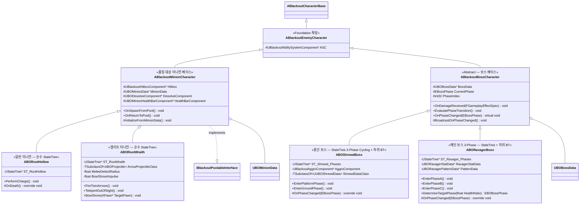

# AI/Boss — 01. 적 / 보스 캐릭터 상속 계층

> TDD v5 §2, §6 참조. Foundation의 `ABlackoutEnemyCharacter` 스켈레톤을 AI/Boss 에픽에서 확장.

## 구현 노트

- **`ABlackoutMinionCharacter`**: 현재 풀링 계약을 구현하는 적 베이스입니다. `ABlackoutEnemyCharacter`는 ASC 공통 소유자이고, `ABORootHollow` / `ABORootWraith`가 `ABlackoutMinionCharacter`를 통해 풀링 생명주기를 공유합니다.
- **`ABlackoutBossCharacter`**: 보스는 풀링 대상이 아니며 `ABlackoutEnemyCharacter`를 직접 상속합니다. 공통 보스 데이터, Motion Warping, 페이즈/피격 이벤트를 관리합니다.
- **어그로(타겟 선정)**: 현재 코드는 `ABlackoutBossAIController`의 `UBlackoutAggroEvaluator`와 StateTree Evaluator(`FBSTEval_ShrewdAggroTarget`)를 중심으로 보스 타겟을 갱신합니다. `ABOShrewdBoss`에는 디버그/보조 경로로 `UBlackoutAggroComponent`도 남아 있습니다.
- **페이즈 전환**: `OnDamageReceived`에서 현재 Health/MaxHealth 비율을 `BossData->PhaseHealthCutlines`와 비교 → 경계 돌파 시 `EvaluatePhaseTransition` → `OnPhaseChanged` 오버라이드에서 각 보스 고유 연출/GA 활성화.
- **`ABOShrewdBoss`**: 현재 구현은 `UUBOShrewdData`와 Shrewd 전용 GA(`UBlackoutGA_Shrewd_*`, `UBOGA_Shrewd_FireStraightArrow`)를 통해 원거리/텔레포트 패턴을 구성합니다. 씨앗 기믹 관련 클래스는 현재 C++ 구현에 없습니다.
- **`ABORootWraith`**: 원거리 상태에서는 2연발 화살 → 점멸, **근접(`MeleeDetectRadius`) 감지 시 활대를 휘둘러 강하게 밀쳐내는 `BowShove`**(거리 재확보) 후 다시 원거리로 복귀. 기존 상태 전이가 Kite → Fire → Teleport 순환에서 **Kite → Fire → (Teleport | BowShove→Kite)** 로 확장됨.
- **`ABORavagerBoss`**: `UBORavagerStatData`와 `UBORavagerPatternData`를 참조하고, HealthRatio 기반으로 `EBOBossPhase`를 결정합니다. 미니언 스폰은 `UBlackoutGA_Ravager_SummonMinion`과 풀 서브시스템 경로에서 처리합니다.
- **공통 어트리뷰트**: 보스도 `UBlackoutBaseAttributeSet`(Foundation) 사용. 추가 어트리뷰트 불필요.
