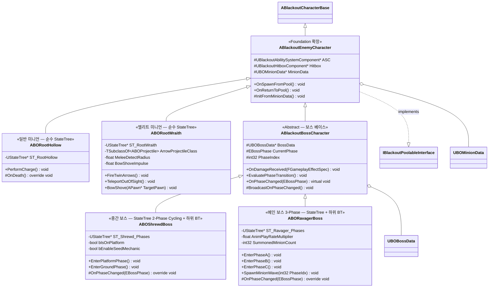

# AI/Boss — 01. 적 / 보스 캐릭터 상속 계층

> TDD v5 §2, §6 참조. Foundation의 `ABlackoutEnemyCharacter` 스켈레톤을 AI/Boss 에픽에서 확장.

## 구현 노트

- **`ABlackoutBossCharacter`**: 보스는 풀링 대상이 아니므로 `OnReturnToPool`을 오버라이드하여 풀 반환 대신 `Destroy()` 처리. **어그로(타겟 선정)는 별도 컴포넌트를 두지 않고 `ABlackoutBossAIController`의 StateTree Evaluator(`FBSTEval_AggroTarget`)가 전담**. Shrewd / Ravager **동일 규칙**(GDD §6.0) 적용 — 03 다이어그램 참조.
- **페이즈 전환**: `OnDamageReceived`에서 현재 Health/MaxHealth 비율을 `BossData->PhaseHealthCutlines`와 비교 → 경계 돌파 시 `EvaluatePhaseTransition` → `OnPhaseChanged` 오버라이드에서 각 보스 고유 연출/GA 활성화.
- **`ABOShrewdBoss`**: `bIsOnPlatform` 리플리케이션 → StateTree Evaluator가 읽어 발판(원거리)/지면(근접) 2-Phase Cycling 트리거. **씨앗 기믹은 GDD §5에서 "개발 보류. 제거될 수 있음"으로 명시됨** — `bEnableSeedMechanic` 데이터 플래그(기본 `false`)로 런타임 게이팅, 대응 GA(`GA_Shrewd_SeedHatch`) 및 BT Task(`UBTTask_SeedDrop`) 스켈레톤은 유지하되 페이즈 전이 경로에서 분리.
- **`ABORootWraith`**: 원거리 상태에서는 2연발 화살 → 점멸, **근접(`MeleeDetectRadius`) 감지 시 활대를 휘둘러 강하게 밀쳐내는 `BowShove`**(거리 재확보) 후 다시 원거리로 복귀. 기존 상태 전이가 Kite → Fire → Teleport 순환에서 **Kite → Fire → (Teleport | BowShove→Kite)** 로 확장됨.
- **`ABORavagerBoss`**: `AnimPlayRateMultiplier`는 Phase C 진입 시 1.0 → 1.3 승수 적용해 선후딜 감소 (TDD §6). 미니언 스폰은 `UBlackoutPoolSubsystem`을 통해 수행. `SpawnMinionWave(PhaseIdx)`는 Phase A는 일반 미니언, Phase B 이상은 일반+엘리트(Root Wraith) 혼합으로 분기.
- **공통 어트리뷰트**: 보스도 `UBlackoutBaseAttributeSet`(Foundation) 사용. 추가 어트리뷰트 불필요.
