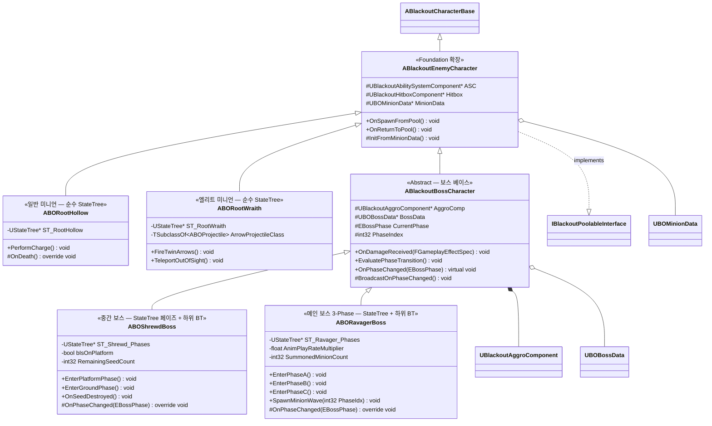

# AI/Boss — 01. 적 / 보스 캐릭터 상속 계층

> TDD v5 §2, §6 참조. Foundation의 `ABlackoutEnemyCharacter` 스켈레톤을 AI/Boss 에픽에서 확장.

## 구현 노트

- **`ABlackoutBossCharacter`**: 보스는 풀링 대상이 아니므로 `OnReturnToPool`을 오버라이드하여 풀 반환 대신 `Destroy()` 처리. `AggroComp`는 서버 Authority에서만 Tick.
- **페이즈 전환**: `OnDamageReceived`에서 현재 Health/MaxHealth 비율을 `BossData->PhaseHealthCutlines`와 비교 → 경계 돌파 시 `EvaluatePhaseTransition` → `OnPhaseChanged` 오버라이드에서 각 보스 고유 연출/GA 활성화.
- **`ABOShrewdBoss`**: `bIsOnPlatform` 리플리케이션 → StateTree 평가자(Evaluator)가 읽어 발판/지면 상태 전이 트리거. 씨앗 모두 파괴되면 `State.Invulnerable` 태그 제거.
- **`ABORavagerBoss`**: `AnimPlayRateMultiplier`는 Phase C 진입 시 1.0 → 1.3 승수 적용해 선후딜 감소 (TDD §6). 미니언 스폰은 `UBlackoutPoolSubsystem`을 통해 수행.
- **공통 어트리뷰트**: 보스도 `UBlackoutBaseAttributeSet`(Foundation) 사용. 추가 어트리뷰트 불필요.
