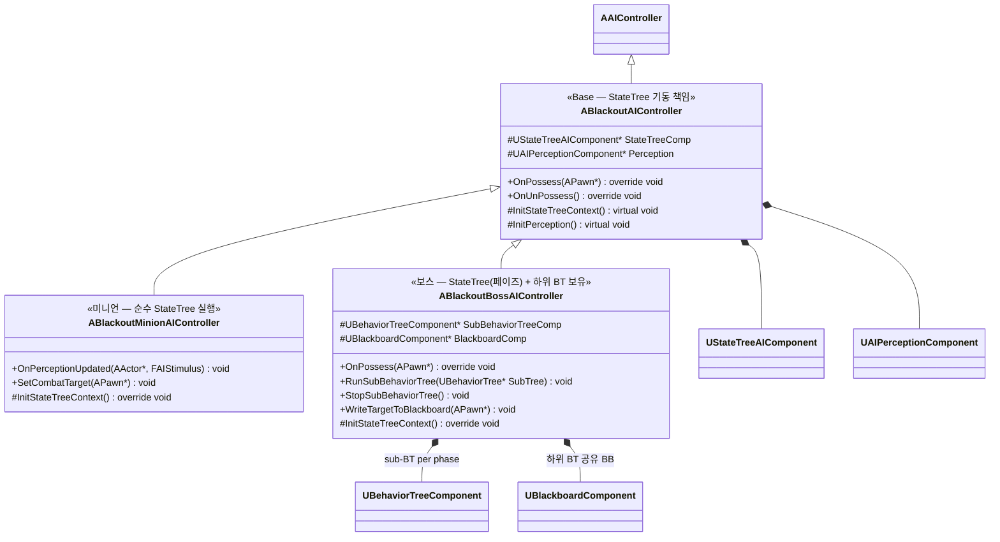
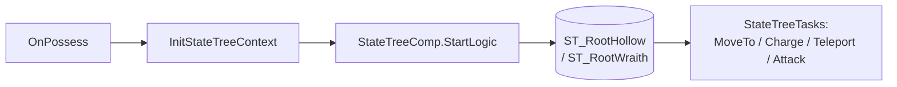

# AI/Boss — 02. AI 컨트롤러 계층 (StateTree 기반)

> TDD v5 §6 확장 설계.
> **미니언 = 순수 StateTree**, **보스 = StateTree(페이즈 관리) + 하위 BehaviorTree(페이즈별 전투 패턴)**.
> 플러그인: `StateTree` + `GameplayStateTree` (`.uproject`에 이미 활성화됨).



> 어그로(타겟 선정)는 `ABlackoutBossAIController`의 `UBlackoutAggroEvaluator`와 StateTree Evaluator(`FBSTEval_ShrewdAggroTarget`)가 담당합니다. Evaluator가 Controller의 Blackboard에 `BB_CurrentTarget`을 기록하여 하위 BT가 참조합니다. Shrewd/Ravager의 튜닝 차이는 `UBOBossData`의 파라미터로 조정합니다. 상세는 03 다이어그램 참조.

## 실행 모델

### 미니언 (Minion)



- `ABlackoutMinionAIController`는 **BehaviorTreeComponent를 보유하지 않음**. 모든 상태·행동이 StateTree Task로 구현됨.
- 경량·단순한 미니언 AI에 적합. 상태 수가 적고(2~4개) Task가 선형 조합되므로 StateTree 표현력만으로 충분.

### 보스 (Boss)

```mermaid
flowchart TB
    Possess[OnPossess] --> InitBoss[InitStateTreeContext<br/>= ASC / Pawn / BBComp 핸들 등록]
    InitBoss --> StartST[StateTreeComp.StartLogic]
    StartST --> BossST[(ST_Ravager_Phases<br/>/ ST_Shrewd_Phases)]
    BossST --> PhaseA[State: Phase A / Platform]
    BossST --> PhaseB[State: Phase B / Ground]
    BossST --> PhaseC[State: Phase C<br/>(Ravager 전용)]
    PhaseA --> SubBT_A[[BT_Ravager_PhaseA<br/>또는 BT_Shrewd_Platform]]
    PhaseB --> SubBT_B[[BT_Ravager_PhaseB<br/>또는 BT_Shrewd_Ground]]
    PhaseC --> SubBT_C[[BT_Ravager_PhaseC]]
    SubBT_A -. EnterState Task .-> RunBT["SubBehaviorTreeComp.StartTree(BT)"]
    SubBT_B -. ExitState Task .-> StopBT["SubBehaviorTreeComp.StopTree()"]
```

- 보스는 **StateTree의 최상위 상태 = 페이즈**. 페이즈 전이(체력 컷라인·이벤트)는 StateTree의 Transition으로 선언적으로 정의.
- 각 페이즈 상태는 `UBSTTask_RunSubBehaviorTree`(커스텀 StateTree Task) 진입 시 하위 BT를 기동, 이탈 시 정지. 하위 BT는 해당 페이즈의 전투 패턴 조합을 담당.
- BehaviorTreeComponent와 BlackboardComponent는 **Controller에 위치**하여 페이즈 전환 시 하위 BT만 교체.

## 구현 노트

- **`UStateTreeAIComponent`**: 엔진 `GameplayStateTree` 플러그인 제공. `OnPossess`에서 `SetStateTreeAsset` 후 `StartLogic()` 호출.
- **`InitStateTreeContext`**: StateTree가 참조하는 외부 데이터 핸들(ASC, Pawn, Controller, BlackboardComp 등)을 바인딩. BP가 아닌 C++ 가상 함수로 서브클래스별 확장. Aggro Evaluator도 이 경로로 ASC·BBComp 핸들을 받음.
- **`ABlackoutBossAIController::RunSubBehaviorTree`**: `UBSTTask_RunSubBehaviorTree::EnterState`에서 호출됨. 이미 다른 BT가 돌고 있다면 `StopTree` 후 교체.
- **Blackboard 스코프**: 보스의 Blackboard는 **하위 BT 전용**으로 사용. 어그로 Evaluator(`UBlackoutAggroEvaluator` / `FBSTEval_ShrewdAggroTarget`)가 `BB_CurrentTarget`을 기록하고, `UBTService_LineOfSightCheck`가 `BB_HasLineOfSight`를 기록. 하위 BT Task(MoveTo/Attack)가 이를 소비.
- **`WriteTargetToBlackboard`**: Controller의 public 메서드. Evaluator가 외부 데이터 핸들로 Controller를 받아 이 함수를 호출하여 BB 키를 갱신.
- **Perception**: 미니언만 Sight 감각 활성화. 보스는 Aggro Evaluator가 타겟을 전담 → Perception 비활성화 또는 제거.
- **서버 전용**: AI 로직은 서버 Authority. `OnPossess`는 `HasAuthority()` 가드로 조기 리턴.
- **디버깅**: StateTree Debugger (UE 5.3+)로 페이즈 전이/활성 상태 라이브 추적 가능. BT 대비 가시성 개선.
