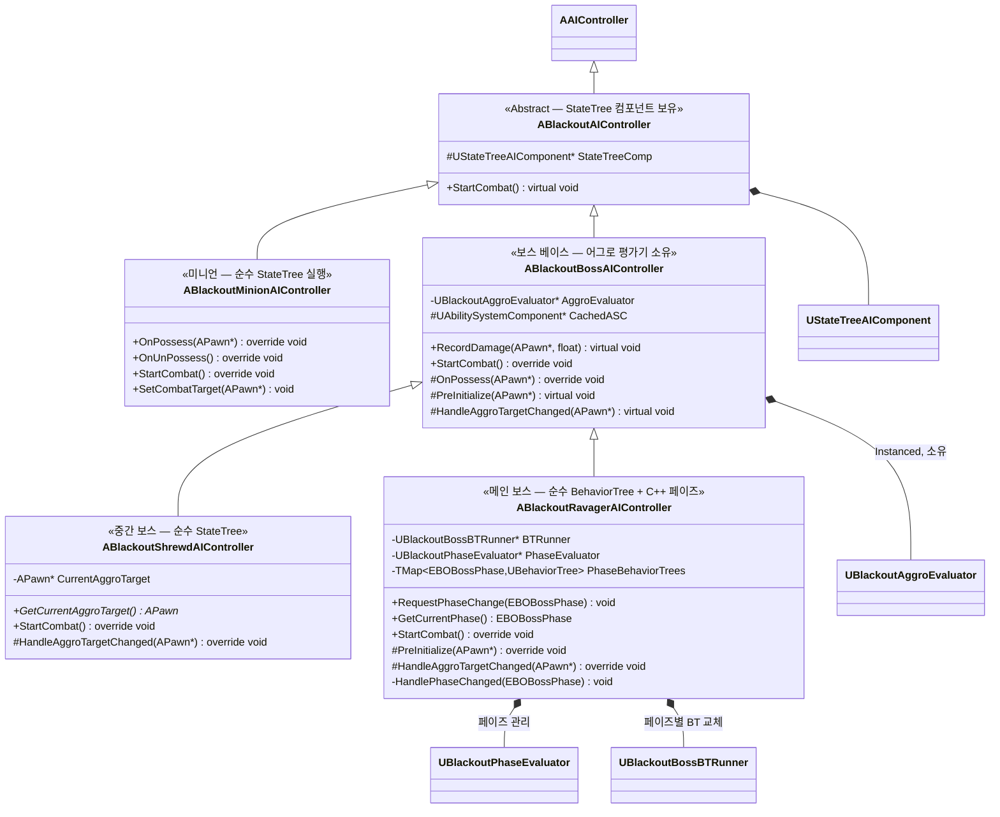
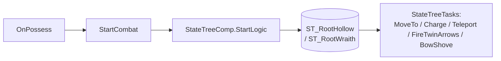
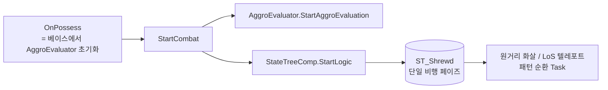
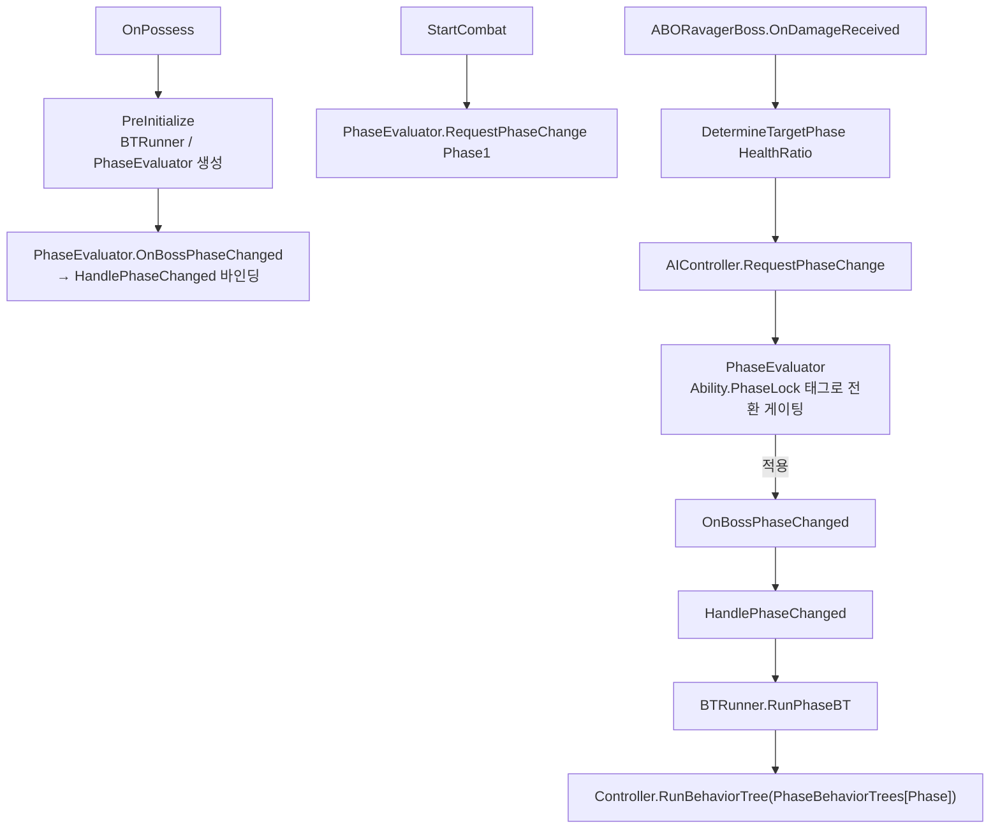

# AI/Boss — 02. AI 컨트롤러 계층

> TDD v6 §6 확장 설계.
> **미니언 = 순수 StateTree**, **중간 보스(Shrewd) = 순수 StateTree**, **메인 보스(Ravager) = 순수 BehaviorTree(C++ 페이즈 관리 모듈 + 페이즈별 BT 교체)**.
> 플러그인: `StateTree` + `GameplayStateTree` (`.uproject`에 이미 활성화됨).

> 어그로(타겟 선정)는 `ABlackoutBossAIController`가 `Instanced`로 소유하는 `UBlackoutAggroEvaluator`가 담당합니다. 평가기는 `OnAggroTargetChanged` 델리게이트로 새 타겟을 알리고, 각 보스 컨트롤러의 `HandleAggroTargetChanged` 오버라이드가 이를 소비합니다(Ravager → Blackboard `Target`, Shrewd → 멤버 `CurrentAggroTarget`). 상세는 03 다이어그램 참조.

## 실행 모델

### 미니언 (Minion)

- `ABlackoutMinionAIController`는 모든 상태·행동을 StateTree Task로 실행합니다.
- `OnPossess`에서 곧바로 `StartCombat()`을 호출하여 `StateTreeComp->StartLogic()` 실행. 서버 Authority 가드.

### 중간 보스 (Shrewd)

- Shrewd는 전투 내내 비행하는 단일 페이즈 보스이며, 패턴 순환을 **순수 StateTree**로 실행합니다.
- `StartCombat`에서 `Super::StartCombat()`(어그로 평가 시작) 후 `StateTreeComp->StartLogic()` 호출.
- 어그로 타겟은 베이스의 `HandleAggroTargetChanged`가 멤버 `CurrentAggroTarget`에 기록하고, `FBSTEval_ShrewdAggroTarget`이 Pawn의 `UBlackoutAggroComponent::GetCurrentTarget()`을 읽어 StateTree에 퍼블리시합니다.

### 메인 보스 (Ravager)

- Ravager는 페이즈 관리와 패턴 실행을 모두 BehaviorTree 레이어로 처리합니다.
- **페이즈 관리(`UBlackoutPhaseEvaluator`)**: 페이즈 단조 증가만 허용. 보스 ASC에 `Ability.PhaseLock` 태그가 있으면 전환을 `PendingPhase`로 대기시켰다가 태그 해제 시 적용 → `OnBossPhaseChanged` 브로드캐스트.
- **페이즈별 BT 교체(`UBlackoutBossBTRunner`)**: `TMap<EBOBossPhase, UBehaviorTree>`에서 새 페이즈 BT를 찾아 `Controller->RunBehaviorTree()`로 통째로 교체.
- **페이즈 결정**: 보스 캐릭터 `ABORavagerBoss::OnDamageReceived`(ASC Health 변경 델리게이트)에서 `DetermineTargetPhase(HealthRatio)`를 계산해 `AIController->RequestPhaseChange()` 호출.

## 구현 노트

- **`UStateTreeAIComponent`**: 엔진 `GameplayStateTree` 플러그인 제공. 베이스 `ABlackoutAIController`가 보유하며, 미니언과 Shrewd가 사용. Ravager는 베이스를 상속하지만 StateTree를 시작하지 않음.
- **`ABlackoutBossAIController::PreInitialize`**: `OnPossess`에서 호출. Pawn의 `IAbilitySystemInterface`로 `CachedASC`를 캐싱. 서브클래스(Ravager)가 오버라이드하여 `BTRunner`/`PhaseEvaluator`를 추가 생성.
- **어그로 평가기 수명**: `OnPossess`에서 `AggroEvaluator->Initialize(this, CachedASC)`, `OnUnPossess`에서 `Deinitialize()` 후 nullptr 처리. Ravager는 추가로 `PhaseEvaluator->Deinitialize()`, `BTRunner->StopBT()`.
- **Blackboard 키(Ravager 전용)**: `HandleAggroTargetChanged`가 `Target`(Object) 키를 갱신 → BehaviorTree Task/Service/Decorator가 소비.
- **Perception**: 보스는 어그로 평가기가 타겟을 전담하므로 Perception 비활성. 미니언만 필요 시 Sight 사용.
- **서버 전용**: AI 로직은 서버 Authority. `StartCombat`/`PreInitialize` 경로는 `HasAuthority()` 가드.
- **디버깅**: 미니언·Shrewd는 StateTree Debugger, Ravager는 BT Visual Logger로 각각 추적.
