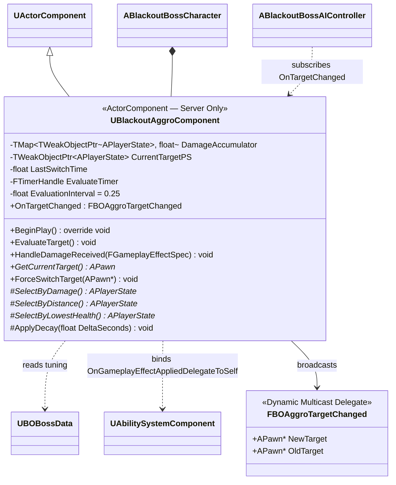

# AI/Boss — 03. 어그로 컴포넌트 (Aggro Component)

> TDD v5 §6.1, GDD §6.0 참조. 서버 Authority 전용. 보스에만 부착하여 누적 피해·거리·체력 기반 3단계 타겟 선정.

## 타겟 선정 3단계 (GDD §6.0 1:1 매핑)

| 순위 | 판정 | 구현 |
|---|---|---|
| 1 | 누적 피해 최대 | `SelectByDamage()` — `DamageAccumulator` 최대. 2위와의 격차 < `AggroDamageThreshold`면 2순위로 이관 |
| 2 | 최근접 | `SelectByDistance()` — `FVector::DistSquared` |
| 3 | 최저 체력 | `SelectByLowestHealth()` — `UBlackoutBaseAttributeSet::Health` |

## 구현 노트

- **감쇠 타이머**: `ApplyDecay`를 1초 간격 Timer로 호출. 값 = `Accumulator * (1 - AggroDecayRate)`.
- **전환 쿨다운**: 마지막 전환 후 `AggroSwitchCooldown` 경과 전에는 재평가 결과가 바뀌어도 `CurrentTargetPS` 유지. 현재 타겟이 다운/사망한 경우만 쿨다운 무시.
- **피해 수신 바인딩**: `BeginPlay`에서 Pawn의 ASC에 `OnGameplayEffectAppliedDelegateToSelf.AddUObject(this, &HandleDamageReceived)` — Spec에서 Instigator PlayerState 추출 후 Accumulator 갱신.
- **튜닝**: 모든 파라미터(`AggroSwitchCooldown`, `AggroDamageThreshold`, `AggroDecayRate`)는 `UBOBossData`에서 주입.
- **Blackboard 연동**: `OnTargetChanged` 델리게이트 수신자(`ABlackoutBossAIController`)가 `BB_CurrentTarget`에 기록 → BT가 참조.
- **서버 전용 가드**: `BeginPlay`에서 `GetOwnerRole() != ROLE_Authority`면 즉시 `DestroyComponent()`.
