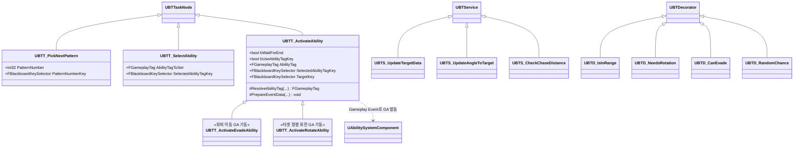
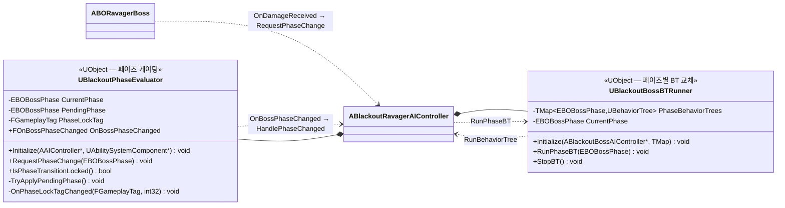
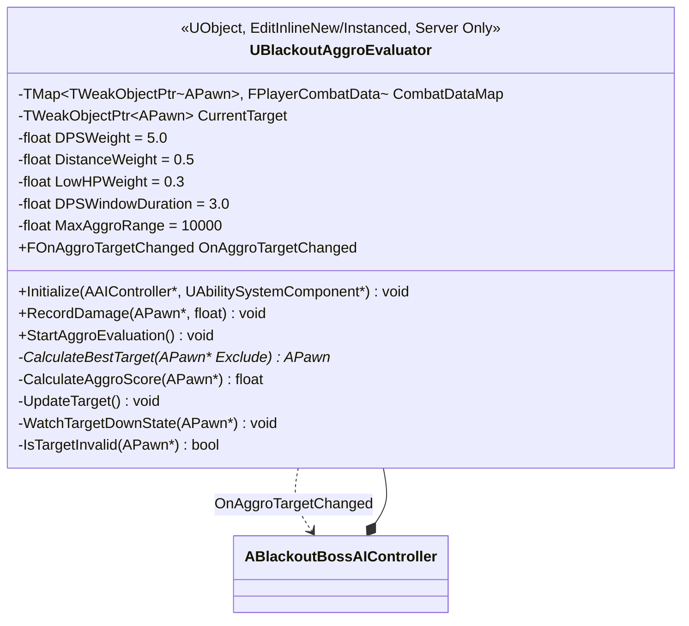

# AI/Boss — 03. StateTree 자산(미니언/Shrewd) + Ravager BehaviorTree·페이즈 모듈

> 미니언·중간 보스(Shrewd)는 **순수 StateTree**, 메인 보스(Ravager)는 **순수 BehaviorTree + C++ 페이즈 관리 모듈**.
> TDD v6 §6 확장 설계.

## 자산 매핑

| 에셋 / 모듈 | 종류 | 대상 | 책임 |
|---|---|---|---|
| `ST_RootHollow` | StateTree | `ABORootHollow` | Chase → Charge → Recover 순환 |
| `ST_RootWraith` | StateTree | `ABORootWraith` | Kite → FireTwinArrows → (Teleport \| 근접 시 BowShove) 순환 |
| `ST_Shrewd` | StateTree | `ABOShrewdBoss` | 단일 비행 페이즈 — 원거리 화살 / LoS 텔레포트 패턴 순환 |
| `UBlackoutPhaseEvaluator` | C++ UObject | `ABlackoutRavagerAIController` | 페이즈 단조 전환 + `Ability.PhaseLock` 태그 게이팅 |
| `UBlackoutBossBTRunner` | C++ UObject | `ABlackoutRavagerAIController` | `TMap<EBOBossPhase, UBehaviorTree>`에서 페이즈 BT 교체 실행 |
| `BT_Ravager_Phase1` | BehaviorTree | Ravager Phase1(100~60%) | `DoubleSwipe` / `LungeAttackCombo` / `BackwardJump`→`Shockwave` 연계 / `SummonMinion` |
| `BT_Ravager_Phase2` | BehaviorTree | Ravager Phase2(60~30%) | Phase1 + `EnergyBurst`(웅크려 충전형 AoE) + 일반+엘리트 혼합 스폰 |
| `BT_Ravager_Phase3` | BehaviorTree | Ravager Phase3(30%↓) | Phase1/2 + `Gorenado` (기둥 파괴는 돌진 계열 GA의 부차 효과) |

> 페이즈 BT 자산 키는 `EBOBossPhase`(None/Phase1/Phase2/Phase3)이며, `ABlackoutRavagerAIController::PhaseBehaviorTrees`에서 BP/에디터로 페이즈↔BT를 매핑합니다.

## StateTree 커스텀 Task / Condition / Evaluator (미니언 · Shrewd)

```mermaid
classDiagram
    direction TB

    FStateTreeTaskCommonBase <|-- FBSTTask_MoveTowardTarget
    FStateTreeTaskCommonBase <|-- FBSTTask_RetreatFromTarget
    FStateTreeTaskCommonBase <|-- FBSTTask_StrafeAroundTarget
    FStateTreeTaskCommonBase <|-- FBSTTask_FocusOnTarget
    FStateTreeTaskCommonBase <|-- FBSTTask_Charge
    FStateTreeTaskCommonBase <|-- FBSTTask_Teleport
    FStateTreeTaskCommonBase <|-- FBSTTask_FireTwinArrows
    FStateTreeTaskCommonBase <|-- FBSTTask_BowShove
    FStateTreeTaskCommonBase <|-- FBSTTask_FlyKite
    FStateTreeTaskCommonBase <|-- FBSTTask_ActivateAbility

    FStateTreeConditionCommonBase <|-- FBSTCond_HealthBelow
    FStateTreeConditionCommonBase <|-- FBSTCond_TargetWithinRange

    FStateTreeEvaluatorCommonBase <|-- FBSTEval_HealthRatio
    FStateTreeEvaluatorCommonBase <|-- FBSTEval_ShrewdAggroTarget
    FStateTreeEvaluatorCommonBase <|-- FBSTEval_WraithAggroTarget

    class FBSTTask_Charge {
        <<Root Hollow 돌진 박치기>>
        +float ChargeDistance
        +float StaggerImpulse
    }
    class FBSTTask_Teleport {
        <<Root Wraith / Shrewd LoS 점멸>>
        +float DesiredOffsetRange
        +bool bRequireOutOfSight
    }
    class FBSTTask_FireTwinArrows {
        <<Root Wraith 2연발 투사체>>
        +TSubclassOf~ABOProjectile~ ProjectileClass
        +float IntervalSeconds
    }
    class FBSTTask_BowShove {
        <<Root Wraith 근접 밀치기>>
        +float ShoveImpulse
        +float ShoveRange
    }
    class FBSTTask_FlyKite {
        <<Shrewd 비행 카이팅 이동>>
    }
    class FBSTTask_ActivateAbility {
        <<GA 기동 공용 (StateTree)>>
        +FGameplayTag AbilityTag
        +bool bWaitForEnd
    }
    class FBSTCond_HealthBelow {
        +float Ratio
    }
    class FBSTEval_HealthRatio {
        <<Owner ASC Health/MaxHealth 퍼블리시>>
    }
    class FBSTEval_ShrewdAggroTarget {
        <<Pawn의 AggroComponent.GetCurrentTarget 읽어 퍼블리시>>
    }
    class FBSTEval_WraithAggroTarget {
        <<엘리트 미니언 타겟 선정>>
    }

    FBSTEval_ShrewdAggroTarget ..> UBlackoutAggroComponent : GetCurrentTarget
```

> `FBSTEval_HealthRatio` / `FBSTCond_HealthBelow`는 StateTree 빌딩 블록으로 남아 있으나, **Ravager 페이즈 전환에는 사용되지 않습니다**(Ravager는 보스 캐릭터의 C++ 경로로 페이즈를 결정). 미니언/Shrewd에서 필요 시 활용합니다.

## Ravager BehaviorTree 노드

- **패턴 선택 흐름**: `UBTT_PickNextPattern`(패턴 번호를 Blackboard에 기록) → `UBTT_SelectAbility`(능력 `FGameplayTag`를 Blackboard에 기록) → `UBTT_ActivateAbility`(태그를 해석해 Gameplay Event로 GA 발동, `bWaitForEnd`면 GA 종료까지 대기).
- **이동/정렬/회피**: `UBTT_ActivateEvadeAbility`, `UBTT_ActivateRotateAbility`(둘 다 `UBTT_ActivateAbility` 파생).
- **상황 판단**: Service `UBTS_UpdateTargetData`(타겟/거리 갱신), `UBTS_UpdateAngleToTarget`(각도), `UBTS_CheckChaseDistance`(추격 거리). Decorator `UBTD_IsInRange`, `UBTD_NeedsRotation`, `UBTD_CanEvade`, `UBTD_RandomChance`.
- **Blackboard 핵심 키**: `Target`(Object, 어그로 평가기가 기록), 패턴 번호, 선택 능력 태그.

## C++ 페이즈 모듈 (Ravager)

- **`UBlackoutPhaseEvaluator`**: `RequestPhaseChange`는 단조 증가만 수용합니다. `Ability.PhaseLock` 태그가 ASC에 있으면 요청 페이즈를 `PendingPhase`에 저장하고, 태그 카운트가 0이 될 때(`OnPhaseLockTagChanged`) 적용합니다. 적용 시 `OnBossPhaseChanged` 브로드캐스트.
- **`UBlackoutBossBTRunner`**: `RunPhaseBT(NewPhase)`가 맵에서 BT를 찾아 `OwnerController->RunBehaviorTree(*Tree)`로 교체. `StopBT()`는 BrainComponent를 정지.
- **페이즈 결정 진입점**: `ABORavagerBoss::OnDamageReceived` → `DetermineTargetPhase(HealthRatio)`(≤0.3→Phase3, ≤0.6→Phase2, else Phase1) → `RequestPhaseChange`.

## 어그로 Evaluator 상세 (`UBlackoutAggroEvaluator`)

> GDD §6.0·TDD §6.1의 피해·거리·체력 기반 타겟 선정을 **가중치 점수제**로 수행합니다.

- **피해 기록**: `FPlayerCombatData`가 타임스탬프 찍힌 `FDamageRecord` 배열을 보관하고, `GetDamageInWindow`가 최근 `DPSWindowDuration`(3초) 윈도우 합만 집계(오래된 기록 자동 제거). 보스 캐릭터 `OnDamageReceived`에서 `RecordDamage` 호출.
- **점수 산정(`CalculateAggroScore`)**: `DPS×DPSWeight + 근접도×DistanceWeight + 저체력×LowHPWeight`. `MaxAggroRange` 밖 후보 제외.
- **전환 게이팅**: 고정 쿨다운 변수 대신 **게임플레이 태그 이벤트**(`TargetChangeTag`)로 전환을 잠그고, 현재 타겟의 다운/사망 태그(`DownTag`)를 감시해 무효 시 즉시 재선정.
- **결과 전파**: `OnAggroTargetChanged` → 컨트롤러 `HandleAggroTargetChanged`(Ravager: Blackboard `Target` / Shrewd: 멤버 `CurrentAggroTarget`).
- **서버 Authority 전용**: `RecordDamage`/평가가 서버에서만 호출됨.

## 구현 노트

- **StateTree 외부 데이터**: 미니언/Shrewd의 커스텀 Task는 `FStateTreeExternalDataHandle`로 `AAIController`/`APawn`/`UAbilitySystemComponent`를 주입받음.
- **Ravager 추적 경로**: 페이즈·패턴이 BehaviorTree + C++ 모듈에서 결정되므로 BT Visual Logger로 추적합니다.
- **페이즈 전이 원자성**: `Ability.PhaseLock` 태그가 패턴 시전 동안 페이즈 적용 시점을 조절해, 패턴이 끊기거나 두 페이즈 BT가 경쟁하지 않도록 보장합니다.
- **Shrewd 어그로 경로**: 베이스 평가기(`UBlackoutAggroEvaluator`)가 타겟을 갱신하고, StateTree Evaluator는 Pawn의 `UBlackoutAggroComponent`에서 현재 타겟을 읽습니다.
