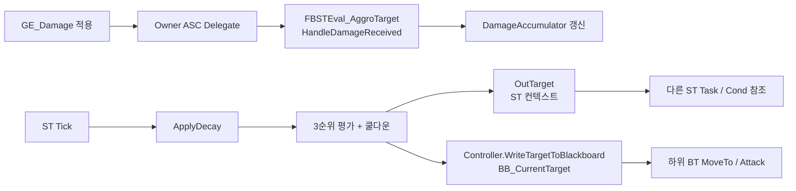
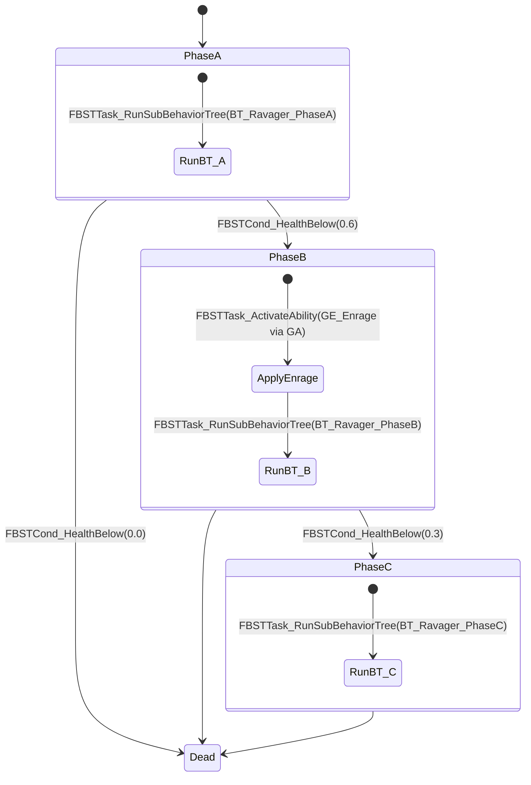
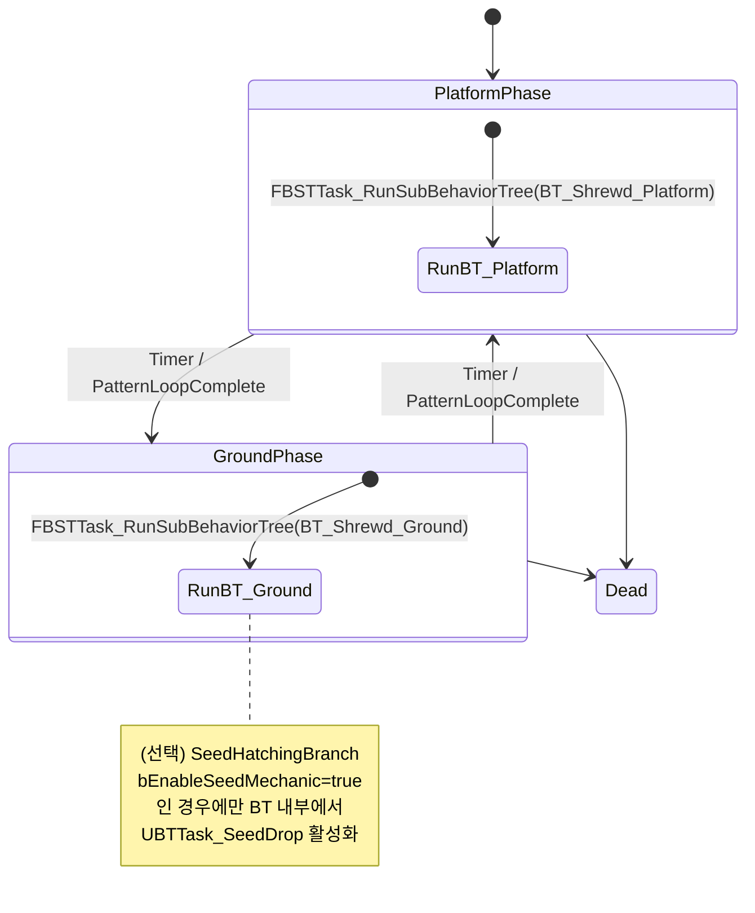
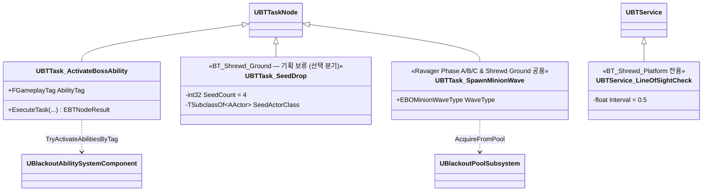

# AI/Boss — 03. StateTree 자산 + 보스 페이즈별 하위 BehaviorTree

> 미니언은 **순수 StateTree**, 보스는 **StateTree(페이즈) + 하위 BT(페이즈별 패턴)** 하이브리드.
> TDD v5 §6 확장 설계.

## 자산 매핑

| 에셋 | 종류 | 대상 | 책임 |
|---|---|---|---|
| `ST_RootHollow` | StateTree | `ABORootHollow` | Chase → Charge → Recover 순환 |
| `ST_RootWraith` | StateTree | `ABORootWraith` | Kite → FireTwinArrows → (Teleport 또는 근접 시 BowShove) 순환 |
| `ST_Shrewd_Phases` | StateTree | `ABOShrewdBoss` | Platform(원거리) ↔ Ground(근접) **2-Phase Cycling** |
| `BT_Shrewd_Platform` | BehaviorTree | Shrewd Platform 상태 하위 | `ExplosiveArrow` / `QuickFlurry` / `LoSTeleport` |
| `BT_Shrewd_Ground` | BehaviorTree | Shrewd Ground 상태 하위 | `MeleeCombo` / `Lunge` (Motion Warping) / ~~`SeedDrop`~~ (**기획 보류**) |
| `ST_Ravager_Phases` | StateTree | `ABORavagerBoss` | Phase A/B/C 관리 |
| `BT_Ravager_PhaseA` | BehaviorTree | Ravager Phase A 상태 하위 | `DoubleSwipe` / `LungeAttackCombo`(할퀴기+물기 콤보 통합) / `BackwardJump`→`ChargedShockwave` 연계 / `Howl_Summon` |
| `BT_Ravager_PhaseB` | BehaviorTree | Ravager Phase B 상태 하위 | Phase A 전체 + `EnergyBurst`(웅크려 충전형 AoE) + 일반+엘리트 혼합 스폰 |
| `BT_Ravager_PhaseC` | BehaviorTree | Ravager Phase C 상태 하위 | Phase A/B 전체 + `Gorenado` (기둥 파괴는 돌진 계열 GA의 부차 효과) |

## StateTree 커스텀 Task / Condition / Evaluator

```mermaid
classDiagram
    direction TB

    FStateTreeTaskCommonBase <|-- FBSTTask_MoveToTarget
    FStateTreeTaskCommonBase <|-- FBSTTask_Charge
    FStateTreeTaskCommonBase <|-- FBSTTask_Teleport
    FStateTreeTaskCommonBase <|-- FBSTTask_FireTwinArrows
    FStateTreeTaskCommonBase <|-- FBSTTask_BowShove
    FStateTreeTaskCommonBase <|-- FBSTTask_ActivateAbility
    FStateTreeTaskCommonBase <|-- FBSTTask_RunSubBehaviorTree

    FStateTreeConditionCommonBase <|-- FBSTCond_HealthBelow
    FStateTreeConditionCommonBase <|-- FBSTCond_IsOnPlatform
    FStateTreeConditionCommonBase <|-- FBSTCond_HasLineOfSight

    FStateTreeEvaluatorCommonBase <|-- FBSTEval_HealthRatio
    FStateTreeEvaluatorCommonBase <|-- FBSTEval_AggroTarget

    class FBSTTask_MoveToTarget {
        <<이동 Task>>
        +FStateTreeExternalDataHandle~AAIController~ AIController
        +EnterState(...) EStateTreeRunStatus
        +Tick(...) EStateTreeRunStatus
    }

    class FBSTTask_Charge {
        <<Root Hollow 돌진>>
        +float ChargeDistance
        +float StaggerImpulse
    }

    class FBSTTask_Teleport {
        <<Root Wraith / Shrewd LoS 점멸>>
        +float DesiredOffsetRange
        +bool bRequireOutOfSight
    }

    class FBSTTask_FireTwinArrows {
        <<Root Wraith 2연발 투사체>>
        +TSubclassOf~ABOProjectile~ ProjectileClass
        +float IntervalSeconds
    }

    class FBSTTask_BowShove {
        <<Root Wraith 근접 밀치기 — 신규>>
        +float ShoveImpulse
        +float ShoveRange
        +float PostShoveBackstepDistance
    }

    class FBSTTask_ActivateAbility {
        <<GA 기동 공용>>
        +FGameplayTag AbilityTag
        +bool bWaitForEnd
    }

    class FBSTTask_RunSubBehaviorTree {
        <<보스 페이즈 상태 전용>>
        +UBehaviorTree* SubTreeAsset
        +EnterState(...) : Controller.RunSubBehaviorTree
        +ExitState(...) : Controller.StopSubBehaviorTree
    }

    class FBSTCond_HealthBelow {
        <<페이즈 전이 조건>>
        +float Ratio
    }

    class FBSTEval_HealthRatio {
        <<Owner ASC Health/MaxHealth 퍼블리시>>
        +FStateTreeOutputDataHandle~float~ OutRatio
    }

    class FBSTEval_AggroTarget {
        <<보스 전용 — 어그로 평가·퍼블리시 일체>>
        -TMap~TWeakObjectPtr~APlayerState~, float~ DamageAccumulator
        -TWeakObjectPtr~APlayerState~ CurrentTargetPS
        -float LastSwitchTime
        +float EvaluationInterval = 0.25
        +FStateTreeExternalDataHandle~UAbilitySystemComponent~ OwnerASC
        +FStateTreeExternalDataHandle~ABlackoutBossAIController~ Controller
        +FStateTreeExternalDataHandle~UBOBossData~ BossData
        +FStateTreeOutputDataHandle~APawn~ OutTarget
        +TreeStart(Context) void
        +TreeStop(Context) void
        +Tick(Context, DeltaSeconds) void
        #HandleDamageReceived(FGameplayEffectSpec) void
        #ApplyDecay(float DeltaSeconds) void
        #SelectByDamage() APlayerState*
        #SelectByDistance() APlayerState*
        #SelectByLowestHealth() APlayerState*
    }

    FBSTTask_ActivateAbility ..> UBlackoutAbilitySystemComponent : TryActivateAbilitiesByTag
    FBSTTask_RunSubBehaviorTree ..> ABlackoutBossAIController : RunSubBehaviorTree / StopSubBehaviorTree
    FBSTEval_AggroTarget ..> UAbilitySystemComponent : OnGameplayEffectAppliedDelegateToSelf
    FBSTEval_AggroTarget ..> ABlackoutBossAIController : WriteTargetToBlackboard
    FBSTEval_AggroTarget ..> UBOBossData : reads tuning
```

## 어그로 Evaluator 상세 (`FBSTEval_AggroTarget`)

> GDD §6.0·TDD §6.1의 누적 피해·거리·체력 기반 3순위 타겟 선정을 StateTree Evaluator로 구현.
> 보스 StateTree의 **최상위 Evaluator로 등록**되어 모든 페이즈에서 지속 실행됨. 별도 ActorComponent를 두지 않음.

### 타겟 선정 3단계 (GDD §6.0 1:1 매핑)

| 순위 | 판정 | 구현 |
|---|---|---|
| 1 | 누적 피해 최대 | `SelectByDamage()` — `DamageAccumulator` 최대. 2위와의 격차 < `AggroDamageThreshold`면 2순위로 이관 |
| 2 | 최근접 | `SelectByDistance()` — `FVector::DistSquared` |
| 3 | 최저 체력 | `SelectByLowestHealth()` — `UBlackoutBaseAttributeSet::Health` |

### 수명 주기 훅

| 훅 | 동작 |
|---|---|
| `TreeStart` | Owner ASC에 `OnGameplayEffectAppliedDelegateToSelf` 바인딩, `LastSwitchTime` 초기화 |
| `Tick` | `ApplyDecay(DeltaSeconds)` → 3순위 재평가 → 쿨다운(`AggroSwitchCooldown`) 통과 시에만 `CurrentTargetPS` 교체 → `OutTarget` 퍼블리시 + `Controller->WriteTargetToBlackboard(NewTarget)` |
| `TreeStop` | ASC 델리게이트 언바인딩, `DamageAccumulator` 클리어 |

### 튜닝 파라미터 (`UBOBossData` 주입)

- `AggroSwitchCooldown` (기본 **5.0초** — GDD §6.0 "최소 5초 간격" 규정값) — 마지막 전환 후 쿨다운 경과 전 타겟 유지. 현재 타겟이 **다운/사망**이면 쿨다운 무시.
- `AggroDamageThreshold` (기본 0.15 = 15%) — 1위와 2위 누적 피해 격차 임계.
- `AggroDecayRate` (기본 0.02 /sec) — `Accumulator *= (1 - AggroDecayRate * DeltaSeconds)` 선형 감쇠.
- **Shrewd / Ravager 동일 Evaluator 인스턴스 사용**: 보스별 차이는 위 파라미터 값만 변경해서 `UBOBossData`로 주입. 로직/코드 분기 없음.

### 데이터 흐름

- **서버 Authority 전용**: `GE_Damage` 적용이 서버에서만 일어나므로 Evaluator도 서버에서만 의미를 가짐. `TreeStart`에서 `GetWorld()->GetNetMode() == NM_Client`면 조기 리턴하는 방어 코드 권장.
- **BB 기록 경로**: Evaluator는 Controller를 External Data로 받아 `WriteTargetToBlackboard`를 호출. 이 한 곳에서 ST 컨텍스트와 하위 BT Blackboard를 동시에 갱신하여 일관성 유지.

## 보스 StateTree 페이즈 설계

### `ST_Ravager_Phases`

### `ST_Shrewd_Phases`

> **2-Phase Cycling**: 발판(원거리) ↔ 지면(근접) 을 타이머/패턴 루프 완료 조건으로 왕복.
> **씨앗 기믹은 GDD §5에서 "개발 보류. 제거될 수 있음"으로 명시됨.** 아래 `SeedHatchingBranch`는 `bEnableSeedMechanic = true`일 때만 활성화되는 선택 분기이며 기본값은 비활성.

## 하위 BT 설계 원칙

- 하위 BT는 **페이즈 전환 관심 없음**. 오직 해당 페이즈의 패턴 선택·실행만 담당. 페이즈 경계 감시는 StateTree가 전담.
- 하위 BT의 **Blackboard는 Controller 소유** (`ABlackoutBossAIController::BlackboardComp`). 핵심 키:
  - `BB_CurrentTarget` (Object) — `FBSTEval_AggroTarget`이 Tick마다 `Controller->WriteTargetToBlackboard`로 기록
  - `BB_HasLineOfSight` (Bool) — `UBTService_LineOfSightCheck`가 업데이트 (Shrewd 전용)
- 하위 BT 내부는 전통적 Selector / Sequence 구성. Ability 발동은 `UBTTask_ActivateBossAbility(AbilityTag=GA.Ravager.DoubleSwipe)`로 호출.

## 구현 노트

- **StateTree 외부 데이터**: 모든 커스텀 Task는 `FStateTreeExternalDataHandle`로 `AAIController`, `APawn`, `UAbilitySystemComponent`를 주입받음. `InitStateTreeContext`에서 등록.
- **페이즈 전이 원자성**: `FBSTCond_HealthBelow`는 Evaluator(`FBSTEval_HealthRatio`) 출력값을 읽음. Evaluator가 매 Tick Health/MaxHealth를 퍼블리시하여 조건이 즉시 반응.
- **Enrage 적용 위치**: Phase B 진입 시 **StateTree Task로 `GE_Enrage` 적용 후** 하위 BT를 기동. 순서는 State 내부의 Sequential Tasks로 선언.
- **중단·인터럽트**: 보스 사망·씨앗 파괴 완료 등 우선순위 이벤트는 StateTree의 Transition 트리거로 상향. 하위 BT는 상태 이탈 시 `FBSTTask_RunSubBehaviorTree::ExitState`에서 자동으로 `StopTree()` → 리소스 누수 없음.
- **데이터 기반**: 페이즈 컷라인(`FBSTCond_HealthBelow`의 Ratio)은 `UBOBossData::PhaseHealthCutlines` 배열을 StateTree 파라미터로 바인딩하여 주입.
- **하위 BT 재사용**: `UBTTask_ActivateBossAbility`, `UBTService_LineOfSightCheck` 등 기존 BT 노드는 그대로 하위 BT에서 활용. StateTree 측에 중복 구현 불필요(보스 패턴은 BT, 페이즈 관리는 ST로 역할 분리).
- **디버깅**: StateTree Debugger로 페이즈 전이를 시각 추적, 동시에 BT Visual Logger로 하위 패턴 실행을 관찰 — 두 레이어가 독립이므로 로그가 깔끔히 분리됨.
