# AI/Boss — 04. 보스 어빌리티(GA) 세트

> TDD v5 §6, GDD §5·§6 참조. 패턴별 GA를 Ability Tag로 BT에서 호출.
> **2026-04-21 GDD 개정 반영**: TurnBite 통합, Howl_AoE→EnergyBurst 재정의, PillarCharge 제거, Shrewd 패턴 세분화, 씨앗 기믹 보류 반영.

```mermaid
classDiagram
    direction TB

    UBlackoutGameplayAbility <|-- UGA_Shrewd_ExplosiveArrow
    UBlackoutGameplayAbility <|-- UGA_Shrewd_QuickFlurry
    UBlackoutGameplayAbility <|-- UGA_Shrewd_LoSTeleport
    UBlackoutGameplayAbility <|-- UGA_Shrewd_MeleeCombo
    UBlackoutGameplayAbility <|-- UGA_Shrewd_Lunge
    UBlackoutGameplayAbility <|-- UGA_Shrewd_SeedHatch

    UBlackoutGameplayAbility <|-- UGA_Ravager_DoubleSwipe
    UBlackoutGameplayAbility <|-- UGA_Ravager_LungeAttackCombo
    UBlackoutGameplayAbility <|-- UGA_Ravager_BackwardJump
    UBlackoutGameplayAbility <|-- UGA_Ravager_ChargedShockwave
    UBlackoutGameplayAbility <|-- UGA_Ravager_Howl_Summon
    UBlackoutGameplayAbility <|-- UGA_Ravager_Howl_Phase
    UBlackoutGameplayAbility <|-- UGA_Ravager_Howl_Shockwave
    UBlackoutGameplayAbility <|-- UGA_Ravager_EnergyBurst
    UBlackoutGameplayAbility <|-- UGA_Ravager_Gorenado

    class UGA_Shrewd_ExplosiveArrow {
        <<발판 페이즈 — 폭발 속성 단발 투사체>>
        +float SplashRadius
    }

    class UGA_Shrewd_QuickFlurry {
        <<발판 페이즈 — 짧은 딜레이 후 복수 화살 연사>>
        +int32 ShotCount
        +float IntervalSeconds
    }

    class UGA_Shrewd_LoSTeleport {
        <<LoS 차단 시 즉시 점멸 후 근접 콤보 연계>>
        +ActivateAbility() override void
    }

    class UGA_Shrewd_MeleeCombo {
        <<지면 페이즈 — 활대 근접 타격>>
    }

    class UGA_Shrewd_Lunge {
        <<지면 페이즈 — 장거리 강습 도약 (Motion Warping)>>
        +float LungeDistance
    }

    class UGA_Shrewd_SeedHatch {
        <<기획 보류 — 씨앗 부화 기믹>>
        +int32 SeedCount
        +float InvulnerableDuration
    }

    class UGA_Ravager_DoubleSwipe {
        <<Phase A — 2연속 할퀴기 (엇박자 콤보)>>
    }

    class UGA_Ravager_LungeAttackCombo {
        <<Phase A — 도약 덮침 → 할퀴기 → 물기 복합 콤보>>
        <<기존 TurnBite 흡수>>
        +float LungeDistance
        +bool bBreaksPillarOnHit
    }

    class UGA_Ravager_BackwardJump {
        <<Phase A — 회피 이동 (Shockwave 선행)>>
        +float JumpBackwardDistance
    }

    class UGA_Ravager_ChargedShockwave {
        <<Phase A — 앞발 충전 후 지면 장풍>>
        +float ChargeDuration
        +float TravelDistance
        +bool bBreaksPillarOnHit
    }

    class UGA_Ravager_Howl_Summon {
        <<Phase A — Root Hollow 간헐 스폰>>
        +int32 SpawnCount = 3
    }

    class UGA_Ravager_Howl_Phase {
        <<Phase B 진입 트리거 — 붉은 안개 포효>>
    }

    class UGA_Ravager_Howl_Shockwave {
        <<Phase C 진입 트리거 — 광역 충격파 포효>>
    }

    class UGA_Ravager_EnergyBurst {
        <<Phase B — 제자리 웅크려 충전 후 광역 에너지 파동>>
        +float ChargeDuration
        +float BlastRadius
    }

    class UGA_Ravager_Gorenado {
        <<Phase C — 궁극기 볼텍스 소용돌이 (중앙으로 흡입)>>
        +float PullStrength
    }

    UGA_Ravager_Howl_Summon ..> UBlackoutPoolSubsystem : Spawn Root Hollow
    UGA_Ravager_LungeAttackCombo ..> ABlackoutDestructiblePillar : 히트 시 Multicast_Shatter
    UGA_Ravager_ChargedShockwave ..> ABlackoutDestructiblePillar : 히트 시 Multicast_Shatter
    UGA_Shrewd_LoSTeleport ..> UBlackboardKeyRegistry : consumes BB_HasLineOfSight
```

## 페이즈 ↔ GA 매트릭스

### Shrewd (중간 보스, 2-Phase Cycling)

| 페이즈 / 조건 | 활성 GA |
|---|---|
| 원거리 (`bIsOnPlatform=true`) | `ExplosiveArrow`, `QuickFlurry`, `LoSTeleport` |
| 근접 (`bIsOnPlatform=false`) | `MeleeCombo`, `Lunge`, `LoSTeleport`(양 페이즈 공통) |
| (보류) 씨앗 기믹 | `SeedHatch` — `bEnableSeedMechanic=true`일 때만 |

### Ravager (메인 보스, 3-Phase)

| 페이즈 / 조건 | 활성 GA |
|---|---|
| Phase A (100~60%) | `DoubleSwipe`, `LungeAttackCombo`(도약+할퀴기+물기 통합), `BackwardJump`→`ChargedShockwave` 연계, `Howl_Summon` |
| Phase A→B 전이 | `Howl_Phase` (붉은 안개) → `GE_Enrage` 적용 |
| Phase B (60~30%) | Phase A 전체 + `EnergyBurst`(제자리 웅크려 충전형) + 일반+엘리트 혼합 스폰 |
| Phase B→C 전이 | `Howl_Shockwave` (광역 충격파 포효) |
| Phase C (30%↓) | Phase A/B 전체 + `Gorenado` (PlayRate 승수 1.3) — 기둥은 이미 상당수 파괴된 상태 |

## GDD 2026-04-21 개정 차분 요약

| 변경 유형 | 이전 | 이후 |
|---|---|---|
| 제거 | `UGA_Ravager_TurnBite` | `UGA_Ravager_LungeAttackCombo`에 "물기" 단계로 흡수 |
| 제거 | `UGA_Ravager_PillarCharge` | `LungeAttackCombo` / `ChargedShockwave`의 **히트 시 기둥 파괴 부차 효과**로 대체 (§05 참조) |
| 제거 | `UGA_Ravager_Shockwave` | `UGA_Ravager_ChargedShockwave`로 리네이밍 (GDD 용어 "차지 쇼크웨이브" 정합) |
| 제거 | `UGA_Shrewd_RangedVolley` | `UGA_Shrewd_ExplosiveArrow` + `UGA_Shrewd_QuickFlurry` 2종으로 세분화 |
| 제거 | `UGA_Shrewd_GroundSlam` | `UGA_Shrewd_MeleeCombo` + `UGA_Shrewd_Lunge` 2종으로 재정의 (GDD §5 근접 페이즈 명시) |
| 재정의 | `UGA_Ravager_Howl_AoE` (즉사급 포효) | `UGA_Ravager_EnergyBurst` (제자리 웅크려 충전 후 광역 파동) — 연출/패턴 성격 변경 |
| 신규 | — | `UGA_Ravager_Howl_Phase` (Phase B 진입 붉은 안개 포효), `UGA_Ravager_Howl_Shockwave` (Phase C 진입 광역 충격파) |
| 보류 | `UGA_Shrewd_SeedHatch` | 스켈레톤 유지, `bEnableSeedMechanic` 데이터 플래그로 비활성 기본 |

## 구현 노트

- **Ability Tag 네이밍**: `GA.Shrewd.ExplosiveArrow`, `GA.Shrewd.QuickFlurry`, `GA.Shrewd.LoSTeleport`, `GA.Shrewd.MeleeCombo`, `GA.Shrewd.Lunge`, `GA.Ravager.DoubleSwipe`, `GA.Ravager.LungeAttackCombo`, `GA.Ravager.BackwardJump`, `GA.Ravager.ChargedShockwave`, `GA.Ravager.Howl.Summon`, `GA.Ravager.Howl.Phase`, `GA.Ravager.Howl.Shockwave`, `GA.Ravager.EnergyBurst`, `GA.Ravager.Gorenado`. `UBOBossData::AbilityDamageMap`의 Key와 일치시켜 데이터 기반 데미지 조회.
- **데미지 적용**: 각 GA는 `GE_Damage` 스펙을 만들고 `SetByCaller`로 `BossData->AbilityDamageMap[AbilityTag]` 값을 주입.
- **Grant 경로**: `ABlackoutBossCharacter::BeginPlay`에서 해당 보스 전용 `GrantedAbilities` 배열을 순회하여 ASC에 `GiveAbility`.
- **Phase B 전이 순서**: `FBSTCond_HealthBelow(0.6)` 통과 → StateTree Sequential Tasks로 `GA.Ravager.Howl.Phase` 활성 → 완료 후 `GE_Enrage` ApplyToSelf → 하위 BT(`BT_Ravager_PhaseB`) 기동.
- **Phase C 전이 순서**: `FBSTCond_HealthBelow(0.3)` 통과 → `GA.Ravager.Howl.Shockwave` 활성(광역 데미지 판정 포함) → `AnimPlayRateMultiplier = 1.3` 설정 → 하위 BT(`BT_Ravager_PhaseC`) 기동.
- **기둥 파괴 경로**: `UGA_Ravager_LungeAttackCombo` / `UGA_Ravager_ChargedShockwave`의 히트 판정에서 `ABlackoutDestructiblePillar`에 닿으면 `Multicast_Shatter` 트리거. 별도의 PillarCharge GA를 두지 않음 — GDD §6의 "보스의 돌진 공격에 의해 영구적으로 파괴"를 돌진 계열 GA의 부차 효과로 통합 구현 (§05 참조).
- **AI 호출 경로**: BT에서 `UBTTask_ActivateBossAbility(AbilityTag=GA.Ravager.Gorenado)` → ASC의 `TryActivateAbilitiesByTag` → `ActivateAbility`.
