# AI/Boss — 04. 보스 어빌리티(GA) 세트

> TDD v5 §6, GDD §5·§6 참조. 패턴별 GA를 Ability Tag로 BT에서 호출.

```mermaid
classDiagram
    direction TB

    UBlackoutGameplayAbility <|-- UGA_Shrewd_LoSTeleport
    UBlackoutGameplayAbility <|-- UGA_Shrewd_RangedVolley
    UBlackoutGameplayAbility <|-- UGA_Shrewd_GroundSlam

    UBlackoutGameplayAbility <|-- UGA_Ravager_DoubleSwipe
    UBlackoutGameplayAbility <|-- UGA_Ravager_TurnBite
    UBlackoutGameplayAbility <|-- UGA_Ravager_BackwardJump
    UBlackoutGameplayAbility <|-- UGA_Ravager_Shockwave
    UBlackoutGameplayAbility <|-- UGA_Ravager_LungeAttack
    UBlackoutGameplayAbility <|-- UGA_Ravager_Howl_Summon
    UBlackoutGameplayAbility <|-- UGA_Ravager_Howl_AoE
    UBlackoutGameplayAbility <|-- UGA_Ravager_Gorenado
    UBlackoutGameplayAbility <|-- UGA_Ravager_PillarCharge

    class UGA_Shrewd_LoSTeleport {
        <<LoS 차단 시 즉시 점멸>>
        +ActivateAbility() override void
    }

    class UGA_Shrewd_RangedVolley {
        <<발판 페이즈 원거리 투사체>>
    }

    class UGA_Shrewd_GroundSlam {
        <<지면 페이즈 근접 AoE>>
    }

    class UGA_Ravager_DoubleSwipe {
        <<Phase A — 2연타 할퀴기>>
    }

    class UGA_Ravager_Howl_Summon {
        <<Phase A — Root Hollow 스폰>>
        +int32 SpawnCount = 3
    }

    class UGA_Ravager_Howl_AoE {
        <<Phase B — 광역 즉사급>>
    }

    class UGA_Ravager_Gorenado {
        <<Phase C — 궁극기 소용돌이>>
    }

    class UGA_Ravager_PillarCharge {
        <<기둥 파괴 전용 돌진>>
        +float PillarDamage
    }

    UGA_Ravager_Howl_Summon ..> UBlackoutPoolSubsystem : Spawn Root Hollow
    UGA_Ravager_PillarCharge ..> ABlackoutDestructiblePillar : Multicast_Shatter
    UGA_Shrewd_LoSTeleport ..> UBlackboardKeyRegistry : consumes BB_HasLineOfSight
```

## 페이즈 ↔ GA 매트릭스

| 보스 | 페이즈 / 조건 | 활성 GA |
|---|---|---|
| Shrewd | 발판(`bIsOnPlatform=true`) | `RangedVolley`, `LoSTeleport` |
| Shrewd | 지면(`bIsOnPlatform=false`) | `GroundSlam`, `LoSTeleport` |
| Ravager | Phase A (100~60%) | `DoubleSwipe`, `TurnBite`, `BackwardJump`→`Shockwave`, `LungeAttack`, `Howl_Summon` |
| Ravager | Phase B (60~30%) | Phase A 전체 + `Howl_AoE` + 혼합 미니언 스폰 |
| Ravager | Phase C (30%↓) | Phase A/B + `Gorenado` + `PillarCharge` 활성 (PlayRate 승수) |

## 구현 노트

- **Ability Tag 네이밍**: `GA.Shrewd.LoSTeleport`, `GA.Ravager.DoubleSwipe` 형식. `UBOBossData::AbilityDamageMap`의 Key와 일치시켜 데이터 기반 데미지 조회.
- **데미지 적용**: 각 GA는 `GE_Damage` 스펙을 만들고 `SetByCaller`로 `BossData->AbilityDamageMap[AbilityTag]` 값을 주입.
- **Grant 경로**: `ABlackoutBossCharacter::BeginPlay`에서 해당 보스 전용 `GrantedAbilities` 배열을 순회하여 ASC에 `GiveAbility`.
- **Phase B `GE_Enrage`**: GA가 아닌 `GameplayEffect`. `EnterPhaseB`에서 `ApplyGameplayEffectToSelf`.
- **AI 호출 경로**: BT에서 `UBTTask_ActivateBossAbility(AbilityTag=GA.Ravager.Gorenado)` → ASC의 `TryActivateAbilitiesByTag` → `ActivateAbility`.
