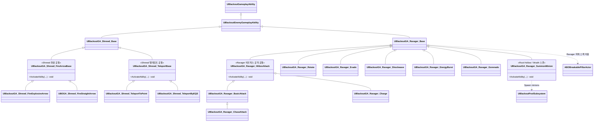

# AI/Boss — 04. 보스 어빌리티(GA) 세트

> TDD v5 §6, GDD §5·§6 참조. 현재 C++ 구현 기준의 보스 GA 클래스명과 계층을 정리합니다.

## 페이즈 ↔ GA 매트릭스

### Shrewd (중간 보스)

| 패턴 축 | 현재 C++ GA |
|---|---|
| 폭발 화살 | `UBlackoutGA_Shrewd_FireExplosiveArrow` |
| 직선 화살 | `UBOGA_Shrewd_FireStraightArrow` |
| 지정 지점 텔레포트 | `UBlackoutGA_Shrewd_TeleportToPoint` |
| EQS 기반 텔레포트 | `UBlackoutGA_Shrewd_TeleportByEQS` |

### Ravager (메인 보스)

| 패턴 축 | 현재 C++ GA |
|---|---|
| 공통 근접 히트박스 | `UBlackoutGA_Ravager_HitboxAttack` |
| 기본/추격/돌진 공격 | `UBlackoutGA_Ravager_BasicAttack`, `UBlackoutGA_Ravager_ChaseAttack`, `UBlackoutGA_Ravager_Charge` |
| 방향 전환/회피 | `UBlackoutGA_Ravager_Rotate`, `UBlackoutGA_Ravager_Evade` |
| 광역/특수 패턴 | `UBlackoutGA_Ravager_Shockwave`, `UBlackoutGA_Ravager_EnergyBurst`, `UBlackoutGA_Ravager_Gorenado` |
| 미니언 소환 | `UBlackoutGA_Ravager_SummonMinion` |

## 구현 노트

- **Ability Tag 네이밍**: C++ 클래스명은 `UBlackoutGA_*` 계열을 사용하고, 실제 발동/데미지 데이터는 `UBOBossData::AbilityDamageMap`의 GameplayTag Key와 일치시켜 조회합니다.
- **데미지 적용**: 각 GA는 `GE_Damage` 스펙을 만들고 `SetByCaller`로 `BossData->AbilityDamageMap[AbilityTag]` 값을 주입합니다.
- **Grant 경로**: `ABlackoutBossCharacter::BeginPlay`에서 해당 보스 전용 `GrantedAbilities` 배열을 순회하여 ASC에 `GiveAbility`합니다.
- **Phase 전이**: `FBSTCond_HealthBelow` / `UBlackoutPhaseEvaluator`가 체력 비율을 감시하고, `ABORavagerBoss::DetermineTargetPhase`가 목표 `EBOBossPhase`를 결정합니다.
- **기둥 파괴 경로**: `UBlackoutGA_Ravager_Base` 계열에서 만든 Ravager 피해 스펙이 `ABOBreakablePillarActor::ReceiveDamageFromHitbox`에 전달되면 서버가 출처를 검증한 뒤 `BreakPillar()`를 호출합니다. 별도의 PillarCharge GA는 없습니다.
- **AI 호출 경로**: BT/StateTree Task가 Ability Tag로 ASC의 `TryActivateAbilitiesByTag`를 호출하고, GA는 `InstancedPerActor` 정책으로 각 보스/미니언 인스턴스에서 실행됩니다.
