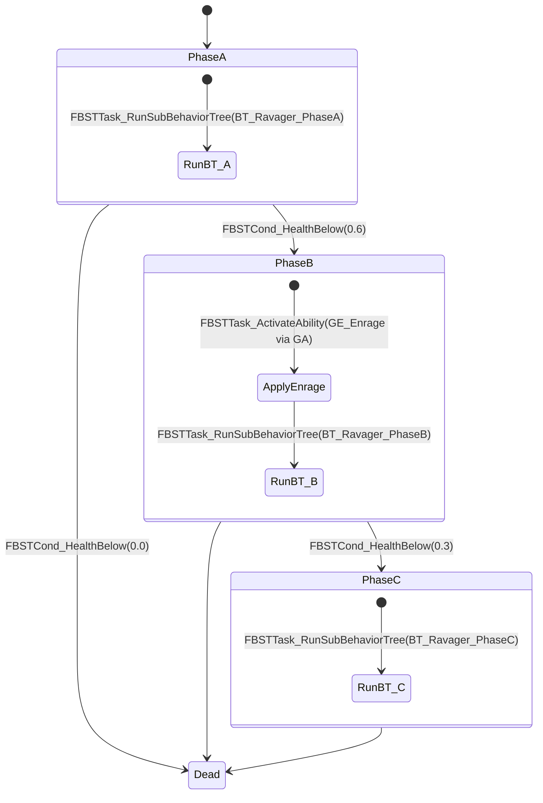
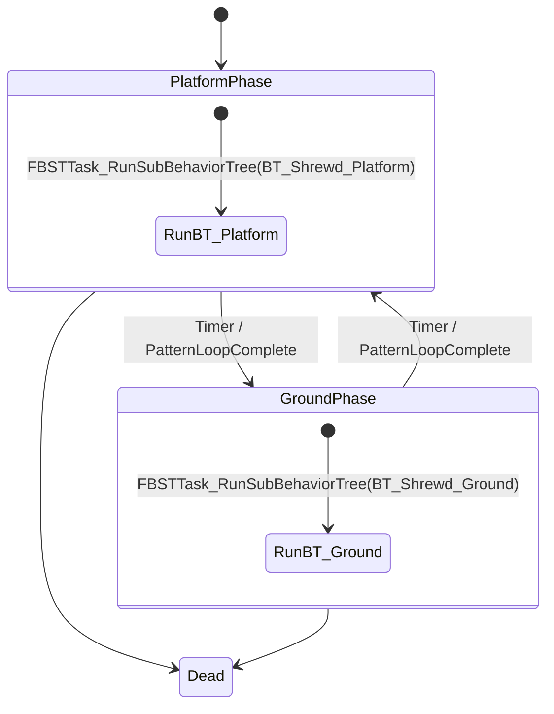
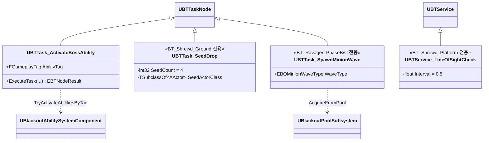

# AI/Boss — 04. StateTree 자산 + 보스 페이즈별 하위 BehaviorTree

> 미니언은 **순수 StateTree**, 보스는 **StateTree(페이즈) + 하위 BT(페이즈별 패턴)** 하이브리드.
> TDD v5 §6 확장 설계.

## 자산 매핑

| 에셋 | 종류 | 대상 | 책임 |
|---|---|---|---|
| `ST_RootHollow` | StateTree | `ABORootHollow` | Chase → Charge → Recover 순환 |
| `ST_RootWraith` | StateTree | `ABORootWraith` | Kite → FireTwinArrows → Teleport 순환 |
| `ST_Shrewd_Phases` | StateTree | `ABOShrewdBoss` | Platform ↔ Ground 페이즈 관리 |
| `BT_Shrewd_Platform` | BehaviorTree | Shrewd Platform 상태 하위 | 원거리 투사체 + LoS 점멸 |
| `BT_Shrewd_Ground` | BehaviorTree | Shrewd Ground 상태 하위 | 근접 AoE + 씨앗 투하 |
| `ST_Ravager_Phases` | StateTree | `ABORavagerBoss` | Phase A/B/C 관리 |
| `BT_Ravager_PhaseA` | BehaviorTree | Ravager Phase A 상태 하위 | DoubleSwipe / TurnBite / Lunge / Howl_Summon |
| `BT_Ravager_PhaseB` | BehaviorTree | Ravager Phase B 상태 하위 | Phase A 전체 + Howl_AoE + 혼합 스폰 |
| `BT_Ravager_PhaseC` | BehaviorTree | Ravager Phase C 상태 하위 | Phase A/B + Gorenado + PillarCharge |

## StateTree 커스텀 Task / Condition / Evaluator

```mermaid
classDiagram
    direction TB

    FStateTreeTaskCommonBase <|-- FBSTTask_MoveToTarget
    FStateTreeTaskCommonBase <|-- FBSTTask_Charge
    FStateTreeTaskCommonBase <|-- FBSTTask_Teleport
    FStateTreeTaskCommonBase <|-- FBSTTask_FireTwinArrows
    FStateTreeTaskCommonBase <|-- FBSTTask_ActivateAbility
    FStateTreeTaskCommonBase <|-- FBSTTask_RunSubBehaviorTree

    FStateTreeConditionCommonBase <|-- FBSTCond_HealthBelow
    FStateTreeConditionCommonBase <|-- FBSTCond_IsOnPlatform
    FStateTreeConditionCommonBase <|-- FBSTCond_HasLineOfSight

    FStateTreeEvaluatorCommonBase <|-- FBSTEval_HealthRatio
    FStateTreeEvaluatorCommonBase <|-- FBSTEval_AggroTarget

    class FBSTTask_MoveToTarget {
        <<이동 Task>>
        +FStateTreeExternalDataHandle~AAIController~ AIController
        +EnterState(...) EStateTreeRunStatus
        +Tick(...) EStateTreeRunStatus
    }

    class FBSTTask_Charge {
        <<Root Hollow 돌진>>
        +float ChargeDistance
        +float StaggerImpulse
    }

    class FBSTTask_Teleport {
        <<Root Wraith / Shrewd LoS 점멸>>
        +float DesiredOffsetRange
        +bool bRequireOutOfSight
    }

    class FBSTTask_FireTwinArrows {
        <<Root Wraith 2연발 투사체>>
        +TSubclassOf~ABOProjectile~ ProjectileClass
        +float IntervalSeconds
    }

    class FBSTTask_ActivateAbility {
        <<GA 기동 공용>>
        +FGameplayTag AbilityTag
        +bool bWaitForEnd
    }

    class FBSTTask_RunSubBehaviorTree {
        <<보스 페이즈 상태 전용>>
        +UBehaviorTree* SubTreeAsset
        +EnterState(...) : Controller.RunSubBehaviorTree
        +ExitState(...) : Controller.StopSubBehaviorTree
    }

    class FBSTCond_HealthBelow {
        <<페이즈 전이 조건>>
        +float Ratio
    }

    class FBSTEval_HealthRatio {
        <<Owner ASC Health/MaxHealth 퍼블리시>>
        +FStateTreeOutputDataHandle~float~ OutRatio
    }

    class FBSTEval_AggroTarget {
        <<AggroComp.GetCurrentTarget 퍼블리시>>
        +FStateTreeOutputDataHandle~APawn~ OutTarget
    }

    FBSTTask_ActivateAbility ..> UBlackoutAbilitySystemComponent : TryActivateAbilitiesByTag
    FBSTTask_RunSubBehaviorTree ..> ABlackoutBossAIController : RunSubBehaviorTree / StopSubBehaviorTree
    FBSTEval_AggroTarget ..> UBlackoutAggroComponent : GetCurrentTarget
```

## 보스 StateTree 페이즈 설계

### `ST_Ravager_Phases`

### `ST_Shrewd_Phases`

## 하위 BT 설계 원칙

- 하위 BT는 **페이즈 전환 관심 없음**. 오직 해당 페이즈의 패턴 선택·실행만 담당. 페이즈 경계 감시는 StateTree가 전담.
- 하위 BT의 **Blackboard는 Controller 소유** (`ABlackoutBossAIController::BlackboardComp`). 핵심 키:
  - `BB_CurrentTarget` (Object) — AggroComp가 `OnTargetChanged`에서 기록
  - `BB_HasLineOfSight` (Bool) — `UBTService_LineOfSightCheck`가 업데이트 (Shrewd 전용)
- 하위 BT 내부는 전통적 Selector / Sequence 구성. Ability 발동은 `UBTTask_ActivateBossAbility(AbilityTag=GA.Ravager.DoubleSwipe)`로 호출.

## 구현 노트

- **StateTree 외부 데이터**: 모든 커스텀 Task는 `FStateTreeExternalDataHandle`로 `AAIController`, `APawn`, `UAbilitySystemComponent`를 주입받음. `InitStateTreeContext`에서 등록.
- **페이즈 전이 원자성**: `FBSTCond_HealthBelow`는 Evaluator(`FBSTEval_HealthRatio`) 출력값을 읽음. Evaluator가 매 Tick Health/MaxHealth를 퍼블리시하여 조건이 즉시 반응.
- **Enrage 적용 위치**: Phase B 진입 시 **StateTree Task로 `GE_Enrage` 적용 후** 하위 BT를 기동. 순서는 State 내부의 Sequential Tasks로 선언.
- **중단·인터럽트**: 보스 사망·씨앗 파괴 완료 등 우선순위 이벤트는 StateTree의 Transition 트리거로 상향. 하위 BT는 상태 이탈 시 `FBSTTask_RunSubBehaviorTree::ExitState`에서 자동으로 `StopTree()` → 리소스 누수 없음.
- **데이터 기반**: 페이즈 컷라인(`FBSTCond_HealthBelow`의 Ratio)은 `UBOBossData::PhaseHealthCutlines` 배열을 StateTree 파라미터로 바인딩하여 주입.
- **하위 BT 재사용**: `UBTTask_ActivateBossAbility`, `UBTService_LineOfSightCheck` 등 기존 BT 노드는 그대로 하위 BT에서 활용. StateTree 측에 중복 구현 불필요(보스 패턴은 BT, 페이즈 관리는 ST로 역할 분리).
- **디버깅**: StateTree Debugger로 페이즈 전이를 시각 추적, 동시에 BT Visual Logger로 하위 패턴 실행을 관찰 — 두 레이어가 독립이므로 로그가 깔끔히 분리됨.
