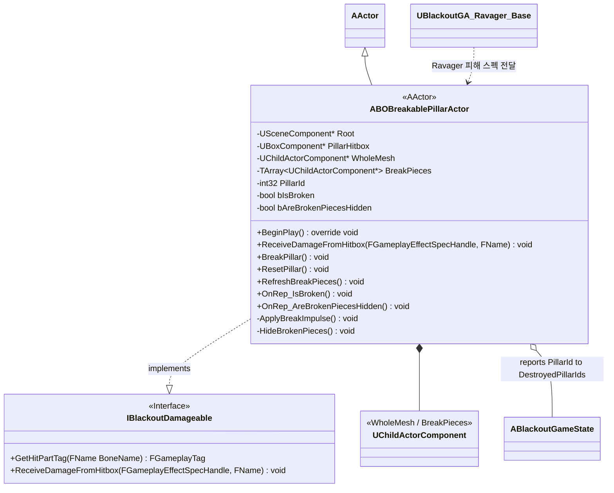
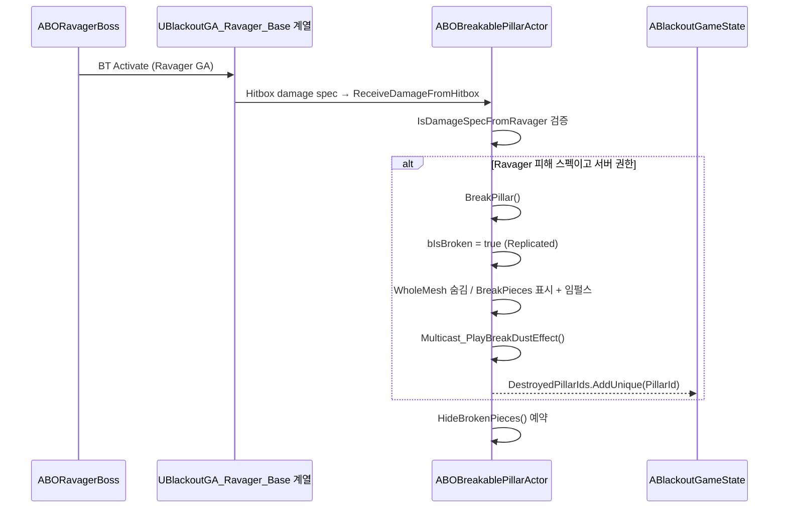

# AI/Boss — 05. 파괴 가능 기둥 (Breakable Pillar)

> TDD v5 §8 참조. 현재 C++ 구현은 `ABOBreakablePillarActor`가 통짜 ChildActor와 파편 ChildActor 목록을 전환하고, Ravager 계열 피해 스펙만 수용해 서버 권한으로 파괴합니다.

## 파괴 플로우

## 구현 노트

- **결정적 상태 복원**: Chaos Geometry Collection 시뮬레이션이 아니라, 사전에 배치된 `WholeMesh`와 `BreakPieces` ChildActorComponent의 표시/물리 상태를 전환합니다. `ResetPillar()`가 파편 트랜스폼을 초기 상태로 되돌립니다.
- **Late-join / 관전자**: 신규 접속자는 `bIsBroken`, `bAreBrokenPiecesHidden` 복제를 통해 `ApplyCurrentState()`에서 현재 기둥 상태를 즉시 맞춥니다.
- **피해 필터**: `ReceiveDamageFromHitbox`는 `IsDamageSpecFromRavager`로 Ravager 계열 피해 스펙만 수용합니다. 플레이어 총격/폭발·다른 GA 히트는 무시합니다.
- **성능 가드**: `BrokenPieceVisibleDuration` 이후 서버가 `HideBrokenPieces()`를 호출하고, `bAreBrokenPiecesHidden` 복제로 클라이언트 표시 상태를 맞춥니다.
- **`ABlackoutGameState::DestroyedPillarIds`**: Phase C 진입 시 Ravager가 이 배열 길이를 참조하여 회피 난이도 로직에 반영할 수 있습니다.
