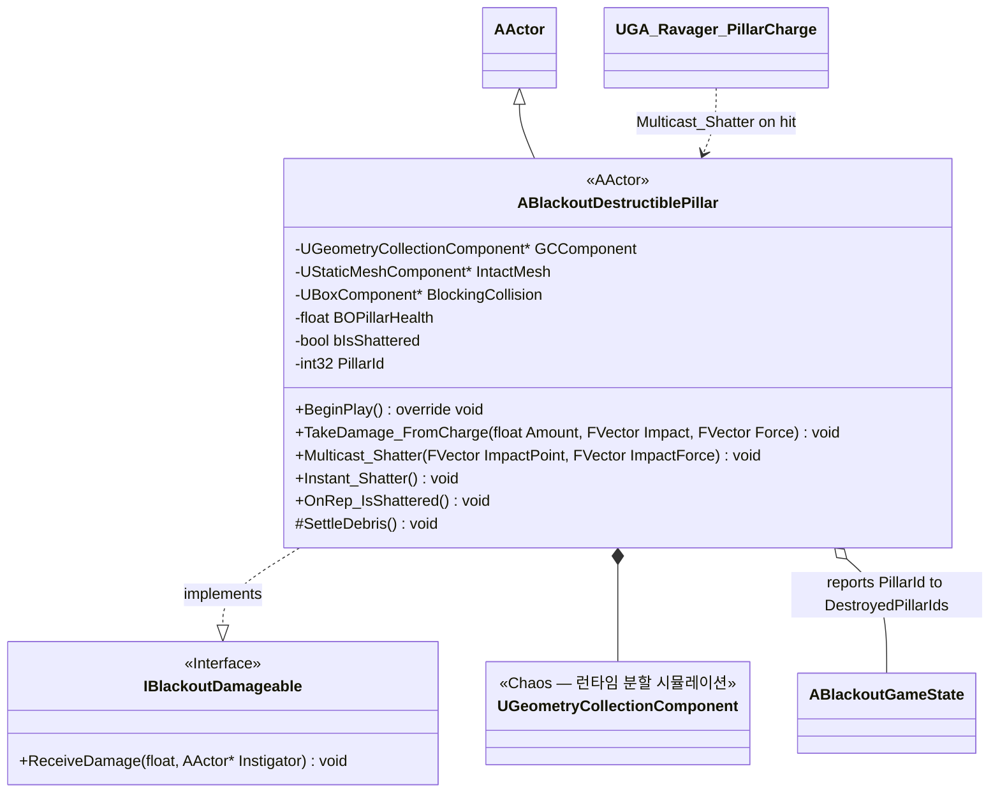
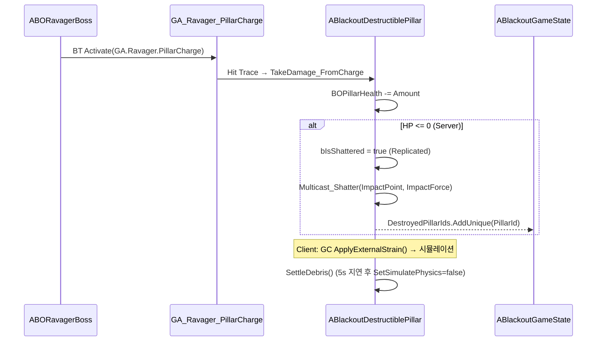

# AI/Boss — 05. 파괴 가능 기둥 (Destructible Pillar)

> TDD v5 §8 참조. Chaos Destruction(Geometry Collection)으로 Ravager의 `GA_Ravager_PillarCharge`에 의해서만 파괴.

## 파괴 플로우

## 구현 노트

- **결정적 시뮬레이션 아님**: Chaos 시뮬레이션은 클라이언트별로 독립 실행. 서버는 `bIsShattered` 플래그만 리플리케이트하여 대역폭 절감.
- **Late-join / 관전자**: 신규 접속자는 `OnRep_IsShattered`에서 `Instant_Shatter()` 호출 → 시뮬레이션 없이 즉시 잔해 상태 스폰.
- **피해 필터**: `TakeDamage_FromCharge`는 `GA_Ravager_PillarCharge` 인스티게이터만 수용. 일반 총격/폭발은 무시 (`IBlackoutDamageable::ReceiveDamage`에서 Instigator 확인).
- **성능 가드**: `SettleDebris()`는 5초 뒤 물리 비활성화. 추가로 8초 경과 잔해는 서버 Tick에서 `SetActorHiddenInGame(true)`.
- **`ABlackoutGameState::DestroyedPillarIds`**: Phase C 진입 시 Ravager가 이 배열 길이를 참조하여 회피 난이도 로직 (예: 카메라 세이프티 영역 축소)에 반영.
