# AI/Boss — 06. 의존 관계 및 구현 순서

> 전체 AI/Boss 레이어가 어떻게 맞물리는지, 그리고 어떤 순서로 구현하면 블로킹 없이 진행되는지 요약.
> **AI 프레임워크: 미니언 = 순수 StateTree, 보스 = StateTree(페이즈 + 어그로 Evaluator) + 하위 BT(페이즈별 패턴).**

## 의존 그래프

```mermaid
classDiagram
    direction LR

    class FoundationLayer {
        <<선행>>
        ABlackoutEnemyCharacter
        IBlackoutPoolableInterface
        UBlackoutPoolSubsystem
        UBlackoutBaseAttributeSet
        UBOMinionData / UBOBossData
    }

    class CombatLayer {
        <<선행>>
        GE_Damage
        ExecCalc_DamageCalc
        UBlackoutHitboxComponent
    }

    class AIControllerLayer {
        ABlackoutAIController (StateTreeAIComp)
        ABlackoutMinionAIController
        ABlackoutBossAIController (+BTComp,BBComp)
    }

    class StateTreeAssets {
        ST_RootHollow / ST_RootWraith
        ST_Shrewd_Phases / ST_Ravager_Phases
        FBSTTask_* / FBSTCond_*
        FBSTEval_HealthRatio
        FBSTEval_AggroTarget ★ 어그로 평가 전담
    }

    class SubBTAssets {
        BT_Shrewd_Platform / Ground
        BT_Ravager_PhaseA/B/C
        UBTTask_ActivateBossAbility
        UBTService_LineOfSightCheck
    }

    class CharacterLayer {
        ABORootHollow / ABORootWraith
        ABlackoutBossCharacter
        ABOShrewdBoss / ABORavagerBoss
    }

    class AbilityLayer {
        GA_Shrewd_*
        GA_Ravager_*
    }

    class PillarLayer {
        ABlackoutDestructiblePillar
        GameState::DestroyedPillarIds
    }

    FoundationLayer --> CharacterLayer
    FoundationLayer --> AIControllerLayer
    CombatLayer --> AbilityLayer
    CombatLayer --> PillarLayer
    AIControllerLayer --> StateTreeAssets : StateTreeAIComp.StartLogic
    StateTreeAssets --> SubBTAssets : FBSTTask_RunSubBehaviorTree
    AIControllerLayer --> SubBTAssets : BehaviorTreeComp (보스 전용)
    CharacterLayer --> StateTreeAssets : ST 에셋 참조
    StateTreeAssets --> AIControllerLayer : FBSTEval_AggroTarget → WriteTargetToBlackboard
    AbilityLayer --> CharacterLayer : GrantedAbilities
    AbilityLayer --> PillarLayer : GA_Ravager_PillarCharge
    SubBTAssets --> AbilityLayer : UBTTask_ActivateBossAbility
    StateTreeAssets --> AbilityLayer : FBSTTask_ActivateAbility (미니언 공격)
    CombatLayer --> StateTreeAssets : GE_Damage → ASC Delegate → FBSTEval_AggroTarget
```

## 권장 구현 순서

| 단계 | 작업 | 산출물 | 검증 |
|---|---|---|---|
| 1 | `ABlackoutAIController` 베이스 + `UStateTreeAIComponent` 부착 | 02 | Pawn Possess 시 StateTree 시작 로그 |
| 2 | StateTree 공용 기반 Task/Cond/Eval(`FBSTTask_ActivateAbility`, `FBSTEval_HealthRatio` 등) | 03 | 빈 ST에서 Ability 발동 테스트 |
| 3 | `ABORootHollow` + `ST_RootHollow` + `FBSTTask_Charge` | 01, 03 | 더미 플레이어 추격·돌진 |
| 4 | `ABORootWraith` + `ST_RootWraith` + `FBSTTask_Teleport` / `FBSTTask_FireTwinArrows` | 01, 03 | 2연발 후 시야 밖 점멸 |
| 5 | `ABlackoutBossCharacter` 추상 베이스 + 페이즈 enum/이벤트 | 01 | HP 비율 컷라인 돌파 시 `OnPhaseChanged` 호출 |
| 6 | `ABlackoutBossAIController` + `BTComp`/`BBComp` + `WriteTargetToBlackboard` | 02 | BB 키 수동 기록 테스트 |
| 7 | **`FBSTEval_AggroTarget` Evaluator** (누적 피해 추적·감쇠·3순위 선정·BB 기록) | 03 | 피해 집중 플레이어로 타겟 전환·쿨다운·감쇠 동작 확인 |
| 8 | `FBSTTask_RunSubBehaviorTree` + `FBSTCond_HealthBelow` 구현 | 03 | 빈 ST(PhaseA→B)에서 하위 BT 기동/정지 전이 |
| 9 | `ABOShrewdBoss` + `ST_Shrewd_Phases` + `BT_Shrewd_Platform`/`Ground` + Shrewd GA | 01, 03, 04 | 발판/지면 교대, LoS 점멸, 씨앗 무적 |
| 10 | `ABORavagerBoss` + `ST_Ravager_Phases` + `BT_Ravager_PhaseA` + Phase A GA 세트 | 01, 03, 04 | Phase A 패턴 순환 |
| 11 | `BT_Ravager_PhaseB` + `GE_Enrage` + `GA_Ravager_Howl_AoE` (Phase B 전이) | 04 | 페이즈 전환 연출, 혼합 스폰 |
| 12 | `BT_Ravager_PhaseC` + `GA_Ravager_Gorenado` + PlayRate 승수 | 04 | Phase C 궁극기 동작 |
| 13 | `ABlackoutDestructiblePillar` (Chaos Geometry Collection) | 05 | `GA_Ravager_PillarCharge` 히트로만 파괴 |
| 14 | `GameState::DestroyedPillarIds` 동기화 + Phase C 난이도 반영 | 05 | Late-join 시 잔해 재현 |

## 핵심 교차 검증 포인트

- **StateTree ↔ 하위 BT 경계**: 페이즈 전이는 **오직 StateTree만** 수행하도록 강제. 하위 BT에서 페이즈 변경을 시도하는 노드가 없어야 함(그렇지 않으면 두 레이어가 상태를 경쟁).
- **어그로 Evaluator ↔ BB**: `FBSTEval_AggroTarget::Tick` → `Controller->WriteTargetToBlackboard` → 하위 BT가 `BB_CurrentTarget`을 읽는 단일 경로만 존재. 컴포넌트·델리게이트 중간 계층 없음.
- **StateTree 외부 데이터 수명**: `FStateTreeExternalDataHandle`로 주입되는 ASC·Controller·BossData는 Pawn/Controller 수명 동안 유효해야 함 — 풀 반환 시점(보스는 풀 미대상이지만 안전 가드 목적)에 StateTree를 먼저 Stop.
- **서버 권한**: Evaluator의 `HandleDamageReceived`는 서버 ASC 델리게이트에서만 호출됨. 클라이언트 ST 인스턴스에서는 `TreeStart` 시 NM_Client 가드로 조기 리턴.
- **풀링 ↔ 스폰**: `GA_Ravager_Howl_Summon` 또는 `UBTTask_SpawnMinionWave`는 `UBlackoutPoolSubsystem::AcquireFromPool` 경유. 직접 `SpawnActor` 금지(TDD §12).
- **데이터 기반**: 어그로 파라미터, 페이즈 컷라인, 패턴 데미지는 모두 `UBOBossData`에서 주입. StateTree 파라미터 바인딩으로 노출하여 BP·에디터에서 수정 가능.
- **디버깅 분리**: 페이즈 전이 문제는 StateTree Debugger, 패턴 선택 문제는 BT Visual Logger로 각각 격리 추적.
