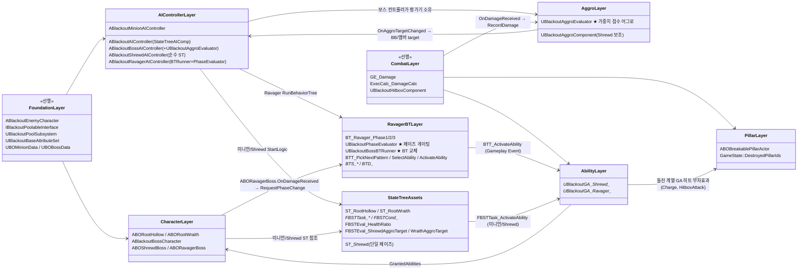

# AI/Boss — 06. 의존 관계 및 구현 순서

> 전체 AI/Boss 레이어가 어떻게 맞물리는지, 그리고 어떤 순서로 구현하면 블로킹 없이 진행되는지 요약.
> **AI 프레임워크 (v6): 미니언 = 순수 StateTree, 중간 보스(Shrewd) = 순수 StateTree, 메인 보스(Ravager) = 순수 BehaviorTree(C++ `UBlackoutPhaseEvaluator` 페이즈 관리 + `UBlackoutBossBTRunner` 페이즈별 BT 교체). 어그로는 컨트롤러 소유 `UBlackoutAggroEvaluator`.**

## 의존 그래프

## 권장 구현 순서

| 단계 | 작업 | 산출물 | 검증 |
|---|---|---|---|
| 1 | `ABlackoutAIController` 베이스 + `UStateTreeAIComponent` 부착 | 02 | Pawn Possess 시 StateTree 시작 로그 |
| 2 | StateTree 공용 기반 Task/Cond/Eval(`FBSTTask_ActivateAbility`, `FBSTEval_HealthRatio` 등) | 03 | 빈 ST에서 Ability 발동 테스트 |
| 3 | `ABORootHollow` + `ST_RootHollow` + `FBSTTask_Charge` | 01, 03 | 더미 플레이어 추격·돌진 Stagger |
| 4 | `ABORootWraith` + `ST_RootWraith` + `FBSTTask_Teleport` / `FBSTTask_FireTwinArrows` / **`FBSTTask_BowShove`** | 01, 03 | 2연발 후 시야 밖 점멸, 근접 감지 시 활대 밀치기 |
| 5 | `ABlackoutBossCharacter` 추상 베이스 + 페이즈 enum/피격 이벤트 | 01 | HP 비율 변화 시 `OnDamageReceived` 호출 |
| 6 | `ABlackoutBossAIController` + `UBlackoutAggroEvaluator` 소유 + `HandleAggroTargetChanged` | 02 | 타겟 변경 델리게이트 수신 테스트 |
| 7 | **`UBlackoutAggroEvaluator`** (슬라이딩 윈도우 DPS + 가중치 점수 + 태그 게이팅) | 02, 03 | 피해 집중 플레이어로 타겟 전환·무효 시 즉시 재선정 확인 |
| 8 | `ABlackoutShrewdAIController` + `ST_Shrewd` + Shrewd GA(`FireExplosiveArrow`, `FireStraightArrow`, `TeleportToPoint`, `TeleportByEQS`) | 01, 02, 03, 04 | 순수 StateTree로 원거리 화살·텔레포트 패턴 순환 |
| 9 | `UBlackoutPhaseEvaluator` + `UBlackoutBossBTRunner` + `ABlackoutRavagerAIController` 배선 | 02, 03 | `RequestPhaseChange`로 페이즈 BT 교체, `Ability.PhaseLock` 중 전환 시점 제어 |
| 10 | `ABORavagerBoss` + `DetermineTargetPhase` + `BT_Ravager_Phase1/2/3` + Ravager GA 세트(`BasicAttack`, `ChaseAttack`, `Charge`, `Shockwave`, `EnergyBurst`, `Gorenado`, `SummonMinion`) | 01, 03, 04 | HP 컷라인 돌파 시 페이즈별 패턴 순환 |
| 11 | `UBlackoutGA_Ravager_SummonMinion` + 풀 서브시스템 스폰 경로 | 04 | 일반+엘리트 혼합 스폰 |
| 12 | `ABOBreakablePillarActor` + Ravager GA 피해 스펙 연결 | 05 | Phase A/B 전투 중 기둥 순차 파괴 |
| 14 | `GameState::DestroyedPillarIds` 동기화 + Phase C 난이도 반영 | 05 | Late-join 시 잔해 재현 |

## 핵심 교차 검증 포인트

- **페이즈 전환 경계(Ravager)**: 페이즈 전환은 `UBlackoutPhaseEvaluator`가 수행합니다. 패턴 BT는 페이즈를 직접 바꾸지 않으며, `Ability.PhaseLock` 태그가 패턴 시전 중 전환 적용 시점을 조절해 두 페이즈 BT가 경쟁하지 않게 합니다.
- **어그로 Evaluator ↔ 타겟 소비**: `UBlackoutAggroEvaluator`가 타겟을 계산해 `OnAggroTargetChanged`로 알리면 컨트롤러가 소비합니다(Ravager: Blackboard `Target` / Shrewd: 멤버 `CurrentAggroTarget`). Shrewd StateTree Evaluator는 Pawn의 `UBlackoutAggroComponent`에서 현재 타겟을 읽습니다.
- **외부 데이터 수명**: StateTree(미니언/Shrewd) `FStateTreeExternalDataHandle`로 주입되는 ASC·Controller는 Pawn/Controller 수명 동안 유효해야 함 — 미니언 풀 반환 시점에 StateTree를 먼저 Stop.
- **서버 권한**: `RecordDamage`/평가는 서버 ASC 경로에서만 호출됨. 클라이언트 AI 인스턴스에서는 조기 리턴 가드.
- **풀링 ↔ 스폰**: `UBlackoutGA_Ravager_SummonMinion`은 `UBlackoutPoolSubsystem` 경유로 미니언을 꺼냅니다. 직접 `SpawnActor`는 특수 연출/비풀링 대상에만 제한합니다.
- **기둥 파괴 경로**: 별도 전용 GA에 의존하지 않고, Ravager 돌진/히트박스 계열 GA(`Charge`, `HitboxAttack`)의 피해 스펙이 `ABOBreakablePillarActor`에 들어오면 서버에서 출처를 검증한 뒤 `BreakPillar()`를 호출합니다.
- **어그로 튜닝 위치**: 가중치(`DPSWeight`/`DistanceWeight`/`LowHPWeight`)·윈도우·사거리는 `UBlackoutAggroEvaluator` 인스턴스에 노출됩니다. `UBOBossData`의 어그로 필드는 평가기가 참조하지 않는 잔여 항목.
- **데이터 기반**: 페이즈 컷라인·부위 배율·패턴 데미지는 `UBOBossData`(또는 Ravager 전용 `UBORavagerStatData`/`UBORavagerPatternData`)에서 주입.
- **디버깅 분리**: 미니언/Shrewd는 StateTree Debugger, Ravager 페이즈/패턴은 BT Visual Logger로 격리 추적.
