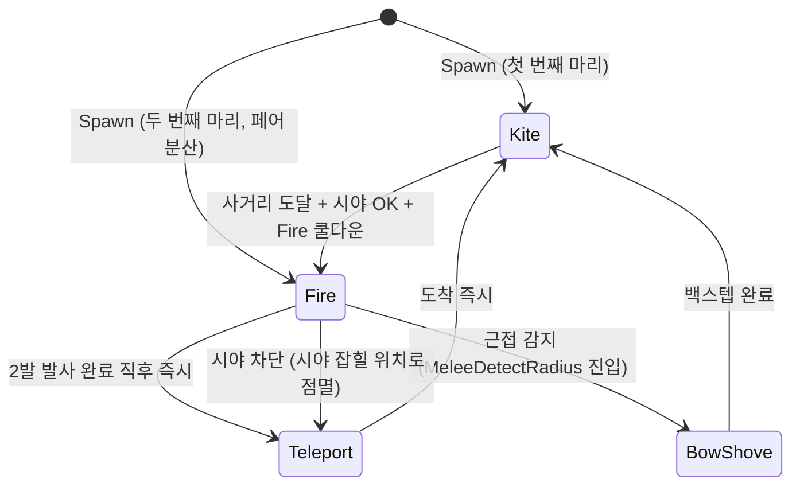

# AI/Boss — 07. 패턴 설계 — Root Wraith (정예 미니언)

> `ABORootWraith` 의 행동·수치·역할 정의. 클래스 / StateTree 자산은 01·03 문서, 본 문서는 **언제 / 어떻게 / 왜** 발동하는지의 기획 결정.

---

## 0. 역할 강제 의도

Root Wraith 는 단순 적이 아니라 **C 캐릭터(저격) 의 탄약 / 회복 자원 수급 채널**.

- C 가 정예 헤드샷을 못 따면 4인 팀 전체 탄약 부족 → 페이즈 진행 막힘
- 따라서 "정예" 정의는 단순 강함이 아니라 **이 자원 채널을 구성하는 적의 역할**
- 다른 직업이 잡으면 비용 들고 보상 없음 → 자연스럽게 C 픽 우선순위 + 분업 자율 학습

이 의도가 HP 320, 헤드샷 1발 즉살, 페어 1쌍씩 4마리, 일반 처치 시 드랍 없음의 근거입니다.

---

## 1. 정체성 — 의도한 플레이어 경험

- **위치 압박**: 텔레포트로 팀 진영 분산 강요. 무시하면 후방 갉아먹힘
- **흐름 끊기**: 보스 패턴 회피 중 갑자기 화살
- **공중 부유**: 일반 미니언과 시각·공간 분리. 안개 위 활잡이 톤

텔레포트 등장 → 화살 조준 선딜 1초 사이의 헤드샷 기회.

---

## 2. 출현 / 빈도

- Phase B / C 안개 속 또는 일반 미니언 틈새에 페어(2마리) 로 등장
- 페이즈당 페어 1쌍 = 메인보스 1회분 총 4마리 (시작값, 플레이테스트로 1~2마리 단위 조정)

### EQS — 스폰 위치 선정

`EQT_RootWraith_SpawnSpot` 도입. 페이즈 B/C 진입 시 페어 2마리의 스폰 위치 결정.

| 단계 | 내용 |
|---|---|
| Generator | 보스 주변 도넛 (15~25m 반경) |
| Test 1 | NavMesh 위 |
| Test 2 | 가장 가까운 플레이어와 12m+ 떨어짐 (인접 매복 방지) |
| Test 3 | 보스 충돌체 5m+ 떨어짐 |
| Test 4 | 플레이어 시점에서 시야 차단 (안개·기둥·지형에 가려짐) |
| Test 5 | 첫 번째 Wraith 와 반대편 플랭크 (각도 120도+) |
| Score | 안개 영역·어두운 곳 가중치 |

두 번째 Wraith 는 첫 번째 Wraith 위치를 입력으로 받아 Test 5 적용 → 양쪽 협공 자동 배치. 안개 속 등장으로 첫 사격까지 발견 지연.

---

## 3. 상태 전이

### 머신



### 전이 조건

| 전이 | 조건 |
|---|---|
| Kite → Fire | 플레이어와 10~15m + 시야 확보 + Fire 쿨다운 OK |
| Fire → Teleport | 2연발 발사 완료 직후. 추가 조건 없음 |
| Fire → BowShove | `MeleeDetectRadius(3m)` 진입 시 Fire 도중이라도 즉시 캔슬 |
| Fire → Teleport (예외) | 사격 중 시야 차단 시 즉시 점멸 |
| BowShove → Kite | 백스텝 (`PostShoveBackstepDistance` 5m) 완료 후 |

### EQS — 텔레포트 위치 선정

`EQT_RootWraith_TeleportSpot` 도입. 사이클마다 점멸 위치 결정.

| 단계 | 내용 |
|---|---|
| Generator | 현재 타겟 플레이어 주변 도넛 (10~15m 반경) |
| Test 1 | NavMesh 위 |
| Test 2 | 보스 충돌체 5m+ 떨어짐 |
| Test 3 | 후보 → 플레이어 시야 확보 |
| Test 4 | 플레이어-보스 축 기준 보스 뒤편 아닌지 (Dot product 거름) |
| Test 5 | 다른 Wraith 와 3m+ 분산 |
| Score | 플레이어-보스 축에서 90~135도 측면 플랭크 위치 가산점 |

`FBSTTask_Teleport` 가 EQS 비동기 호출 → 결과 위치로 텔레포트.

---

## 4. 패턴별 타이밍 · 예고 · 회피

### Fire (2연발 화살)

| 단계 | 시간 | 시각 단서 | 회피 가능? |
|---|---|---|---|
| 조준 선딜 | 0.8~1.0초 | 조준선 + 활시위 당기는 모션 + 헤드 노출 | — (헤드샷 윈도우) |
| 1발 발사 | 즉시 | 화살 사출 VFX | 측면 회피·구르기 |
| 인터벌 | 0.3초 | 활시위 재장전 모션 | — |
| 2발 발사 | 즉시 | — | 측면 회피·구르기 |
| 후딜 | ~0 | — | (즉시 Teleport) |

조준 선딜 0.8~1.0, 짧으면 C 도 못 맞춤.

### Teleport (점멸)

| 단계 | 시간 | 시각 단서 | 무적? |
|---|---|---|---|
| 출발 예고 | 0.2~0.3초 | 본체 점멸 + VFX 수축 | 무적 진입 직전 |
| 비행 | 0.3~0.5초 | 본체 사라짐 | 무적 |
| 도착 예고 | 0.2초 | 도착 위치 VFX (잔상 / 안개) | 무적 |
| 본체 등장 | 즉시 | 본체 출현 | 해제 (헤드샷 가능) |

도착 예고 0.2초 — 플레이어에게 다음 위치 단서 제공. 비행 중 무적은 EQS 가 거른 후에도 발생할 위치 충돌 (보스 패턴이 점멸 위치 덮음) 방지용.

### BowShove (활대 밀치기)

| 단계 | 시간 | 시각 단서 | 회피 가능? |
|---|---|---|---|
| 선딜 | 0.4초 | 활대 들어올리는 모션 + 자세 전환 | 회피창 |
| 임팩트 | 0.1초 | 활대 휘두름 + 임펄스 | 늦으면 피격 |
| 후딜 | 0.5초 | 자세 복귀 + 백스텝 시작 | — |

선딜 0.4초가 평균 반응 시간 + 회피 모션 시작에 충분.

### 회피 창 일관성

3 패턴 모두 선딜 ≥ 0.4초 + 명확한 시각 단서 + 회피 가능 만족.

---

## 5. 페어 행동 동기화

### 사이클 분산 — 초기 상태 분기

페어 스폰 시 두 마리가 다른 단계에서 출발:

- 첫 번째 Wraith → 즉시 Kite 시작 (사거리 잡는 중 그림)
- 두 번째 Wraith → 즉시 Fire 시작 (이미 잠복 사격 중 그림)

`ABlackoutMinionAIController` 가 spawn 순서별로 StateTree initial state 다르게 set. 처음부터 자연스러운 어긋남.

### 어그로 분배

각 마리가 다른 플레이어를 타겟. 어그로 평가 시 둘이 같은 타겟 선택하면 한 마리는 다음 후보로 강제 전환. 4인 팀 진영 분산 강제.

### 사이클 결과

```
시간축:   t=0     t=1     t=2     t=3     t=4
A 마리:  Kite ─→ Kite ─→ Fire ─→ Tele ─→ Kite
B 마리:  Fire ─→ Tele ─→ Kite ─→ Kite ─→ Fire
```

→ 화살이 약 2초마다 한 명씩 → 지속 압박감 유지.

---

## 6. 수치

### HP

| 항목 | 값 | 근거 |
|---|---|---|
| 일반 미니언 HP | 100 (기준선) | — |
| Root Wraith HP | 320 | 일반 미니언 3.2배. 정예 체감 + 답답하지 않음 |

처치 시나리오:

- C 저격 헤드샷 1발 = 즉살 (헤드 데미지 320)
- C 저격 일반 부위 = 4발
- A SMG = 30~40발 (5~7초 지속 사격)
- B 유탄 직격 = 2발

헤드샷 1발 즉살이 핵심 — C 픽의 시간 효율 보장.

### 데미지 (Wraith → Player)

| 패턴 | 데미지 (HP %) | 추가 효과 |
|---|---|---|
| 화살 1발 | 10~12% | — |
| 2연발 합 | 20~24% | — |
| BowShove 임팩트 | 5~8% | knockback + 짧은 stagger (~0.4초) |

페어 동시 사격 한 명 집중 시 사이클당 ~48% — 위치 분산 강제. 1발 회피만으로 12% 손실 → 회복 가능.

### 사거리 / 이동 (UE 표준 cm)

| 항목 | 값 |
|---|---|
| Fire 화살 사거리 | 2000 (20m) |
| 화살 속도 | 2000 cm/s |
| `MeleeDetectRadius` | 300 (3m) |
| `ShoveRange` | 250 (2.5m) |
| `PostShoveBackstepDistance` | 500 (5m) |
| `DesiredOffsetRange` (Teleport) | 800~1200 |
| Wraith 간 최소 거리 (EQS) | 300 (3m) |
| Kite 이동 속도 | 350 cm/s |
| Fire 정지 | 0 cm/s |

### 수직 위치 (공중 부유)

일반 미니언은 발 아래 통과 가능 / 플레이어는 통과 불가 높이.

| 항목 | 값 (Z, cm) | 비고 |
|---|---|---|
| 본체 중심 | 200 (2m) | 일반 미니언 머리 위 |
| 헤드 (약점) | 250 (2.5m) | 플레이어 눈높이(~180) + α — C 정밀 사격 각도 |
| 콜리전 하단 (발) | 150 (1.5m) | 플레이어 통과 차단 임계 |

공중 부유로 일반 미니언 / 보스와 점유 공간 자연 분리 → EQS 위치 선정 제약 가벼움.

---

## 7. 약점 / 사망 보상

### 약점

- 헤드 = 치명타 hitbox. 별도 노출 창 없음 — Fire 조준 선딜 1초가 사실상 기회
- 헤드 hit = 데미지 320 (헤드샷 1발 즉살)
- 일반 부위 hit = 데미지 80

### 사망 보상

| 처치 방식 | 드랍 |
|---|---|
| C 헤드샷 치명타 | 탄약 박스(중) + 회복약 1 |
| 일반 처치 (모든 직업) | 드랍 없음 |
| AoE 다중 포함 처치 (B) | B 멀티킬 룰 적용 |

일반 처치 시 드랍 없음 = "역할대로 안 잡으면 자원 안 떨어짐" 의 시스템적 강제.

### 사망 연출

- 피격 → 즉시 hit reaction (짧은 stagger 모션)
- 사망 → 본체 점멸하며 사라짐 (Teleport VFX 재활용)
- 풀 반환 (`UBlackoutPoolSubsystem`)

시체 잔존 X — 유령 톤 + 풀링 효율 + 시각적 깔끔함.

---

## 8. 협업 합의 필요 항목

- 보스 담당자: Phase B/C 정예 페어 1쌍씩 스폰 가정 OK
- C 캐릭터 담당자: 저격 단발 데미지 80 / 헤드샷 320 가정과 무기 GA 수치 정합
- A·B 담당자: 일반 미니언 HP 100 가정과 정합
- 보스 담당자: 보스 메인 공격 데미지가 화살(10~12%) 보다 충분히 큰지 (보스가 메인 위협 유지)

---

## 10. 우선순위 / 플레이테스트 조정 대상

가장 민감한 수치 3가지 (먼저 조정):

1. HP 320 — 너무 높으면 (500) C 외 답답, 너무 낮으면 (200) 차별 약화
2. 화살 데미지 10~12% — 페어 동시 사격 즉사급이면 강함, 약하면 무시 가능
3. `MeleeDetectRadius` 3m — BowShove 트리거 빈도

이외 (이동 속도, 사거리, 백스텝 거리) 는 한 번 잡으면 잘 안 흔들리는 영역.
