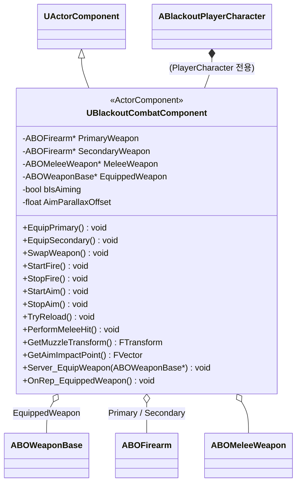

# Combat — 01. 전투 컴포넌트 (Combat Component)

> TDD v5 §2 "플레이어 전용 무기 행동 분리" 참조. 플레이어 캐릭터에만 부착, 조준/사격/장전/무기 스왑 등 입력-무기 중계 허브.

## 구현 노트

- **부착 대상**: `ABlackoutPlayerCharacter`에만 부착. 적 캐릭터는 본 컴포넌트 없음.
- **크로스헤어 보정(TDD §10.3)**: `GetAimImpactPoint()`가 카메라 전진 라인트레이스 결과를 반환하여 `UW_Crosshair`의 True Impact Indicator에 사용됨.
- **무기 스왑**: `Server_EquipWeapon` RPC → `EquippedWeapon` replicated → `OnRep_EquippedWeapon`에서 3인칭 모델 attach 처리.
- **GAS 연결**: 입력(StartFire/TryReload 등)은 대응 `UBlackoutGameplayAbility`를 `TryActivateAbilityByClass`로 기동. 비용·쿨다운·Cost 체크는 GA 레이어에서 담당(본 컴포넌트는 상태 미보유).
- **조준 상태**: `bIsAiming` 는 GA에서도 조회 가능하도록 `Replicated`. IK/Aim Offset BP에서 바인딩.
