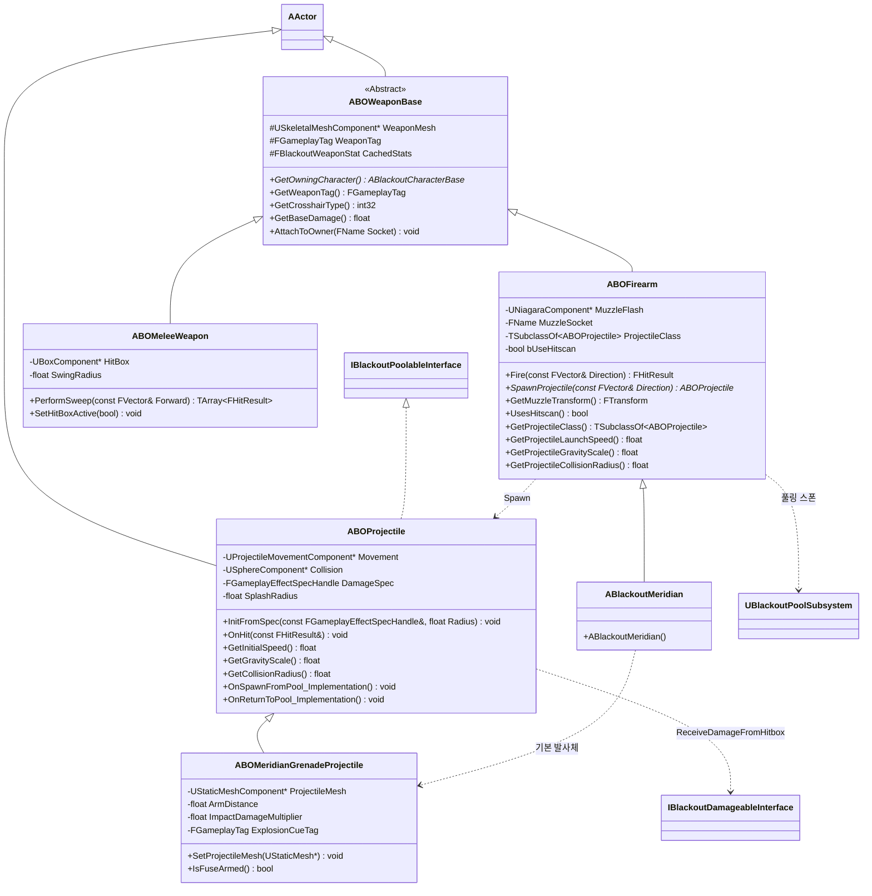

# Combat — 02. 무기 계층 (Weapon Hierarchy)

> TDD v5 §2.3, §4.1 참조. 무기는 `AActor` 기반. 총기/근접/투사체로 분기. 투사체는 풀링 대상.

## 구현 노트

- **데이터 소싱**: 생성자/BeginPlay에서 `WeaponTag`를 키로 `DT_WeaponStats` 조회 → `CachedStats` 에 복사. HUD 크로스헤어 종류(`CrosshairType`, 0~5)도 공통 무기 스탯으로 함께 제공.
- **Hitscan vs Projectile**: `bUseHitscan = true`면 `LineTraceByChannel`, false면 `ABOProjectile` 을 풀에서 스폰.
- **투사체 풀링**: `ABOProjectile`은 `IBlackoutPoolableInterface` 구현. `UBlackoutPoolSubsystem::SpawnFromPool`로 획득.
  - `OnSpawnFromPool`: Collision/Movement 리셋, `DamageSpec` 주입
  - `OnReturnToPool`: Movement 정지, Collision 비활성화, `DamageSpec` 초기화
- **근접 무기**: `ABOMeleeWeapon::PerformSweep` 결과는 `GA_Melee_Player` 가 수신 → `GE_Damage` 적용.
- **투사체 데미지 전달**: `ABOProjectile`은 `SpecHandle`만 보관하고, `OnHit` 시점에 `IBlackoutDamageableInterface::ReceiveDamageFromHitbox(SpecHandle, BoneName)` 를 호출.
- **메리디안 유탄발사기**: `ABlackoutMeridian`은 `ABOFirearm` 기반의 비히트스캔 보조무기이며, 기본 `ProjectileClass`로 `ABOMeridianGrenadeProjectile`을 사용.
- **착탄 예측 데이터 제공**: `UBlackoutImpactIndicatorComponent`가 투사체 예측 착탄점을 계산할 수 있도록 `ABOFirearm`/`ABOProjectile`은 초기 속도, 중력 스케일, 충돌 반경을 조회할 수 있는 읽기 전용 API를 제공합니다.
