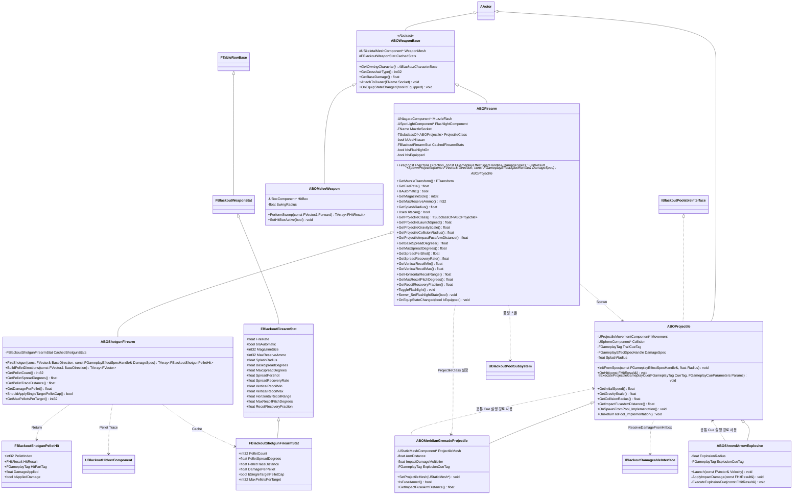

# Combat — 02. 무기 계층 (Weapon Hierarchy)

> TDD v5 §2.3, §4.1 참조. 무기는 `AActor` 기반. 총기/근접/투사체로 분기. 투사체는 풀링 대상.

## 구현 노트

- **데이터 소싱**: 각 무기 클래스의 `FDataTableRowHandle`이 지정한 스탯 행을 `BeginPlay` 시점에 조회 → `CachedStats` / `CachedFirearmStats` 에 복사. HUD 크로스헤어 종류(`CrosshairType`, 0~5)도 공통 무기 스탯으로 함께 제공.
- **Hitscan vs Projectile**: `bUseHitscan = true`면 `LineTraceByChannel`, false면 `ABOProjectile` 을 풀에서 스폰.
- **산탄 전용 분기**: `ABOShotgunFirearm`은 `ABOFirearm`의 히트스캔 계열 하위 클래스입니다. 탄약은 발사 1회당 1발만 차감하고, `PelletCount`만큼 원뿔 분포 방향을 생성해 각 펠릿별 라인트레이스를 수행합니다.
  - `FBlackoutShotgunPelletHit`은 펠릿 인덱스, 히트 결과, 부위 태그, 실제 적용 피해량을 묶어 `UBlackoutGA_FireWeapon`과 디버그/보상 집계가 같은 이벤트를 추적할 수 있게 합니다.
  - `bSingleTargetPelletCap`이 켜진 경우 동일 타겟에 적용되는 최대 펠릿 수를 `MaxPelletsPerTarget`으로 제한하여 근접 보스 대상 폭딜을 튜닝할 수 있습니다.
  - 포자피개/더블 배럴은 `FBlackoutShotgunFirearmStat` 행으로 `PelletCount`, `PelletSpreadDegrees`, `DamagePerPellet`, `PelletTraceDistance`를 각각 튜닝합니다.
- **투사체 풀링**: `ABOProjectile`은 `IBlackoutPoolableInterface` 구현. `UBlackoutPoolSubsystem::SpawnFromPool`로 획득.
  - `OnSpawnFromPool`: Collision/Movement 리셋, `DamageSpec` 주입, 트레일 루핑 Gameplay Cue 활성화 (`EGameplayCueEvent::OnActive` 트리거)
  - `OnReturnToPool`: Movement 정지, Collision 비활성화, `DamageSpec` 초기화, 트레일 루핑 Gameplay Cue 비활성화 (`EGameplayCueEvent::Removed` 트리거)
- **근접 무기**: `ABOMeleeWeapon::PerformSweep` 결과는 `UBlackoutGA_MeleePlayer`가 수신 → `GE_Damage` 적용.
- **투사체 데미지 전달**: `ABOProjectile`은 `SpecHandle`만 보관하고, `OnHit` 시점에 `IBlackoutDamageableInterface::ReceiveDamageFromHitbox(SpecHandle, BoneName)` 를 호출.
- **투사체 GameplayCue 실행 경로**: `ABOProjectile`은 투사체 계열이 공통으로 사용할 `ExecuteProjectileGameplayCue()` 보호 헬퍼를 제공합니다. 이 헬퍼는 `Instigator`/`Owner`가 플레이어 캐릭터인 경우 기존 무기 Cue 멀티캐스트 경로를 사용하고, 그 외에는 `IAbilitySystemInterface`의 ASC 또는 GameplayCueManager fallback으로 실행합니다. 단, 폭발 여부·폭발 반경 피해·신관 조건 같은 판정 책임은 기본 투사체로 올리지 않고 각 하위 클래스가 유지합니다.
- **산탄 데미지 전달**: `ABOShotgunFirearm::FireShotgun`은 펠릿별로 `DamageSpec`을 복제하거나 `Data.Damage`를 펠릿 피해량으로 재설정한 Spec을 사용합니다. 히트박스가 있으면 `UBlackoutHitboxComponent::ReceiveDamageSpec`, 일반 Damageable이면 `ReceiveDamageFromHitbox`로 전달합니다.
- **메리디안 유탄발사기**: 별도 C++ 무기 클래스를 두지 않습니다. `ABOFirearm` 기반 블루프린트/데이터 행에서 `bUseHitscan=false`, `ProjectileClass=ABOMeridianGrenadeProjectile`로 설정해 비히트스캔 보조무기로 구성합니다.
- **슈루드 폭발 화살**: `ABOShrewdArrowExplosive`는 `ABOProjectile` 기반 보스 전용 폭발 투사체입니다. 착탄 즉시 자체 반경 피해를 적용하고 `ExplosionCueTag`를 실행하되, Cue 실행의 네트워크/ASC 경로는 `ABOProjectile`의 공통 헬퍼를 재사용합니다.
- **착탄 예측 데이터 제공**: `UBlackoutImpactIndicatorComponent`가 투사체 예측 착탄점을 계산할 수 있도록 `ABOFirearm`/`ABOProjectile`은 초기 속도, 중력 스케일, 충돌 반경, 충격 신관 활성 거리를 조회할 수 있는 읽기 전용 API를 제공합니다.
