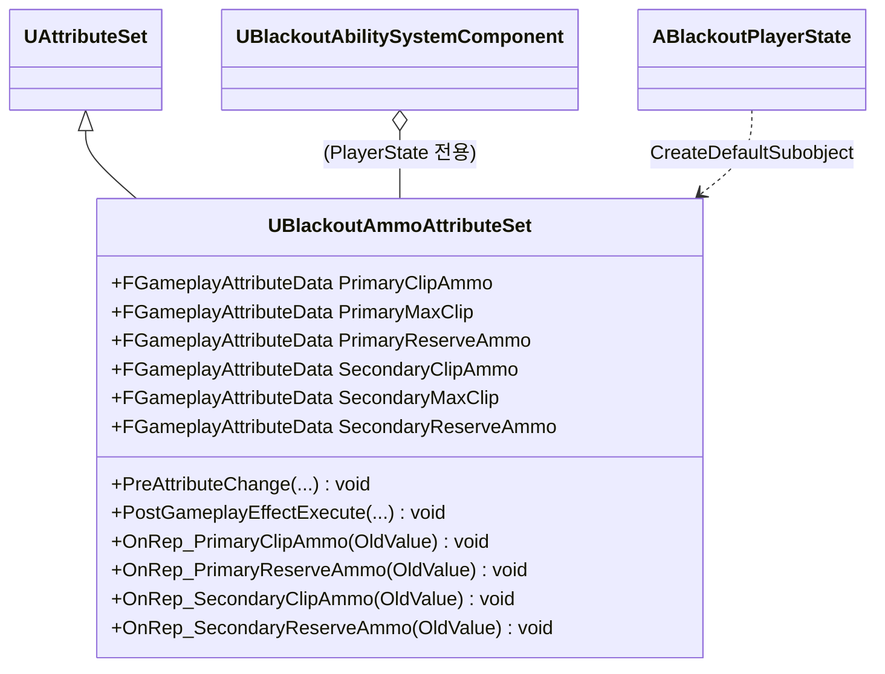

# Combat — 03. 탄약 어트리뷰트 세트 (Ammo AttributeSet)

> TDD v5 §3 참조. 플레이어 전용. 기본 AttributeSet과 분리하여 메모리 최적화 및 순환 참조 방지.

## 구현 노트

- **소유 주체**: `ABlackoutPlayerState` 생성자에서 `CreateDefaultSubobject`. 적 캐릭터는 탄약 개념 없음.
- **Clamp 규칙**: `PreAttributeChange` 에서 `ClipAmmo ≤ MaxClip`, `ReserveAmmo ≥ 0` 클램프.
- **재장전 흐름(TDD §4.1 `UBlackoutGA_Reload`)**:
  1. `UBlackoutGA_Reload` 활성화 → 장전 몽타주 재생
  2. 몽타주 완료 Notify → `ExecCalc_Reload` 실행 (예비탄 차감, 장탄 보충 동시 처리)
  3. `UW_AmmoDisplay` 위젯이 `GetGameplayAttributeValueChangeDelegate` 로 변경 수신 → 갱신
- **주/보조 분리 이유**: 각 무기가 독립적인 예비탄 풀을 가져야 하므로 3쌍 × 2 = 6 어트리뷰트로 구성.
- **GCD 복제**: Player ASC `Mixed` 모드이므로 `OwnerOnly` 복제 가능. 타 플레이어에게 탄약 동기화 불필요.
