# Combat — 04. 전투 게임플레이 어빌리티 (Combat Abilities)

> TDD v5 §4.1 참조. 플레이어 전용 전투 GA 3종. 모두 `UBlackoutGameplayAbility` 상속, `LocalPredicted` 정책.

```mermaid
classDiagram
    direction TB

    UBlackoutGameplayAbility <|-- UGA_FireWeapon
    UBlackoutGameplayAbility <|-- UGA_Reload
    UBlackoutGameplayAbility <|-- UGA_Melee_Player
    UBlackoutGameplayAbility <|-- UGA_Dodge

    class UBlackoutAbilitySystemComponent {
        +HandleAbilityInputPressed(EBlackoutAbilityInputID) void
        +AbilitySpecInputPressed(FGameplayAbilitySpec&) void
        +ServerSetReplicatedEvent(InputPressed, Handle, ScopedKey, OriginalKey) void
        +RecordInputSyncPayload(FBlackoutAbilityInputSyncPayload) void
    }

    class FBlackoutAbilityInputSyncPayload {
        <<메타데이터 부가 채널>>
        +uint16 SequenceId
        +float ClientInputTimeSeconds
        +float ClientEstimatedServerTimeSeconds
        +FGameplayTag InputTag
        +FGameplayAbilitySpecHandle AbilitySpecHandle
    }

    class FBlackoutComboSectionDef {
        +FName SectionName
        +float WindowOpenAtSeconds
        +float WindowCloseAtSeconds
        +float RecoveryEndAtSeconds
    }

    class ABOShotgunFirearm {
        +FireShotgun(const FVector& BaseDirection, const FGameplayEffectSpecHandle& DamageSpec) TArray~FBlackoutShotgunPelletHit~
    }

    class UGA_FireWeapon {
        -TSubclassOf~UGameplayEffect~ DamageEffectClass
        -float ParallaxMaxDistance
        +ActivateAbility(...) void
        +EndAbility(...) void
        #PerformTrace(const FVector& Start, const FVector& End) FHitResult
        #BuildDamageSpec(const ABOFirearm* Firearm) FGameplayEffectSpecHandle
        #BuildPelletDamageSpec(const ABOShotgunFirearm* Firearm) FGameplayEffectSpecHandle
        #ApplyAmmoCost() bool
        #PlayFireMontage() void
    }

    class UGA_Reload {
        -TSubclassOf~UGameplayEffect~ ReloadEffectClass
        -UAnimMontage* ReloadMontage
        +ActivateAbility(...) void
        +EndAbility(...) void
        -OnReloadMontageCompleted() void
    }

    class UGA_Melee_Player {
        -UAnimMontage* MeleeMontage
        -TArray~FBlackoutComboSectionDef~ ComboSections
        -float ClientInputBufferDuration
        -float ServerReceiveBufferDuration
        -float BaseComboInputGraceDuration
        -float ComboInputJitterMargin
        -float MaxComboInputGraceDuration
        -int32 CurrentComboIndex
        -float CurrentSectionEnteredServerTime
        +ActivateAbility(...) void
        +EndAbility(...) void
        -StartMontageTask() void
        -StartComboInputTask() void
        -OnComboInputPressed(float) void
        -ScheduleComboWindowTimers(FBlackoutComboSectionDef) void
        -OnComboWindowOpened() void
        -OnComboWindowClosed() void
        -OnComboGraceClosed() void
        -TryAdvanceCombo() bool
        -SetNextSectionAuthoritative() void
    }

    class UGA_Dodge {
        -UAnimMontage* DodgeMontage
        -float ClientInputBufferDuration
        -float ServerReceiveBufferDuration
        -float BaseChainInputGraceDuration
        -float ChainInputJitterMargin
        -float MaxChainInputGraceDuration
        -float ChainWindowOpenAtSeconds
        -float ChainWindowCloseAtSeconds
        +ActivateAbility(...) void
        +EndAbility(...) void
        -StartMontageTask() void
        -StartChainInputTask() void
        -OnChainInputPressed(float) void
        -ScheduleChainWindowTimers() void
        -OnChainWindowOpened() void
        -OnChainWindowClosed() void
        -OnChainGraceClosed() void
        -TryStartChainedDodge() bool
    }

    UGA_FireWeapon ..> UBlackoutCombatComponent : GetMuzzleTransform / GetAimImpactPoint
    UGA_FireWeapon ..> ABOFirearm : Fire / SpawnProjectile
    UGA_FireWeapon ..> ABOShotgunFirearm : FireShotgun
    UGA_FireWeapon ..> UBlackoutAmmoAttributeSet : Cost(ClipAmmo -1)
    UGA_Reload ..> UBlackoutAmmoAttributeSet : ReserveAmmo → ClipAmmo
    UGA_Melee_Player ..> ABOMeleeWeapon : PerformSweep
    UGA_Melee_Player ..> FBlackoutComboSectionDef : 윈도우 시각 정의
    UGA_Melee_Player ..> UBlackoutAbilitySystemComponent : WaitInputPress (표준 GAS 경로)
    UGA_Dodge ..> UBlackoutAbilitySystemComponent : WaitInputPress (표준 GAS 경로)
    UBlackoutAbilitySystemComponent ..> FBlackoutAbilityInputSyncPayload : timestamp 메타데이터
```

## 구현 노트

- **`UGA_FireWeapon`**:
  - Cost: `PrimaryClipAmmo` 또는 `SecondaryClipAmmo` 1 차감 (`EquippedWeapon` 슬롯 태그로 분기).
  - `Body.WeakSpot` / `Body.ArmoredLimb` 태그 배율은 `BuildDamageSpec`에서 `SetByCaller` 키로 주입.
  - 산탄 무기(`ABOShotgunFirearm`)는 탄약 Cost를 1회만 적용한 뒤 `FireShotgun`으로 펠릿별 히트스캔을 수행합니다. `BuildPelletDamageSpec`은 펠릿당 피해량을 `Data.Damage`로 주입하고, `FireShotgun` 결과의 `FBlackoutShotgunPelletHit` 배열은 디버그 표시와 멀티타겟 보상 집계의 입력으로 사용합니다.
  - 로비에서는 `LobbyTag.InfiniteAmmo` 분기로 Cost 체크 스킵(TDD §7.1).
  - Cue: `GCN_Weapon_Fire [Static]` 일회성 호출.
- **`UGA_Reload`**:
  - 완료 시 `ExecCalc_Reload`(`UGameplayEffectExecutionCalculation`)가 `ReserveAmmo -= Missing`, `ClipAmmo += Missing` 을 단일 트랜잭션으로 처리.
  - Cue: `GCN_Weapon_Reload [Static]`.
  - 시전 중 사격 입력은 `ActiveTag: State.Reloading` 으로 차단.
- **`UGA_Melee_Player`** (TDD v5 §4.1 v2):
  - 몽타주 재생은 `UAbilityTask_PlayMontageAndWait` 로 처리합니다. **`Multicast_PlayMeleeMontage` / `Multicast_JumpMeleeMontageSection` / `Multicast_StopMeleeMontage` 는 폐기**합니다. 시뮬레이트 프록시는 `FRepAnimMontageInfo` OnRep으로 자연 따라잡습니다.
  - 콤보 섹션은 `ComboSections : TArray<FBlackoutComboSectionDef>` 로 정의하며, 각 항목이 섹션 이름과 `WindowOpenAtSeconds` / `WindowCloseAtSeconds` / `RecoveryEndAtSeconds` 를 담습니다.
  - 서버는 섹션 진입 시점(`GetServerWorldTimeSeconds()`)을 기준으로 `ScheduleComboWindowTimers` 가 윈도우 open/close 와 grace close 타이머를 `SetTimer` 합니다. **AnimNotifyState 는 콤보 상태 머신에 사용하지 않습니다** — 히트박스 활성/비활성(`HandleMeleeAttackWindowBegin/End`)과 시각 effect 트리거 전용.
  - 콤보 입력은 표준 `UAbilityTask_WaitInputPress` + ASC `EAbilityGenericReplicatedEvent::InputPressed` 경로로 수집합니다. 클라이언트는 활성 GA에 대해 `AbilitySpecInputPressed` 직후 명시적으로 `ServerSetReplicatedEvent(InputPressed, ...)` 를 호출하여 서버 GA의 `WaitInputPress` 를 발화시킵니다.
  - 서버 `OnComboInputPressed` 는 다음 순서로 판정: GA 활성 → SequenceId 단조성 → ClientEstimatedServerTime clamp → 윈도우 또는 grace 매칭 → 스태미나·쿨다운·상태 태그. 통과한 입력만 `Montage_SetNextSectionName(CurrentSection, ComboSections[CurrentComboIndex + 1].SectionName)` 으로 권위 점프시키며, 클라이언트가 자체적으로 `JumpToSection` 을 호출해 권위를 앞서지 않습니다.
  - 입력이 어디에도 매칭되지 않으면 **EndAbility 를 호출하지 않고** 현재 섹션의 `RecoveryEndAtSeconds` 까지 자연 종료되도록 두고, 입력 버퍼만 비웁니다.
  - `AnimNotify` 가 AbilityTask 로 히트 노티를 호출 → `ABOMeleeWeapon::PerformSweep` 결과에 `GE_Damage` 적용(기존 유지).
- **`UGA_Dodge`** (TDD v5 §4.1 v2):
  - 몽타주 재생은 `UAbilityTask_PlayMontageAndWait` 로 처리하고, `Multicast_PlayDodgeMontage` 는 폐기합니다. RepAnimMontageInfo 가 시뮬레이트 프록시에 전파합니다.
  - 체인 윈도우 open/close 는 `ChainWindowOpenAtSeconds`/`ChainWindowCloseAtSeconds` 데이터값을 사용한 서버 World Time 타이머로 관리합니다. `BOAnimNotify_DodgeChainWindowOpen` 등 노티파이는 시각 effect 보조 전용입니다.
  - 클라이언트 재입력은 멜리와 동일한 표준 GAS 경로(`AbilitySpecInputPressed` + `ServerSetReplicatedEvent`)로 서버에 전파합니다.
  - 스태미나 소모는 GE Cost 로 처리합니다. `ApplyModToAttribute` 직접 호출은 금지합니다. I-Frame 태그·루트 모션·`LaunchCharacter` 는 서버 검증 성공 후에만 트리거하며, 클라이언트는 prediction 경로로 자연 복제됩니다.
- **입력 보정 공통 규칙**:
  - `SequenceId` 는 입력별 단조 증가를 요구하며, 중복/역순 입력은 버립니다.
  - `FBlackoutAbilityInputSyncPayload` 의 timestamp/sequence 는 **메타데이터 부가 채널**입니다. 입력 트리거는 표준 GAS 복제 이벤트가 담당하고, 페이로드는 서버 grace clamp 계산에만 활용합니다.
  - timestamp 기반 보정은 입력 수락 여부에만 사용하고, 데미지·무적·스태미나 결과를 과거로 소급 승인하지 않습니다.
  - high ping 보정은 액션별 `MaxGrace` (기본 150ms) 로 상한을 고정합니다.
  - 기본 튜닝값: 클라 ring buffer 250 ms, 서버 receive buffer 150 ms, late grace `BaseGrace + RTT*0.5 + Jitter` (상한 150 ms), section cancel-into-next 120~180 ms.
- **전 GA 공통**: `ReplicationPolicy=ReplicateNo`, `InstancingPolicy=InstancedPerActor`, `NetExecutionPolicy=LocalPredicted`. `bReplicateInputDirectly=false` 유지.
