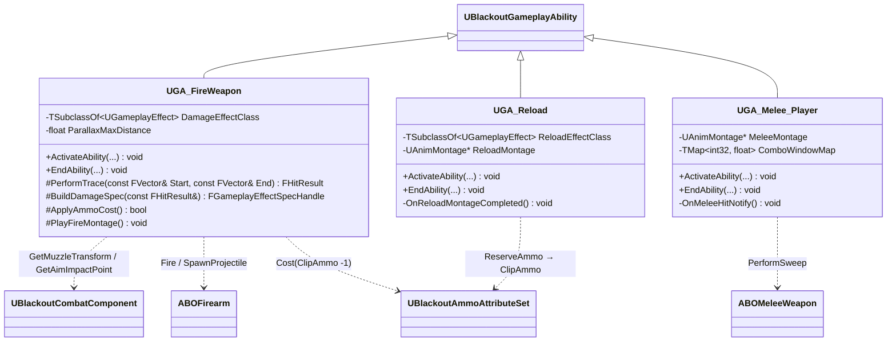

# Combat — 04. 전투 게임플레이 어빌리티 (Combat Abilities)

> TDD v5 §4.1 참조. 플레이어 전용 전투 GA 3종. 모두 `UBlackoutGameplayAbility` 상속, `LocalPredicted` 정책.

## 구현 노트

- **`UGA_FireWeapon`**:
  - Cost: `PrimaryClipAmmo` 또는 `SecondaryClipAmmo` 1 차감 (`EquippedWeapon` 슬롯 태그로 분기).
  - `Body.WeakSpot` / `Body.ArmoredLimb` 태그 배율은 `BuildDamageSpec`에서 `SetByCaller` 키로 주입.
  - 로비에서는 `LobbyTag.InfiniteAmmo` 분기로 Cost 체크 스킵(TDD §7.1).
  - Cue: `GCN_Weapon_Fire [Static]` 일회성 호출.
- **`UGA_Reload`**:
  - 완료 시 `ExecCalc_Reload`(`UGameplayEffectExecutionCalculation`)가 `ReserveAmmo -= Missing`, `ClipAmmo += Missing` 을 단일 트랜잭션으로 처리.
  - Cue: `GCN_Weapon_Reload [Static]`.
  - 시전 중 사격 입력은 `ActiveTag: State.Reloading` 으로 차단.
- **`UGA_Melee_Player`**:
  - `AnimNotify` 가 AbilityTask 로 `OnMeleeHitNotify` 를 호출 → `ABOMeleeWeapon::PerformSweep` 결과에 `GE_Damage` 적용.
  - 콤보: `InputID=Melee` 재입력 시 `ComboWindowMap[CurrentCombo]` 안이면 다음 단계로 진행.
- **전 GA 공통**: `ReplicationPolicy=ReplicateNo`, `InstancingPolicy=InstancedPerActor`, `NetExecutionPolicy=LocalPredicted`.
