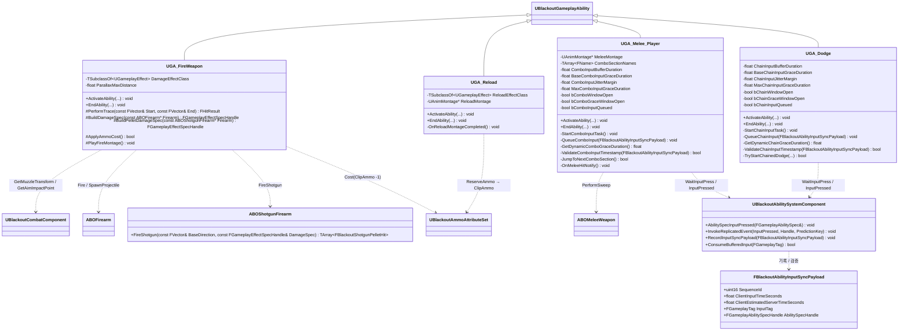

# Combat — 04. 전투 게임플레이 어빌리티 (Combat Abilities)

> TDD v5 §4.1 참조. 플레이어 전용 전투 GA 3종. 모두 `UBlackoutGameplayAbility` 상속, `LocalPredicted` 정책.

## 구현 노트

- **`UGA_FireWeapon`**:
  - Cost: `PrimaryClipAmmo` 또는 `SecondaryClipAmmo` 1 차감 (`EquippedWeapon` 슬롯 태그로 분기).
  - `Body.WeakSpot` / `Body.ArmoredLimb` 태그 배율은 `BuildDamageSpec`에서 `SetByCaller` 키로 주입.
  - 산탄 무기(`ABOShotgunFirearm`)는 탄약 Cost를 1회만 적용한 뒤 `FireShotgun`으로 펠릿별 히트스캔을 수행합니다. `BuildPelletDamageSpec`은 펠릿당 피해량을 `Data.Damage`로 주입하고, `FireShotgun` 결과의 `FBlackoutShotgunPelletHit` 배열은 디버그 표시와 멀티타겟 보상 집계의 입력으로 사용합니다.
  - 로비에서는 `LobbyTag.InfiniteAmmo` 분기로 Cost 체크 스킵(TDD §7.1).
  - Cue: `GCN_Weapon_Fire [Static]` 일회성 호출.
- **`UGA_Reload`**:
  - 완료 시 `ExecCalc_Reload`(`UGameplayEffectExecutionCalculation`)가 `ReserveAmmo -= Missing`, `ClipAmmo += Missing` 을 단일 트랜잭션으로 처리.
  - Cue: `GCN_Weapon_Reload [Static]`.
  - 시전 중 사격 입력은 `ActiveTag: State.Reloading` 으로 차단.
- **`UGA_Melee_Player`**:
  - `AnimNotify` 가 AbilityTask 로 `OnMeleeHitNotify` 를 호출 → `ABOMeleeWeapon::PerformSweep` 결과에 `GE_Damage` 적용.
  - 콤보 입력은 `UAbilityTask_WaitInputPress`와 ASC `InputPressed` 복제 이벤트로 수집합니다. 클라이언트의 콤보 윈도우 Notify 상태를 서버에 RPC로 보고하지 않습니다.
  - 서버는 다음 입력 1개만 `ComboInputBufferDuration` 동안 버퍼링하고, 윈도우 종료 후에는 `BaseComboInputGraceDuration + RTT * 0.5 + ComboInputJitterMargin`으로 계산한 late grace를 `MaxComboInputGraceDuration` 안에서 적용합니다.
  - 입력 timestamp/sequence는 `FBlackoutAbilityInputSyncPayload`로 검증합니다. 클라이언트 시각은 신뢰값이 아니라 보정 힌트이며, 서버 수신 시각과 PlayerState ping 기준으로 clamp 합니다.
  - 버퍼 또는 grace에서 승인된 입력만 `ComboSectionNames[CurrentCombo + 1]`로 점프합니다.
- **`UGA_Dodge`**:
  - 구르기 재입력은 근접 콤보와 동일한 `WaitInputPress`/ASC 입력 복제 경로를 사용합니다.
  - 연속 구르기는 `ChainInputBufferDuration`과 동적 `ChainInputGraceDuration`을 분리하여 관리합니다.
  - 스태미나 소모, I-Frame 태그, 루트 모션/Launch 재시작은 서버 검증 성공 후에만 확정합니다.
- **입력 보정 공통 규칙**:
  - `SequenceId`는 입력별 단조 증가를 요구하며, 중복/역순 입력은 버립니다.
  - timestamp 기반 보정은 입력 수락 여부에만 사용하고, 데미지·무적·스태미나 결과를 과거로 소급 승인하지 않습니다.
  - high ping 보정은 액션별 `MaxGrace`로 상한을 고정합니다.
- **전 GA 공통**: `ReplicationPolicy=ReplicateNo`, `InstancingPolicy=InstancedPerActor`, `NetExecutionPolicy=LocalPredicted`.
