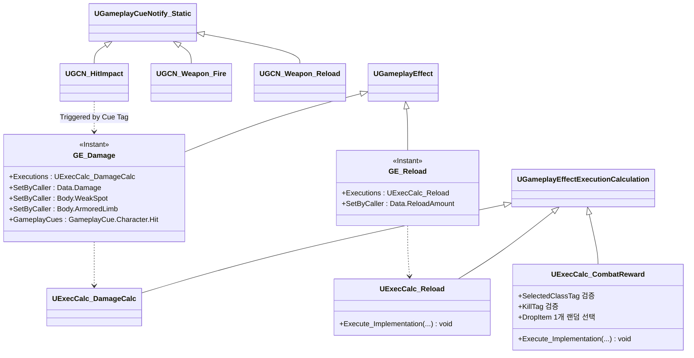

# Combat — 05. 데미지 이펙트 / 보상 / 큐 (Damage Effects & Cues)

> TDD v5 §5 참조. `GE_Damage` + `ExecCalc_DamageCalc`(공통기반 §03) + `ExecCalc_CombatReward` + GameplayCue.

## 구현 노트

- **`GE_Damage`**:
  - `DurationPolicy=Instant`. Source 기준 `Spec.SetSetByCallerMagnitude(Data.Damage, ...)` 로 기본값 세팅 → GA에서 주입.
  - 히트박스 부위 태그는 `ABOProjectile::OnHit` 또는 `UGA_FireWeapon` 이 SpecHandle에 `SetByCaller`로 주입.
  - Cue 태그 `GameplayCue.Character.Hit` 로 `UGCN_HitImpact [Static]` 트리거.
- **`ExecCalc_CombatReward` (TDD §5.1)**:
  - Source PlayerState의 `SelectedClassTag` + 마지막 타격 Spec의 킬 태그 조합을 검증합니다.
  - 조건 만족 시 즉시 자원을 지급하지 않고, 미니언 사망 위치에 `ABlackoutDropItem` 1개를 `UBlackoutPoolSubsystem::SpawnFromPool`로 스폰합니다.
  - 드롭 후보는 주무기 탄약 40% / 보조무기 탄약 40% / 소모품 20% 중 하나이며, 실제 탄약·소모품 지급은 플레이어가 `[E]` 상호작용으로 획득할 때 처리합니다.
  - 클래스 A: `Kill.Melee`, 클래스 B: `Kill.MultiTarget.Count3`, 클래스 C: `Kill.WeakSpot`.
  - 실행 시점은 `ExecCalc_DamageCalc`와 같은 GE 실행 순서에 의존하지 않고, 서버에서 데미지 적용 및 사망 상태 확정이 끝난 직후의 사망 처리 경로에서 호출합니다. 다중 처치는 산탄·폭발·스플래시 판정 소유자가 배치 내 처치 수를 집계한 뒤 `Kill.MultiTarget.Count3`가 포함된 보상 Spec/컨텍스트로 후처리합니다.
- **`ExecCalc_Reload`**:
  - `Missing = MaxClip - ClipAmmo`, `Grant = min(Missing, ReserveAmmo)` → `ClipAmmo += Grant`, `ReserveAmmo -= Grant`.
  - 주/보조 구분은 Spec의 `InstigatorTags`로 전달받음.
- **GameplayCue 분리 (TDD §11)**:
  - `Static` — 일회성(총구 화염, 탄창 탈착음, 혈흔). 객체 인스턴스 없음.
  - `Actor` — 지속형(아직 전투 에픽에는 없음, 보스 Red Mist 등 AI 에픽에서 사용).
- **무기별 Cue 세트**: 발사, 탄 궤적, 표면 재질별 Impact Cue는 무기 데이터의 `FBlackoutWeaponCueSet`에서 태그로 지정하고 서버 ASC에서 실행합니다. 상세 클래스 다이어그램은 [10_Weapon_GameplayCue_Set.md](10_Weapon_GameplayCue_Set.md)를 참조합니다.
