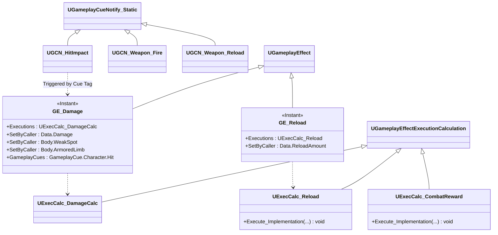

# Combat — 05. 데미지 이펙트 / 보상 / 큐 (Damage Effects & Cues)

> TDD v5 §5 참조. `GE_Damage` + `ExecCalc_DamageCalc`(공통기반 §03) + `ExecCalc_CombatReward` + GameplayCue.

## 구현 노트

- **`GE_Damage`**:
  - `DurationPolicy=Instant`. Source 기준 `Spec.SetSetByCallerMagnitude(Data.Damage, ...)` 로 기본값 세팅 → GA에서 주입.
  - 히트박스 부위 태그는 `ABOProjectile::OnHit` 또는 `UGA_FireWeapon` 이 SpecHandle에 `SetByCaller`로 주입.
  - Cue 태그 `GameplayCue.Character.Hit` 로 `UGCN_HitImpact [Static]` 트리거.
- **`ExecCalc_CombatReward` (TDD §5.1)**:
  - Source PlayerState의 `SelectedClassTag` + 킬 태그 조합 검증 → 성공 시 `BloodRootCount/GulSerumCount` 또는 탄약 보충 GE 연쇄 적용.
  - 클래스 A: `Kill.Melee`, 클래스 B: `Kill.MultiTarget.Count≥3`, 클래스 C: `Kill.WeakSpot` 등.
- **`ExecCalc_Reload`**:
  - `Missing = MaxClip - ClipAmmo`, `Grant = min(Missing, ReserveAmmo)` → `ClipAmmo += Grant`, `ReserveAmmo -= Grant`.
  - 주/보조 구분은 Spec의 `InstigatorTags`로 전달받음.
- **GameplayCue 분리 (TDD §11)**:
  - `Static` — 일회성(총구 화염, 탄창 탈착음, 혈흔). 객체 인스턴스 없음.
  - `Actor` — 지속형(아직 전투 에픽에는 없음, 보스 Red Mist 등 AI 에픽에서 사용).
