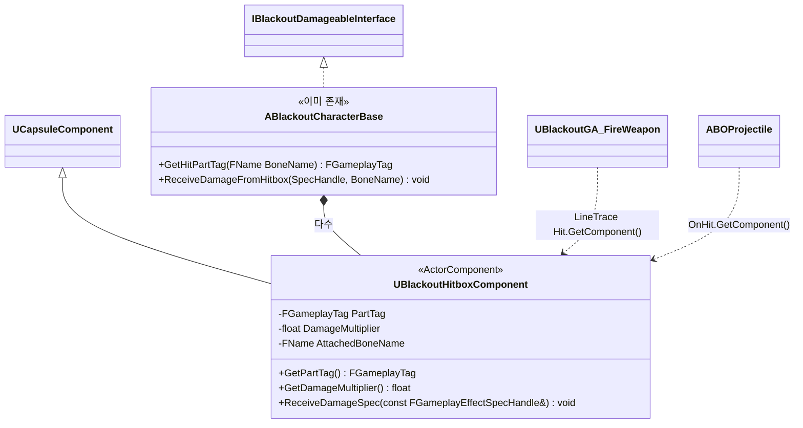

# Combat — 06. 히트박스 시스템 (Hitbox System)

> TDD v5 §5.2 참조. 보스/특수 몬스터의 부위별 피해 배율을 구현하는 컴포넌트.

## 구현 노트

- **부착 방식**: 에디터에서 보스 스켈레탈메시의 특정 Bone(Head, LegArmor 등)에 `UBlackoutHitboxComponent` 를 `AttachToComponent(..., EAttachmentRule::SnapToTarget, BoneName)` 로 추가.
- **부위 태그**:
  - `Body.WeakSpot` — 1.5배 (슈루드 머리, 약탈자 종양 등)
  - `Body.ArmoredLimb` — 0.5배 (약탈자 다리 껍질)
  - 태그가 없는 일반 피격은 기본 1.0배.
- **데미지 파이프라인**:
  1. 트레이스/오버랩이 `UBlackoutHitboxComponent` 를 반환
  2. GA가 `Hit.GetComponent()->GetPartTag()` + `GetDamageMultiplier()` 조회
  3. `GE_Damage.SpecHandle`에 `SetByCaller(PartTag, Multiplier)` 주입
  4. `ExecCalc_DamageCalc` 가 태그 키로 읽어 최종 데미지 산출
- **`IBlackoutDamageableInterface::ReceiveDamageFromHitbox`**:
  - 기본 `Character` 에서는 히트박스 우선 조회, 없으면 Bone 이름만으로 `GetHitPartTag` fallback.
  - 보스 오너 ASC 에 Spec 적용 → `GameplayCue.Character.Hit` 로 혈흔 연출.
- **성능**: 히트박스는 Collision `Query Only` (Overlap 비사용). 라인트레이스 응답용 채널만 설정하여 물리 시뮬 배제.
