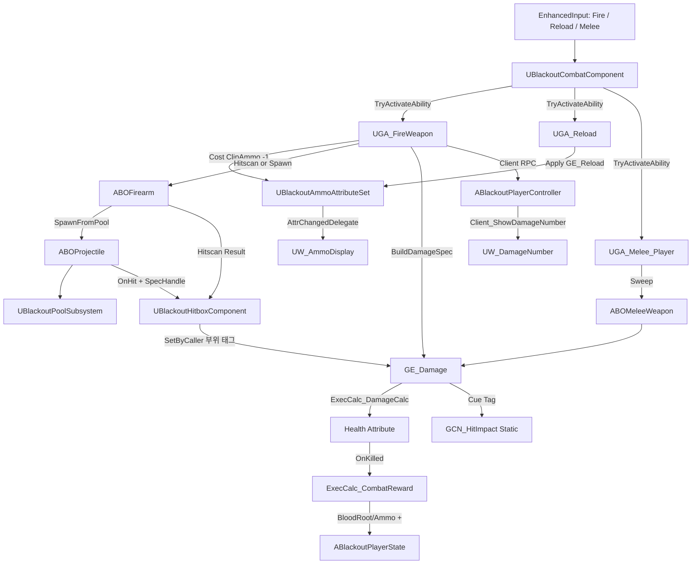

# Combat — 07. 전투 흐름 전체 의존 관계 (Dependency Overview)

> 사격 입력부터 데미지 인식, UI 갱신까지의 전 흐름 종합.

## 의존 관계 다이어그램

## 구현 순서 (권장)

| 단계 | 대상 | 의존 |
|---|---|---|
| 1 | `UBlackoutAmmoAttributeSet` | 공통기반 AttributeSet 패턴 |
| 2 | `ABOWeaponBase` + `ABOFirearm` + `ABOMeleeWeapon` | DT_WeaponStats(완료) |
| 3 | `ABOProjectile` | `IBlackoutPoolableInterface`(완료) |
| 4 | `UBlackoutCombatComponent` | 2, 3 |
| 5 | `UBlackoutHitboxComponent` | `IBlackoutDamageableInterface`(완료) |
| 6 | `GE_Damage` + `GE_Reload` + `ExecCalc_Reload` + `ExecCalc_CombatReward` | 1, 5 |
| 7 | `UGA_FireWeapon` / `UGA_Reload` / `UGA_Melee_Player` | 4, 6 |
| 8 | GameplayCue: `GCN_Weapon_Fire` / `GCN_Weapon_Reload` / `GCN_HitImpact` | 7 |
| 9 | `ABlackoutPlayerCharacter` 통합 (CombatComponent 부착, 입력 바인딩) | 전체 |
| 10 | UI 바인딩 (`UW_AmmoDisplay`, `UW_DamageNumber`) | 1, 7 → UI 에픽에서 완성 |

## 에픽 간 경계

- **UI 에픽**: `UW_DamageNumber`, `UW_Crosshair`, `UW_AmmoDisplay` 위젯 구현은 UI 에픽 소관. 전투 에픽은 RPC/델리게이트 엔드포인트만 제공.
- **AI/Boss 에픽**: 보스의 `UBlackoutHitboxComponent` 배치(Head, ArmoredLimb 등)는 AI/Boss 에픽에서 각 보스 BP 셋업 단계에 처리.
- **Lobby 에픽**: `LobbyTag.InfiniteAmmo` 분기는 `UGA_FireWeapon` 내부에 조건 처리 포함.

## 클래스 추가 영향 범위

- **공통기반 미수정**: 전투 에픽 범위만 신규 파일. `ABlackoutPlayerCharacter` 에만 `UBlackoutCombatComponent` 부착 추가.
- **Build.cs PublicIncludePaths 추가 예정**: `ProjectBlackout/Combat`, `ProjectBlackout/Combat/Weapons`, `ProjectBlackout/Combat/Abilities`.
