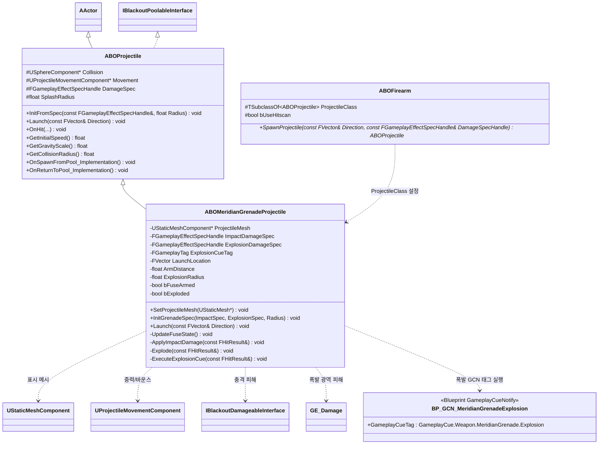

# Combat — 08. 메리디안 유탄 발사체 (Meridian Grenade Projectile)

> 메리디안 무기 모델링 전, 먼저 구현할 유탄 발사체의 클래스 책임 분리안입니다. 기존 `ABOProjectile` 풀링/데미지 전달 구조를 유지하되, 물리 바운스와 신관 상태를 가진 특수 발사체로 분기합니다.

## 요구사항 매핑

| 요구사항 | 설계 |
|---|---|
| 발사체 메시 설정, 기본값은 구 | `ProjectileMesh`는 블루프린트에서 메시 교체 가능. C++ 기본 생성자에서 엔진 기본 구 메시를 로드하거나, 메시가 없으면 `USphereComponent` 충돌체만으로 동작. 메시 표시 크기(`MeshScale`)와 충돌 반경(`CollisionRadius`)은 별도로 조절 |
| 중력 영향 및 물리적 튕김 | `UProjectileMovementComponent`의 `ProjectileGravityScale > 0`, `bShouldBounce = true`, `Bounciness` 사용. 이동 주체는 `Collision`이며 `ProjectileMesh`는 표시용으로 부착 |
| 5m 비행 후 신관 활성화 | `ArmDistance = 500.0f`(cm). `LaunchLocation`부터 현재 위치까지의 거리로 `bFuseArmed` 전환 |
| 신관 비활성 충돌 | `ApplyImpactDamage()`로 낮은 충격 피해만 적용하고 풀에 반환하지 않음. `Movement` 바운스는 유지 |
| 신관 활성 충돌 | 충격 피해는 생략하고 `Explode()`에서 반경 피해 적용, 선택적으로 DebugSphere 표시, `ExplosionCueTag`로 GCN 실행, 이후 즉시 풀 반환 |
| 수명 만료 | `AutoReturnDelay`가 지나면 폭발/피해/GCN 없이 즉시 풀 반환 |

## 구현 노트

- `ABOMeridianGrenadeProjectile`은 `ABOProjectile`을 상속해 기존 풀링 진입점(`OnSpawnFromPool`, `OnReturnToPool`)을 재사용합니다.
- 기존 `ABOProjectile::OnHit`가 즉시 피해 후 풀 반환하는 구조이므로, 유탄 구현 시 `OnHit`는 `virtual`로 확장하거나 유탄 전용 히트 핸들러를 바인딩해야 합니다.
- 신관 거리 판정은 네트워크 권한 서버에서 확정하고, 시각 효과는 GameplayCue로 복제 흐름에 태웁니다. GCN은 C++ 클래스가 아니라 `GameplayCue.Weapon.MeridianGrenade.Explosion` 태그를 받는 블루프린트 `GameplayCueNotify` 에셋으로 제작합니다.
- 폭발 반경 피해는 기존 `FGameplayEffectSpecHandle` 기반 피해 전달 방식을 따르되, 다중 대상 처리는 `OverlapMultiByChannel` 또는 별도 전투 유틸로 분리할 수 있습니다.
- 메리디안 무기는 별도 C++ 무기 클래스를 두지 않고 `ABOFirearm` 기반 블루프린트/데이터 행에서 `bUseHitscan=false`, `ProjectileClass=ABOMeridianGrenadeProjectile`로 설정합니다.
- `UBlackoutImpactIndicatorComponent`의 예측 착탄 인디케이터가 실제 유탄 궤적과 맞도록 `UProjectileMovementComponent`의 초기 속도, 중력 스케일, 충돌 반경은 읽기 전용 API로 노출합니다.
