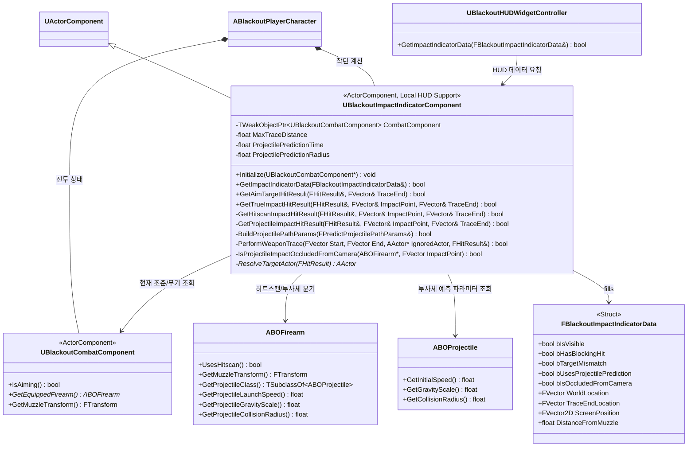
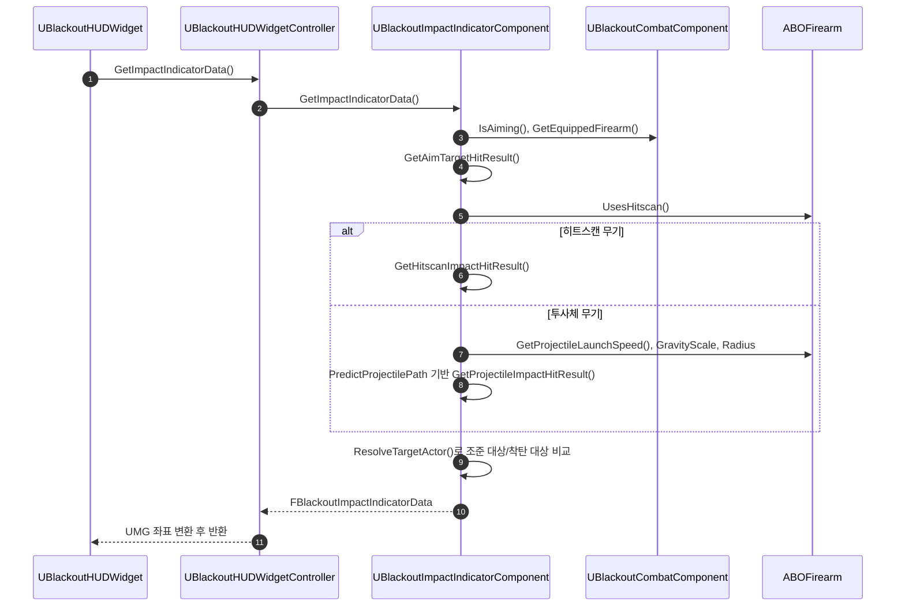

# Combat — 09. 착탄 인디케이터 컴포넌트 (Impact Indicator Component)

> TDD v5 §9 "크로스헤어 + True Impact Indicator" 확장 설계. `UBlackoutCombatComponent`가 커지지 않도록 조준/착탄 계산을 별도 ActorComponent로 분리합니다.

## 책임 분리

| 클래스 | 책임 |
|---|---|
| `UBlackoutCombatComponent` | 입력, 조준 상태, 장착 무기, 총구 Transform 제공 |
| `UBlackoutImpactIndicatorComponent` | 카메라 조준 대상, 실제 착탄 위치, 대상 불일치, 히트스캔/투사체 예측 계산 |
| `ABOFirearm` | 히트스캔 여부와 투사체 예측에 필요한 무기/발사체 파라미터 제공 |
| `UBlackoutHUDWidgetController` | 로컬 플레이어의 인디케이터 데이터를 HUD 좌표계로 전달 |
| `UBlackoutHUDWidget` | 전달받은 데이터로 인디케이터 위치/색/표시 상태 갱신 |

## 계산 흐름

## 구현 노트

- **로컬 계산 전용**: HUD 지원용 시각 피드백이므로 서버 권한 판정에 사용하지 않습니다. 실제 피해 판정은 기존 `GA_FireWeapon`/`ABOFirearm::Fire`/`ABOProjectile` 흐름이 유지합니다.
- **히트스캔**: 카메라 조준 대상 라인트레이스와 총구 기준 라인트레이스를 각각 수행하고, 두 결과의 대표 Actor가 다르면 `bTargetMismatch = true`.
- **투사체**: `UGameplayStatics::PredictProjectilePath` 계열을 사용해 총구 위치, 발사 방향, 초기 속도, 중력 스케일, 충돌 반경을 기반으로 예측 착탄점을 계산합니다.
- **투사체 시야 가림**: 예측 착탄점 계산 후 카메라 위치에서 착탄점까지 추가 라인트레이스를 수행합니다. 착탄점보다 앞에서 다른 blocking hit가 잡히면 `bIsOccludedFromCamera=true`로 전달해 HUD 인디케이터를 전용 색상으로 표시합니다.
- **대상 불일치**: 카메라 조준 대상이 blocking hit를 가진 경우에만 비교합니다. 조준 대상이 없는 허공 조준은 mismatch 경고를 띄우지 않습니다.
- **무기 데이터 확장**: 투사체 예측 정확도를 위해 `ABOFirearm` 또는 `ABOProjectile`에서 초기 속도, 중력 스케일, 충돌 반경을 읽을 수 있어야 합니다.
- **UI 좌표 변환**: 월드 착탄 위치를 UMG 좌표로 변환하는 책임은 HUD 계층에 남깁니다. 전투 컴포넌트는 화면 좌표를 알지 않습니다.
