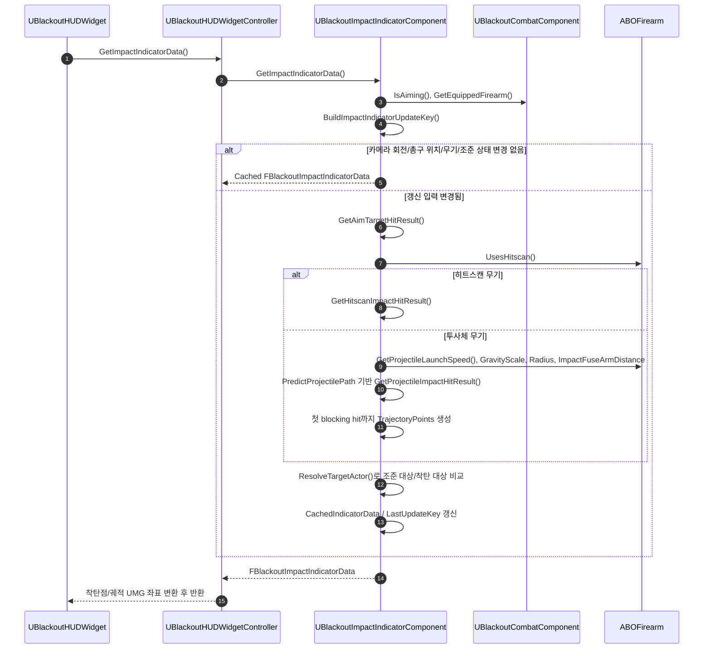

# Combat — 09. 착탄 인디케이터 컴포넌트 (Impact Indicator Component)

> TDD v5 §9 "크로스헤어 + True Impact Indicator" 확장 설계. `UBlackoutCombatComponent`가 커지지 않도록 조준/착탄 계산을 별도 ActorComponent로 분리합니다.

```mermaid
classDiagram
    direction TB

    UActorComponent <|-- UBlackoutImpactIndicatorComponent

    class UBlackoutImpactIndicatorComponent {
        <<ActorComponent, Local HUD Support>>
        -TWeakObjectPtr~UBlackoutCombatComponent~ CombatComponent
        -float MaxTraceDistance
        -float ProjectilePredictionTime
        -float ProjectilePredictionRadius
        -FBlackoutImpactIndicatorUpdateKey LastUpdateKey
        -FBlackoutImpactIndicatorData CachedIndicatorData
        +Initialize(UBlackoutCombatComponent*) void
        +GetImpactIndicatorData(FBlackoutImpactIndicatorData&) bool
        +GetAimTargetHitResult(FHitResult&, FVector& TraceEnd) bool
        +GetTrueImpactHitResult(FHitResult&, FVector& ImpactPoint, FVector& TraceEnd) bool
        -BuildImpactIndicatorUpdateKey(FBlackoutImpactIndicatorUpdateKey&) bool
        -HasImpactIndicatorUpdateInputChanged(FBlackoutImpactIndicatorUpdateKey) bool
        -RefreshCachedImpactIndicatorData(FBlackoutImpactIndicatorUpdateKey) bool
        -GetHitscanImpactHitResult(FHitResult&, FVector& ImpactPoint, FVector& TraceEnd) bool
        -GetProjectileImpactHitResult(FHitResult&, FVector& ImpactPoint, FVector& TraceEnd, TArray~FBlackoutTrajectoryPointData~*, float*) bool
        -BuildProjectilePathParams(FPredictProjectilePathParams&) bool
        -BuildTrajectoryPoints(FPredictProjectilePathResult, TArray~FBlackoutTrajectoryPointData~&, float&) void
        -PerformWeaponTrace(FVector Start, FVector End, AActor* IgnoredActor, FHitResult&) bool
        -IsProjectileImpactOccludedFromCamera(ABOFirearm*, FVector ImpactPoint) bool
        -ResolveTargetActor(FHitResult) AActor*
    }

    class UBlackoutPlayerAnimInstance {
        <<AnimInstance>>
        -FBlackoutAimOffsetBlendSettings AimOffsetBlendSettings
        +GetAimOffsetBlendSettings() FBlackoutAimOffsetBlendSettings
    }

    class UBlackoutGA_FireWeapon {
        <<GameplayAbility>>
        -BuildFireDirection() FVector
    }

    class FBlackoutAimOffsetBlendSettings {
        <<Struct>>
        +float MuzzleFullDistance
        +float EyeFullDistance
        +float BlendInterpSpeed
    }

    class BlackoutAimOffsetMath {
        <<Namespace>>
        +CalculateEyeBlendAlpha(float ProjectedDistance, FBlackoutAimOffsetBlendSettings) float
        +BlendDirection(FVector MuzzleDirection, FVector EyeTargetDirection, float Alpha) FVector
    }

    class FBlackoutImpactIndicatorUpdateKey {
        <<Struct>>
        +bool bIsAiming
        +FRotator CameraRotation
        +FVector MuzzleLocation
        +TWeakObjectPtr~ABOFirearm~ EquippedFirearm
    }

    class EBlackoutTrajectoryVisualState {
        <<Enum>>
        Normal
        FuseInactive
        Occluded
    }

    class FBlackoutTrajectoryPointData {
        <<Struct>>
        +FVector WorldLocation
        +FVector2D ScreenPosition
        +float DistanceFromMuzzle
        +EBlackoutTrajectoryVisualState VisualState
    }

    class FBlackoutImpactIndicatorData {
        <<Struct>>
        +bool bIsVisible
        +bool bHasBlockingHit
        +bool bTargetMismatch
        +bool bUsesProjectilePrediction
        +bool bIsOccludedFromCamera
        +bool bProjectileImpactFuseInactive
        +FVector WorldLocation
        +FVector TraceEndLocation
        +FVector2D ScreenPosition
        +float DistanceFromMuzzle
        +TArray~FBlackoutTrajectoryPointData~ TrajectoryPoints
    }

    class UBlackoutCombatComponent {
        <<ActorComponent>>
        +IsAiming() bool
        +GetEquippedFirearm() ABOFirearm*
        +GetMuzzleTransform() FTransform
    }

    class ABOFirearm {
        +UsesHitscan() bool
        +GetMuzzleTransform() FTransform
        +GetProjectileClass() TSubclassOf~ABOProjectile~
        +GetProjectileLaunchSpeed() float
        +GetProjectileGravityScale() float
        +GetProjectileCollisionRadius() float
        +GetProjectileImpactFuseArmDistance() float
    }

    class ABOProjectile {
        +GetInitialSpeed() float
        +GetGravityScale() float
        +GetCollisionRadius() float
        +GetImpactFuseArmDistance() float
    }

    class UBlackoutHUDWidgetController {
        +GetImpactIndicatorData(FBlackoutImpactIndicatorData&) bool
    }

    ABlackoutPlayerCharacter *-- UBlackoutCombatComponent : 전투 상태
    ABlackoutPlayerCharacter *-- UBlackoutImpactIndicatorComponent : 착탄 계산
    ABlackoutPlayerCharacter --> UBlackoutPlayerAnimInstance : 에임 오프셋 설정 소유
    UBlackoutImpactIndicatorComponent --> UBlackoutCombatComponent : 현재 조준/무기 조회
    UBlackoutImpactIndicatorComponent --> ABOFirearm : 히트스캔/투사체 분기
    UBlackoutImpactIndicatorComponent --> ABOProjectile : 투사체 예측 파라미터 조회
    UBlackoutImpactIndicatorComponent --> FBlackoutAimOffsetBlendSettings : 근거리 전환 설정 조회
    UBlackoutImpactIndicatorComponent --> BlackoutAimOffsetMath : True Hit 방향 전환
    UBlackoutGA_FireWeapon --> FBlackoutAimOffsetBlendSettings : 실제 발사 설정 조회
    UBlackoutGA_FireWeapon --> BlackoutAimOffsetMath : 실제 발사 방향 전환
    UBlackoutPlayerAnimInstance o-- FBlackoutAimOffsetBlendSettings : owns
    UBlackoutPlayerAnimInstance --> BlackoutAimOffsetMath : AO 전환 알파 계산
    UBlackoutImpactIndicatorComponent --> FBlackoutImpactIndicatorUpdateKey : caches update key
    UBlackoutImpactIndicatorComponent --> FBlackoutTrajectoryPointData : fills projectile path
    UBlackoutImpactIndicatorComponent --> FBlackoutImpactIndicatorData : fills
    UBlackoutHUDWidgetController --> UBlackoutImpactIndicatorComponent : HUD 데이터 요청
```

## 책임 분리

| 클래스 | 책임 |
|---|---|
| `UBlackoutCombatComponent` | 입력, 조준 상태, 장착 무기, 총구 Transform 제공 |
| `UBlackoutImpactIndicatorComponent` | 카메라 조준 대상, 실제 착탄 위치, 대상 불일치, 히트스캔/투사체 예측 계산, 유탄 궤적 월드 포인트 캐싱 |
| `FBlackoutAimOffsetBlendSettings` | 총구 기준/눈 위치 기준 조준 전환 거리와 보간 속도를 단일 설정으로 제공 |
| `BlackoutAimOffsetMath` | 에임 오프셋, True Hit, 실제 발사가 공유하는 근거리 전환 알파와 방향 보간 계산 |
| `ABOFirearm` | 히트스캔 여부와 투사체 예측에 필요한 무기/발사체 파라미터 제공 |
| `UBlackoutHUDWidgetController` | 로컬 플레이어의 인디케이터 데이터와 궤적 포인트를 HUD 좌표계로 전달 |
| `UBlackoutHUDWidget` | 전달받은 데이터로 인디케이터 위치/색/표시 상태와 궤적 표시 갱신 |

## 계산 흐름

## 구현 노트

- **로컬 계산 전용**: HUD 지원용 시각 피드백이므로 서버 권한 판정에 사용하지 않습니다. 실제 피해 판정은 기존 `GA_FireWeapon`/`ABOFirearm::Fire`/`ABOProjectile` 흐름이 유지합니다.
- **조건부 갱신**: `GetImpactIndicatorData()`는 매 Tick 호출될 수 있지만, 카메라 회전, 총구 위치, 장착 무기, 조준 상태를 묶은 `FBlackoutImpactIndicatorUpdateKey`가 바뀌지 않으면 이전 `CachedIndicatorData`를 반환합니다. 라인트레이스와 `PredictProjectilePath`는 입력 키가 변경된 경우에만 다시 수행합니다.
- **히트스캔**: 카메라 조준 대상 라인트레이스와 총구 기준 라인트레이스를 각각 수행하고, 두 결과의 대표 Actor가 다르면 `bTargetMismatch = true`.
- **투사체**: `UGameplayStatics::PredictProjectilePath` 계열을 사용해 총구 위치, 발사 방향, 초기 속도, 중력 스케일, 충돌 반경을 기반으로 예측 착탄점을 계산합니다.
- **유탄 궤적 표시**: 투사체 예측 결과의 `PathData`를 `FBlackoutTrajectoryPointData` 배열로 변환해 HUD에 전달합니다. 1차 구현은 첫 blocking hit까지의 궤적만 표시하고, 도탄 이후 경로는 실제 유탄 물리와 오차가 커질 수 있으므로 표시하지 않습니다.
- **유탄 신관 경고**: 투사체 예측 결과가 blocking hit이고, 예측 경로의 누적 비행 거리가 `GetProjectileImpactFuseArmDistance()`보다 짧으면 `bProjectileImpactFuseInactive=true`로 전달해 HUD 인디케이터를 붉은색으로 표시합니다.
- **궤적 상태 색상**: 신관 활성 거리 이전 구간은 `FuseInactive`, 카메라에서 가려진 구간은 필요 시 `Occluded`, 그 외 구간은 `Normal` 상태로 전달해 HUD가 점선/색상/투명도를 분리해 표현할 수 있게 합니다.
- **투사체 시야 가림**: 예측 착탄점 계산 후 카메라 위치에서 착탄점까지 추가 라인트레이스를 수행합니다. 착탄점보다 앞에서 다른 blocking hit가 잡히면 `bIsOccludedFromCamera=true`로 전달해 HUD 인디케이터를 전용 색상으로 표시합니다.
- **대상 불일치**: 카메라 조준 대상이 blocking hit를 가진 경우에만 비교합니다. 조준 대상이 없는 허공 조준은 mismatch 경고를 띄우지 않습니다.
- **무기 데이터 확장**: 투사체 예측 정확도와 신관 경고를 위해 `ABOFirearm` 또는 `ABOProjectile`에서 초기 속도, 중력 스케일, 충돌 반경, 충격 신관 활성 거리를 읽을 수 있어야 합니다.
- **UI 좌표 변환**: 월드 착탄 위치와 궤적 월드 포인트를 UMG 좌표로 변환하는 책임은 HUD 계층에 남깁니다. 전투 컴포넌트는 화면 좌표를 알지 않습니다.
