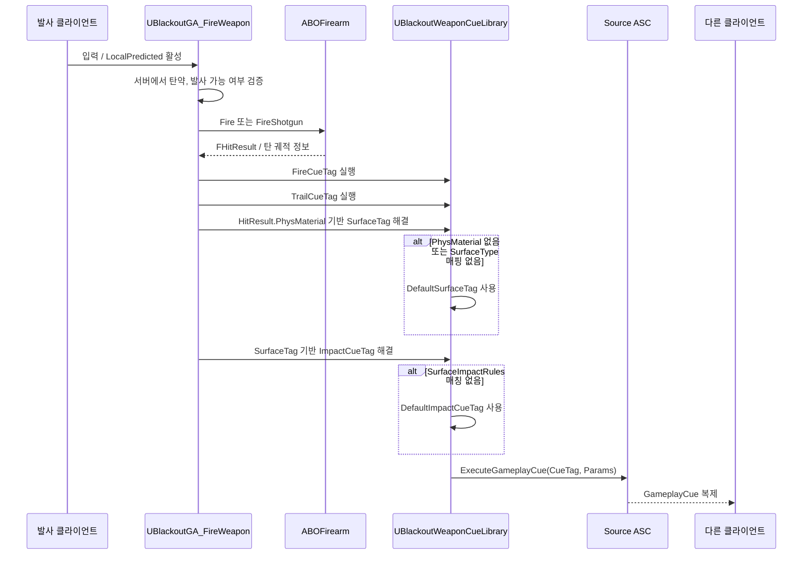

# Combat — 10. 무기별 GameplayCue 세트 (Weapon GameplayCue Set)

> 무기마다 발사, 탄 궤적, 피격 GameplayCue를 태그로 보유하고, 서버 권한 경로에서 실행해 다른 클라이언트에도 보이도록 하는 설계입니다.

```mermaid
classDiagram
    direction TB

    FBlackoutWeaponStat *-- FBlackoutWeaponCueSet : CueSet
    FBlackoutWeaponCueSet *-- FBlackoutSurfaceImpactCueRule : SurfaceImpactRules

    ABOWeaponBase --> FBlackoutWeaponCueSet : Cache / Getter
    ABOFirearm --> FBlackoutWeaponCueSet : Fire / Trail / Impact Cue 조회
    ABOMeleeWeapon --> FBlackoutWeaponCueSet : Swing / Impact Cue 조회
    ABOProjectile --> FBlackoutWeaponCueSet : Init 시 복사

    UBlackoutGA_FireWeapon --> ABOFirearm : Fire / FireShotgun
    UBlackoutGA_FireWeapon --> UBlackoutWeaponCueLibrary : Cue 실행 요청
    ABOProjectile --> UBlackoutWeaponCueLibrary : 충돌/투사체 Cue 실행 요청
    UBlackoutCombatComponent --> ABOMeleeWeapon : Melee 공격 판정 및 GCN 트리거
    UBlackoutCombatComponent --> UBlackoutWeaponCueLibrary : Swing / Impact Cue 실행 요청
    UBlackoutWeaponCueLibrary --> UAbilitySystemComponent : ExecuteGameplayCue
    UBlackoutWeaponCueLibrary --> UPhysicalMaterial : HitResult.PhysMaterial 조회
    UBlackoutWeaponCueLibrary --> UBlackoutImpactSurfaceSettings : SurfaceType -> SurfaceTag
    UBlackoutWeaponCueLibrary --> FBlackoutSurfaceImpactCueRule : ResolveSurfaceImpactCueTag

    UGameplayCueNotify_Static <|-- UGCN_WeaponFire
    UGameplayCueNotify_Static <|-- UGCN_WeaponTrail
    UGameplayCueNotify_Static <|-- UGCN_WeaponImpact

    UAnimNotify <|-- UBOAnimNotify_GameplayCue
    UBOAnimNotify_GameplayCue --> UBlackoutWeaponCueLibrary : Cue 실행 요청

    class FBlackoutWeaponStat {
        <<DataTable Row>>
        +float BaseDamage
        +FBlackoutWeaponCueSet CueSet
    }

    class FBlackoutWeaponCueSet {
        <<Struct>>
        +FGameplayTag FireCueTag
        +FGameplayTag TrailCueTag
        +FGameplayTag DefaultImpactCueTag
        +TArray~FBlackoutSurfaceImpactCueRule~ SurfaceImpactRules
        +bool HasFireCue() bool
        +bool HasTrailCue() bool
        +FGameplayTag ResolveImpactCue(FGameplayTag SurfaceTag) FGameplayTag
    }

    class FBlackoutSurfaceImpactCueRule {
        <<Struct>>
        +FGameplayTag SurfaceTag
        +FGameplayTag ImpactCueTag
        +int32 Priority
    }

    class UBlackoutImpactSurfaceSettings {
        <<DeveloperSettings>>
        +TMap SurfaceTagMap
        +FGameplayTag DefaultSurfaceTag
        +FGameplayTag ResolveSurfaceTag(UPhysicalMaterial*) FGameplayTag
    }

    class UPhysicalMaterial {
        +EPhysicalSurface SurfaceType
    }

    class ABOWeaponBase {
        <<Abstract>>
        #FBlackoutWeaponStat CachedStats
        +GetWeaponCueSet() FBlackoutWeaponCueSet
        +GetFireCueTag() FGameplayTag
        +GetTrailCueTag() FGameplayTag
        +ResolveImpactCueTag(FGameplayTag SurfaceTag) FGameplayTag
    }

    class ABOMeleeWeapon {
        +PerformSweep(const FVector& Forward) TArray~FHitResult~
        +SetHitBoxActive(bool bActive) void
    }

    class UBlackoutCombatComponent {
        +BeginMeleeAttackWindow(const FGameplayEffectSpecHandle&) void
        +UpdateMeleeAttackWindow() void
    }

    class ABOFirearm {
        +Fire(const FVector& Direction, const FGameplayEffectSpecHandle& DamageSpec) FHitResult
        +SpawnProjectile(const FVector& Direction, const FGameplayEffectSpecHandle& DamageSpec) ABOProjectile*
        +GetMuzzleTransform() FTransform
    }

    class ABOProjectile {
        -FGameplayEffectSpecHandle DamageSpec
        -FBlackoutWeaponCueSet CueSet
        +InitFromSpec(const FGameplayEffectSpecHandle&, float Radius, FBlackoutWeaponCueSet) void
        +OnHit(const FHitResult&) void
        #ExecuteProjectileGameplayCue(FGameplayTag CueTag, FGameplayCueParameters Params) void
    }

    class UBlackoutGA_FireWeapon {
        +ActivateAbility(...) void
        -ExecuteFireCue(ABOFirearm*) void
        -ExecuteTrailCue(ABOFirearm*, FHitResult) void
        -ExecuteImpactCue(ABOFirearm*, FHitResult) void
    }

    class UBlackoutWeaponCueLibrary {
        <<BlueprintFunctionLibrary>>
        +BuildCueParameters(AActor* Source, const FHitResult&, FVector MuzzleLocation) FGameplayCueParameters
        +ResolveSurfaceTag(const FHitResult&) FGameplayTag
        +ResolveImpactCueTag(FBlackoutWeaponCueSet, FGameplayTag SurfaceTag) FGameplayTag
        +ExecuteWeaponCue(UAbilitySystemComponent* SourceASC, FGameplayTag CueTag, FGameplayCueParameters Params) void
    }

    class UGCN_WeaponFire {
        <<Static GameplayCue>>
        +GameplayCueTag : GameplayCue.Weapon.*.Fire
    }

    class UGCN_WeaponTrail {
        <<Static GameplayCue>>
        +GameplayCueTag : GameplayCue.Weapon.*.Trail
    }

    class UGCN_WeaponImpact {
        <<Static GameplayCue>>
        +GameplayCueTag : GameplayCue.Weapon.*.Impact.*
    }

    class UBOAnimNotify_GameplayCue {
        <<AnimNotify>>
        +FGameplayTag GameplayCueTag
        +Notify(...) void
    }
```

## 태그 규칙

- 무기별 Cue 태그는 `GameplayCue.Weapon.<WeaponId>.<CueKind>` 형태를 기본으로 합니다.
- `CueKind`는 `Fire`, `Trail`, `Impact.<SurfaceType>`를 사용합니다.
- 표면 재질 태그는 `Surface.<SurfaceType>` 형태를 사용하고, `UPhysicalMaterial.SurfaceType`을 `UBlackoutImpactSurfaceSettings`에서 GameplayTag로 변환합니다.
- 표면 재질이 없거나 매핑되지 않은 대상은 `Surface.Default`로 처리합니다.
- 예시:
  - `GameplayCue.Weapon.ChicagoTypewriter.Fire`
  - `GameplayCue.Weapon.ChicagoTypewriter.Trail`
  - `GameplayCue.Weapon.ChicagoTypewriter.Impact.Flesh`
  - `GameplayCue.Weapon.ChicagoTypewriter.Impact.Metal`
  - `GameplayCue.Weapon.ChicagoTypewriter.Impact.Stone`
  - `GameplayCue.Weapon.Meridian.Impact.Default`
  - `Surface.Default`
  - `Surface.Flesh`
  - `Surface.Metal`
  - `Surface.Stone`

## 실행 흐름

## 구현 노트

- **서버 권한 실행**: 다른 클라이언트가 반드시 봐야 하는 발사, 탄 궤적, 피격 Cue는 서버에서 `SourceASC->ExecuteGameplayCue`로 실행합니다. 로컬 즉시 반응이 필요하면 이후 예측 전용 로컬 Cue를 별도로 추가하되, 서버 Cue와 중복 재생을 방지하는 키가 필요합니다.
- **Cue 위치 전달**: `FGameplayCueParameters`에는 총구 위치, 피격 위치, `FHitResult`, Source/Target Actor를 담습니다. 트레일 Cue는 총구 위치와 착탄 위치를 모두 사용해 빔 또는 트레이서를 그립니다.
- **표면 재질 분기**: `ResolveSurfaceTag`는 `FHitResult.PhysMaterial`의 `SurfaceType`을 읽고 `UBlackoutImpactSurfaceSettings.SurfaceTagMap`으로 `Surface.*` 태그를 얻습니다. `SurfaceImpactRules`에 같은 표면 태그가 있으면 해당 `ImpactCueTag`를 사용하고, 없으면 `DefaultImpactCueTag`를 사용합니다.
- **Fallback 처리**: `FHitResult.PhysMaterial`이 비어 있거나 `SurfaceType`이 `SurfaceTagMap`에 등록되어 있지 않으면 `DefaultSurfaceTag`를 반환합니다. 그 `DefaultSurfaceTag`도 무기 `SurfaceImpactRules`에 매칭되지 않으면 최종적으로 `DefaultImpactCueTag`를 실행합니다. `DefaultImpactCueTag`까지 비어 있으면 Cue를 실행하지 않고 로그로 누락 정보를 남깁니다.
- **트레이스 설정**: 히트스캔 라인트레이스와 투사체 충돌 결과 모두 서버에서 피지컬 머티리얼을 얻을 수 있어야 합니다. 히트스캔은 QueryParams의 `bReturnPhysicalMaterial=true`를 사용하고, 투사체는 충돌 컴포넌트/물리 설정에서 PhysMaterial 반환이 가능해야 합니다.
- **투사체 무기**: `ABOProjectile`은 풀에서 꺼낼 때 DamageSpec과 함께 `FBlackoutWeaponCueSet`을 복사받습니다. 충돌 시 서버에서 같은 Resolver를 사용해 Impact Cue를 실행하고, 필요하면 Trail Cue는 투사체 비주얼 또는 별도 지속 Cue로 분리합니다.
- **투사체 공통 Cue 실행 경로**: `ABOProjectile`은 표면 Impact Cue뿐 아니라 하위 투사체가 만든 폭발/특수 Cue도 실행할 수 있도록 `ExecuteProjectileGameplayCue()` 보호 헬퍼를 제공합니다. 하위 클래스는 필요한 `FGameplayCueParameters`를 직접 구성한 뒤 이 헬퍼에 태그와 파라미터를 넘기며, 헬퍼는 플레이어 캐릭터 멀티캐스트, ASC `ExecuteGameplayCue`, GameplayCueManager fallback 순서로 실행 경로를 정리합니다. 이 공통화는 Cue 전송 경로에 한정하며, 폭발 판정과 피해 적용은 `ABOMeridianGrenadeProjectile`, `ABOShrewdArrowExplosive` 같은 하위 클래스 책임입니다.
- **근접 무기 (Melee Weapon)**:
  - **휘두르기(Swing) GCN**: `UBlackoutCombatComponent::BeginMeleeAttackWindow` 시점에 무기의 `FireCueTag`를 Swing 효과 태그로 활용하여 `UBlackoutWeaponCueLibrary::ExecuteFireCue`로 실행합니다.
  - **피격(Impact) GCN**: `UBlackoutCombatComponent::UpdateMeleeAttackWindow` 시점에 스윕 충돌 결과(`HitResult`)가 유효하고 대상을 중복 피격 방지 목록에 처음 등록하는 시점에 `UBlackoutWeaponCueLibrary::ExecuteImpactCue`를 사용하여 표면 재질(PhysMaterial)에 알맞은 피격 큐를 실행합니다. (벽, 지형, 장애물 등 데미지를 받지 않는 환경 요소를 타격했을 때도 동일하게 피격 큐가 정상적으로 실행됩니다.)
- **기존 태그 호환**: 현재의 `GameplayCue.Weapon.Fire`, `GameplayCue.Character.Hit`은 임시 기본값으로 유지할 수 있지만, 무기별 Cue 제작이 시작되면 위 태그 규칙으로 점진 교체합니다.
- **재장전 및 조작 몽타주 (Reload & Chambering) GCN**:
  - 무기별 고유 몽타주를 사용하는 경우, 몽타주 타임라인의 정확한 프레임(탄창 탈거, 삽입, 노리쇠 작동 등)에 `UBOAnimNotify_GameplayCue` 노티파이를 배치합니다.
  - 노티파이 프로퍼티에 해당 타이밍에 대응하는 구체적인 GCN 태그(예: `GameplayCue.Weapon.ChicagoTypewriter.Reload.Detach`)를 직접 지정하여 즉시 재생합니다.
  - 이 노티파이는 서버 및 클라이언트에서 동적으로 `UBlackoutWeaponCueLibrary::ExecuteWeaponCue`를 호출하여 사운드와 VFX를 동기화하여 트리거합니다.
