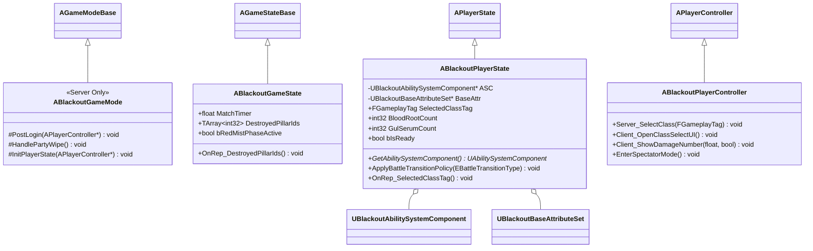

# Foundation — 01. 프레임워크 코어 (Framework Core)

> TDD v5 §1 참조. 서버 권한 진입점 — GameMode / GameState / PlayerState / PlayerController 공통 부모 정의.

## 구현 노트

- `ABlackoutGameMode`: 로비(`ABlackoutLobbyGameMode`)·전투(`ABlackoutBattleGameMode`)의 공통 베이스. 파티 전멸 판정·PostLogin 훅만 제공.
- `ABlackoutPlayerState`: ASC 소유 주체. `ABlackoutLobbyGameMode::PostLogin`에서 GA 일괄 부여.
- `ABlackoutPlayerController`: 관전 전환(`ChangeState(NAME_Spectating)`) 및 클라 RPC 진입점.
- `ABlackoutGameState`: `DestroyedPillarIds` Phase C 회피 난이도 로직 반영(TDD §8).
