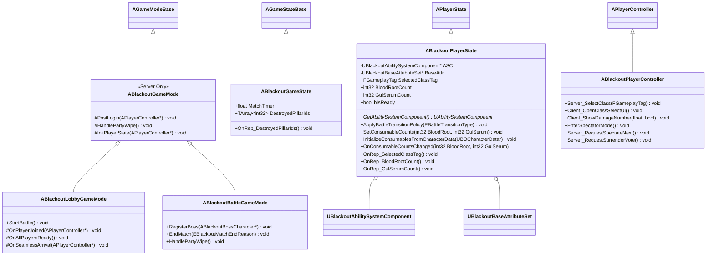

# Foundation — 01. 프레임워크 코어 (Framework Core)

> TDD v5 §1 참조. 서버 권한 진입점 — GameMode / GameState / PlayerState / PlayerController 공통 부모 정의.

## 구현 노트

- `ABlackoutGameMode`: 로비(`ABlackoutLobbyGameMode`)·전투(`ABlackoutBattleGameMode`)의 공통 베이스. PlayerState 초기화, Ready 집계, PostLogin/Logout 공통 훅을 제공합니다.
- `ABlackoutLobbyGameMode`: 로비 도착 처리, 병과 선택/Ready 대기, 현재 보스 단계에 맞는 전투 맵 `ServerTravel`을 담당합니다.
- `ABlackoutBattleGameMode`: 보스 등록, 전투 결과창, 체크포인트/전멸 복귀, 중간 보스 후 로비 복귀와 메인 보스 후 타이틀 복귀를 담당합니다.
- `ABlackoutPlayerState`: ASC와 현재 소모품 소지 수량의 소유 주체. 소모품 아이콘·초기/최대 수량·회복/버프 수치 같은 정적 정의는 `UBOConsumableData`가 소유하고, PlayerState는 복제 대상인 현재 수량만 관리합니다.
- `ABlackoutPlayerController`: 관전 전환(`ChangeState(NAME_Spectating)`), 관전 대상 변경 입력, 항복 투표 서버 RPC의 진입점. 상세 규칙은 [10_Player_Spectator_Surrender.md](10_Player_Spectator_Surrender.md)를 기준으로 합니다.
- `ABlackoutGameState`: `DestroyedPillarIds` Phase C 회피 난이도 로직 반영(TDD §8).
