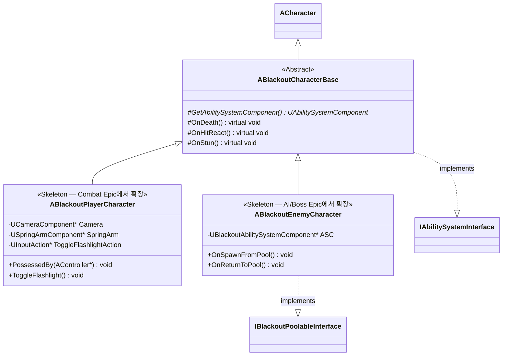

# Foundation — 02. 캐릭터 상속 계층 (Character Hierarchy)

> TDD v5 §2 참조. 1차 구현 범위는 **Base + 빈 자식 스켈레톤**까지. 상세 무기/AI 로직은 각 에픽에서 확장.

## 구현 노트

- `ABlackoutCharacterBase::GetAbilitySystemComponent()`: `IAbilitySystemInterface` 구현체. PlayerCharacter는 PlayerState에서, EnemyCharacter는 자신에서 ASC를 반환.
- `ABlackoutPlayerCharacter::PossessedBy`: 서버 측 `InitAbilityActorInfo` 초기화 진입점.
- `ABlackoutEnemyCharacter`: 풀링 재사용 시 `OnSpawnFromPool`에서 ASC 리셋(GE 제거 + HP 복구) 필수 수행.
- `ABlackoutBossCharacter`는 AI/Boss 에픽에서 `ABlackoutEnemyCharacter`를 상속해 추가.
