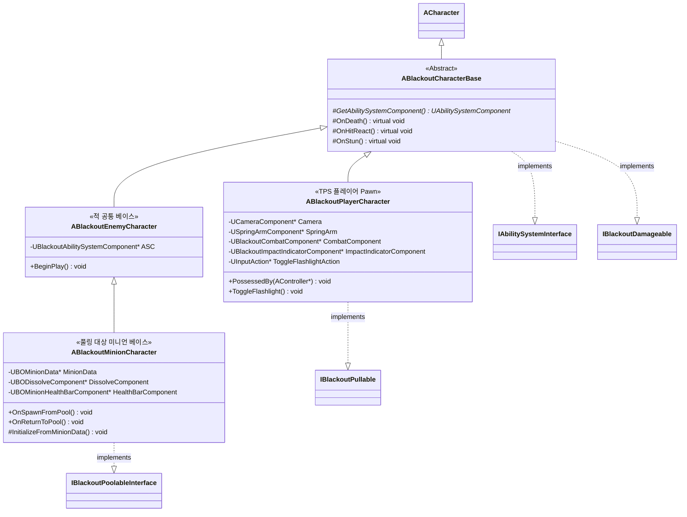

# Foundation — 02. 캐릭터 상속 계층 (Character Hierarchy)

> TDD v5 §2 참조. 공통 베이스와 구체 자식 타입의 상속 관계를 정의합니다.

## 구현 노트

- `ABlackoutCharacterBase::GetAbilitySystemComponent()`: `IAbilitySystemInterface` 구현체. PlayerCharacter는 PlayerState에서, Enemy/Minion/Boss는 자신이 가진 ASC를 반환합니다.
- `ABlackoutPlayerCharacter::PossessedBy`: 서버 측 `InitAbilityActorInfo` 초기화 진입점.
- `ABlackoutEnemyCharacter`: 적 공통 ASC를 소유하는 베이스입니다. 풀링 계약은 직접 구현하지 않습니다.
- `ABlackoutMinionCharacter`: `IBlackoutPoolableInterface` 구현체입니다. 풀링 재사용 시 `OnSpawnFromPool`에서 ASC 리셋(GE 제거 + HP 복구) 및 `UBOMinionData` 기반 초기화를 수행합니다.
- `ABlackoutBossCharacter`는 AI/Boss 에픽에서 `ABlackoutEnemyCharacter`를 상속해 추가.
