# Foundation — 03. GAS 공통 인프라 (GAS Infrastructure)

> TDD v5 §3~§5 참조. ASC / AttributeSet / GA 베이스 / 공통 GE / ExecCalc 정의.
> 개별 플레이어·보스 어트리뷰트와 스킬 GA는 각 에픽에서 상속·확장.

```mermaid
classDiagram
    direction TB

    UAbilitySystemComponent <|-- UBlackoutAbilitySystemComponent
    UAttributeSet <|-- UBlackoutBaseAttributeSet
    UGameplayAbility <|-- UBlackoutGameplayAbility
    UGameplayEffect <|-- GE_Damage
    UGameplayEffect <|-- GE_Downed
    UGameplayEffect <|-- GE_BleedOut
    UGameplayEffectExecutionCalculation <|-- UExecCalc_DamageCalc

    class UBlackoutAbilitySystemComponent {
        +GiveDefaultAbilities(TArray~TSubclassOf~UGameplayAbility~~) void
        +ClearAllAbilitiesAndEffects() void
        +OnDamageReceived(FGameplayEffectSpec) void
        +HandleAbilityInputPressed(EBlackoutAbilityInputID) void
        +ServerSetReplicatedEvent(InputPressed, Handle, ScopedKey, OriginalKey) void
        +RecordInputSyncPayload(FBlackoutAbilityInputSyncPayload) void
        +ValidateInputSequence(EBlackoutAbilityInputID, uint16) bool
    }

    class FBlackoutAbilityInputSyncPayload {
        <<메타데이터 부가 채널>>
        +uint16 SequenceId
        +float ClientInputTimeSeconds
        +float ClientEstimatedServerTimeSeconds
        +FGameplayTag InputTag
        +FGameplayAbilitySpecHandle AbilitySpecHandle
    }

    class UBlackoutBaseAttributeSet {
        <<플레이어 / 적 / 보스 공통>>
        +FGameplayAttributeData Health
        +FGameplayAttributeData MaxHealth
        +FGameplayAttributeData MovementSpeed
        +FGameplayAttributeData BaseDamage
        +FGameplayAttributeData DamageReduction
        +PreAttributeChange(FGameplayAttribute, float) void
        +PostGameplayEffectExecute(FGameplayEffectModCallbackData) void
    }

    class UBlackoutGameplayAbility {
        <<Abstract Base>>
        +EBlackoutAbilityInputID InputID
        +CanActivateAbility(...) bool
        +ActivateAbility(...) virtual void
    }

    class GE_Damage {
        <<Instant>>
        +SetByCaller: Damage
        +SetByCaller: HitPartTag
    }

    class GE_Downed {
        <<Duration / Infinite>>
        +GrantsTag: State.Downed
        +블록: 이동 및 모든 액션 GA
    }

    class GE_BleedOut {
        <<Periodic — 1.0s>>
        +Modifier: Health -X per tick
        +GE_Downed 활성 중 동반 부여
    }

    class UExecCalc_DamageCalc {
        +Execute_Implementation(FGameplayEffectCustomExecutionParameters) void
        -ApplyWeakSpotMultiplier(FGameplayTag) float
        -ApplyArmorReduction(float) float
    }

    UBlackoutAbilitySystemComponent o-- UBlackoutBaseAttributeSet
    UBlackoutAbilitySystemComponent ..> FBlackoutAbilityInputSyncPayload : timestamp 메타데이터
    GE_Damage ..> UExecCalc_DamageCalc : uses
    GE_Damage ..> BlackoutGameplayTags : HitPartTag lookup
```

## 구현 노트

- `UBlackoutAbilitySystemComponent::ClearAllAbilitiesAndEffects()`: 미니언 풀 반환 시 ASC 완전 초기화용.
- `UBlackoutBaseAttributeSet::PostGameplayEffectExecute`: Health 클램핑(0 이하 → OnDeath 델리게이트) 처리.
- `GE_Damage`의 `SetByCaller(HitPartTag)`: `Body.WeakSpot` → ×1.5, `Body.ArmoredLimb` → ×0.5 (TDD §5.2).
- `UBlackoutGameplayAbility`: 플레이어 GA(`GA_Dodge` 등)와 보스 패턴 GA 모두 이 클래스에서 파생.
- `UBlackoutAbilitySystemComponent`: 플레이어 재입력 이벤트를 GAS 표준 `EAbilityGenericReplicatedEvent::InputPressed` 경로(`AbilitySpecInputPressed` + `ServerSetReplicatedEvent`)로 서버에 전파합니다. `bReplicateInputDirectly` 는 사용하지 않습니다. `FBlackoutAbilityInputSyncPayload` 는 부가 메타데이터 채널이며, `Server_RecordAbilityInputSyncPayload` 가 `SequenceId` 단조성·timestamp clamp 값만 기록합니다. 콤보/체인 입력 트리거 자체는 표준 GAS 복제 이벤트가 담당합니다 (자세한 권위 모델은 TDD v5 §4.1 참조).
- 플레이어 전용 `UBlackoutPlayerAttributeSet` / `UBlackoutAmmoAttributeSet`는 **Combat 에픽**에서 `UBlackoutBaseAttributeSet`와 별도로 추가.
