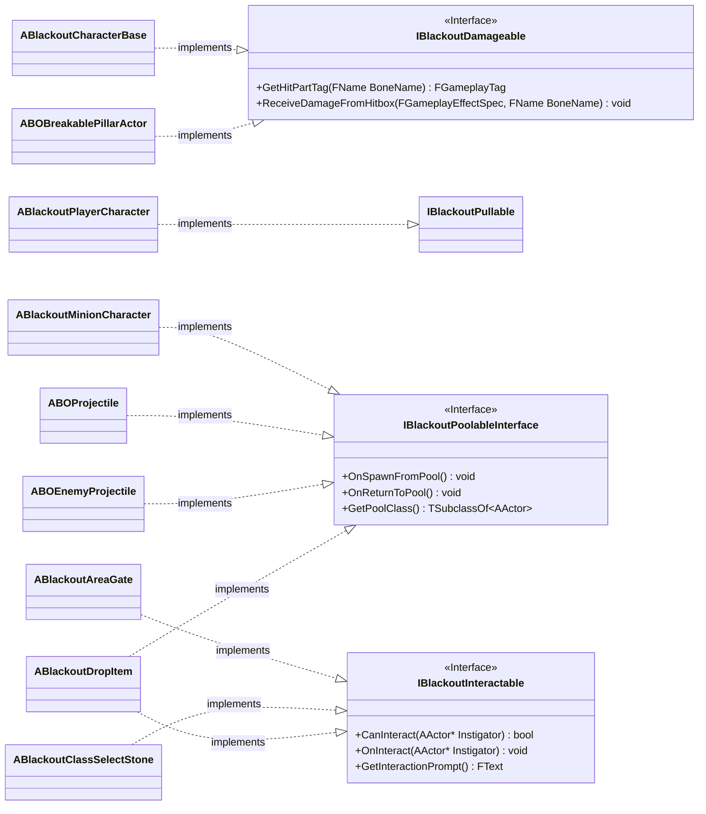

# Foundation — 04. 공통 인터페이스 (Common Interfaces)

> 에픽 간 결합도를 낮추는 공유 인터페이스. 헤더 선언만으로 의존성 없이 참조 가능.

## 구현 노트

| 인터페이스 | 구현 대상 | 용도 |
|---|---|---|
| `IBlackoutPoolableInterface` | `ABlackoutMinionCharacter`, 투사체, 드랍 아이템 | 풀 서브시스템에서 Get/Return 시 호출 |
| `IBlackoutInteractable` | `ABlackoutAreaGate`, `ABlackoutClassSelectStone`, 드랍 아이템 | `[E]` 상호작용 월드 위젯·입력 공용 경로 |
| `IBlackoutDamageable` | `ABlackoutCharacterBase`, `ABOBreakablePillarActor` | 부위별 Bone → `FGameplayTag` 배율 분기 및 Ravager 기둥 파괴 판정 |
| `IBlackoutPullable` | `ABlackoutPlayerCharacter` | 끌어당김/흡입 계열 패턴 대상 계약 |

- `IBlackoutPoolableInterface`는 `UBlackoutPoolSubsystem`이 캐스팅 없이 호출하는 유일한 계약.
- `IBlackoutDamageable`은 보스 에픽에서 먼저 구현되지만, 인터페이스 선언 자체는 공통 기반에 포함.
