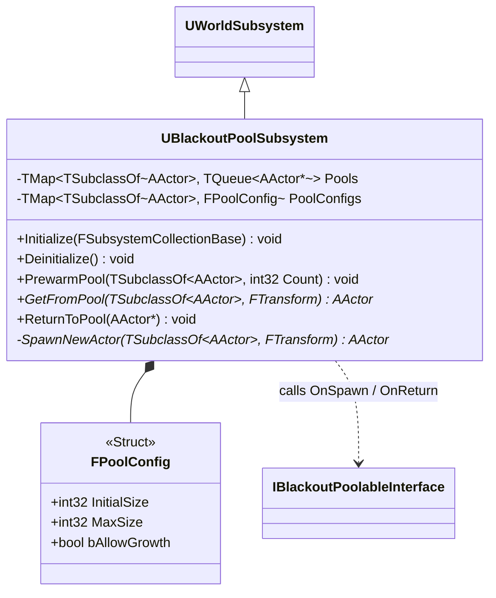

# Foundation — 05. 오브젝트 풀링 서브시스템 (Object Pooling Subsystem)

> TDD v5 §12 참조. World Subsystem 기반. 모든 에픽의 재사용 액터(미니언·발사체·드랍·씨앗 포드)가 이 서브시스템을 경유.



## Pre-warm 풀 크기 표 (TDD §12)

| 액터 타입 | InitialSize | 산출 근거 |
|---|---|---|
| Root Hollow (일반 미니언) | 20 | 최대 동시 활성 예상 수 |
| Root Wraith (엘리트 미니언) | 4 | Phase B 이후 최대 동시 활성 수 |
| 발사체 (화살/충격파 등) | 타입별 계산 | 수명(초) × 연사속도(1/초) |
| 탄약 드랍 아이템 | 20 | 최대 동시 바닥 잔존 수 |
| 소모품 드랍 아이템 | 5 | 최대 동시 바닥 잔존 수 |
| Seed Pod (씨앗 포드) | 16 | 슈루드 최대 투하(12) + 여유 4 |

## 액터 생명 주기

```
발사체:   GetFromPool → 충돌 판정 → GCN 재생 → ReturnToPool
드랍:     GetFromPool → 바닥 드랍 → 오버랩 획득 or 수명 만료 → ReturnToPool
미니언:   GetFromPool (위치/HP/BT 초기화) → HP=0 → 래그돌 N초 → ReturnToPool
```

## 구현 노트

- `GetFromPool`: 큐에 유휴 액터가 없고 `bAllowGrowth=true`이면 `SpawnNewActor`로 동적 추가.
- `ReturnToPool`: `Destroy()` 호출 금지. `IBlackoutPoolableInterface::OnReturnToPool` → Hidden/Collision Off/Tick Off.
- `PrewarmPool`은 `ABlackoutBattleGameMode::BeginPlay`에서 호출.
