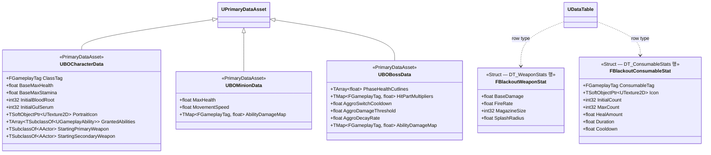

# Foundation — 06. 데이터 에셋 베이스 (Data Assets)

> TDD v5 §11 참조. 모든 수치를 에셋화하여 기획자가 에디터에서 직접 조정 가능.
> 1차 구현 범위: **클래스 선언 + 필수 필드**. 실제 수치는 에셋 생성 후 채움.

## 에셋별 참조 위치

| 데이터 에셋 | 주요 참조처 |
|---|---|
| `UBOCharacterData` | `ABlackoutPlayerState::ApplyBattleTransitionPolicy`, `ABlackoutLobbyGameMode::PostLogin` GA 부여 |
| `UBOMinionData` | `ABlackoutEnemyCharacter::BeginPlay` 어트리뷰트 주입 |
| `UBOBossData` | `ABlackoutBossCharacter` 페이즈 컷라인, `UBlackoutAggroComponent` 튜닝 |
| `DT_WeaponStats` | `UBlackoutCombatComponent` 무기 스탯 조회 |
| `DT_ConsumableStats` | `ABlackoutPlayerState` 초기/최대 소지량 정책, `UBlackoutHUDWidgetController` 소모품 아이콘·수치 표시, `GA_UseConsumable_*` 회복/지속시간/쿨다운 적용 |

## 구현 노트

- 모든 에셋은 `Content/_BP/Core/Data/` 에 배치.
- `UBOBossData.AggroSwitchCooldown` 기본값 `5.0`, `AggroDamageThreshold` `0.15`, `AggroDecayRate` `0.02` (TDD §6.1).
- `UBOBossData.PhaseHealthCutlines`: Phase A→B 60%, B→C 30% 기준.
- `DT_ConsumableStats`는 소모품별 정적 정의만 보관합니다. 현재 소지 수량은 `ABlackoutPlayerState`의 Replicated 프로퍼티가 소유합니다.
- `FBlackoutConsumableStat.InitialCount`는 전투 진입/캐릭터 초기화 시 최소 지급량으로 사용하고, `MaxCount`는 획득·보상·체크포인트 보정 시 상한으로 사용합니다.
- `HealAmount`, `Duration`, `Cooldown`은 `GA_UseConsumable_*`가 읽어 GameplayEffect SetByCaller 값 또는 쿨다운 GE 입력값으로 전달합니다.
