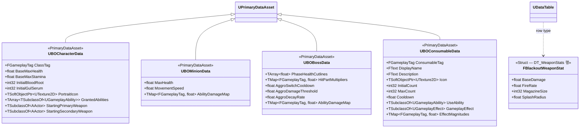

# Foundation — 06. 데이터 에셋 베이스 (Data Assets)

> TDD v5 §11 참조. 모든 수치를 에셋화하여 기획자가 에디터에서 직접 조정 가능.
> 1차 구현 범위: **클래스 선언 + 필수 필드**. 실제 수치는 에셋 생성 후 채움.

## 에셋별 참조 위치

| 데이터 에셋 | 주요 참조처 |
|---|---|
| `UBOCharacterData` | `ABlackoutPlayerState::ApplyBattleTransitionPolicy`, `ABlackoutLobbyGameMode::PostLogin` GA 부여 |
| `UBOMinionData` | `ABlackoutEnemyCharacter::BeginPlay` 어트리뷰트 주입 |
| `UBOBossData` | `ABlackoutBossCharacter` 페이즈 컷라인, `UBlackoutAggroComponent` 튜닝 |
| `UBOConsumableData` | `ABlackoutPlayerState` 초기/최대 소지량 정책, `UBlackoutHUDWidgetController` 소모품 아이콘·수치 표시, `UBlackoutGA_UseBloodRoot` / `UBlackoutGA_UseGulSerum` 회복/버프 수치와 쿨다운 적용 |
| `DT_WeaponStats` | `UBlackoutCombatComponent` 무기 스탯 조회 |

## 구현 노트

- 모든 에셋은 `Content/_BP/Core/Data/` 에 배치.
- `UBOBossData.AggroSwitchCooldown` 기본값 `5.0`, `AggroDamageThreshold` `0.15`, `AggroDecayRate` `0.02` (TDD §6.1).
- `UBOBossData.PhaseHealthCutlines`: Phase A→B 60%, B→C 30% 기준.
- `UBOConsumableData`는 소모품별 정적 정의만 보관합니다. 현재 소지 수량은 `ABlackoutPlayerState`의 Replicated 프로퍼티가 소유합니다.
- 블러드 루트와 굴 세럼처럼 효과 종류가 다른 소모품은 각각 `DA_BloodRoot`, `DA_GulSerum`처럼 별도 DataAsset으로 정의하고, `UseAbility`는 `UBlackoutGA_UseBloodRoot`, `UBlackoutGA_UseGulSerum` 같은 전용 자식 GA를 지정합니다.
- `InitialCount`는 전투 진입/캐릭터 초기화 시 최소 지급량으로 사용하고, `MaxCount`는 획득·보상·체크포인트 보정 시 상한으로 사용합니다.
- `EffectMagnitudes`는 `Data.Consumable.HealAmount`, `Data.Consumable.Duration`, `Data.Consumable.StaminaCostMultiplier` 같은 태그 기반 효과 수치를 보관합니다. `Cooldown`은 효과 수치가 아니라 사용 규칙이므로 별도 필드로 유지합니다.
