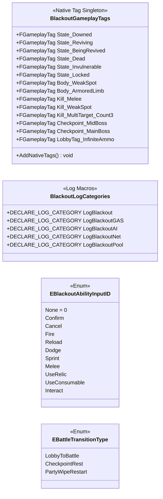

# Foundation — 07. 유틸·태그·로깅 (Utilities, Tags, Logging)

> 모든 에픽이 `#include`할 경량 헤더. 의존성 없이 최우선 구현.

## 파일별 위치

| 파일 | 경로 |
|---|---|
| `BlackoutGameplayTags.h/.cpp` | `Source/ProjectBlackout/GameplayTags/` |
| `BlackoutLogCategories.h` | `Source/ProjectBlackout/Core/` |
| `BlackoutTypes.h` | `Source/ProjectBlackout/Core/` (Enum 통합) |

## 구현 노트

- `BlackoutGameplayTags`: `UGameplayTagsManager::AddNativeGameplayTag()`로 네이티브 태그 등록. 모듈 StartupModule에서 `AddNativeTags()` 호출.
- 네이티브 태그는 `.ini` 의존 없이 C++ 심볼로 직접 참조 가능해 오타 컴파일 오류로 잡힘.
- `LogBlackoutGAS`: GA `ActivateAbility`/`EndAbility` 진입·종료 로그 필수 기록.
- `LogBlackoutPool`: `GetFromPool` miss(큐 비어 동적 스폰) 추적용.
