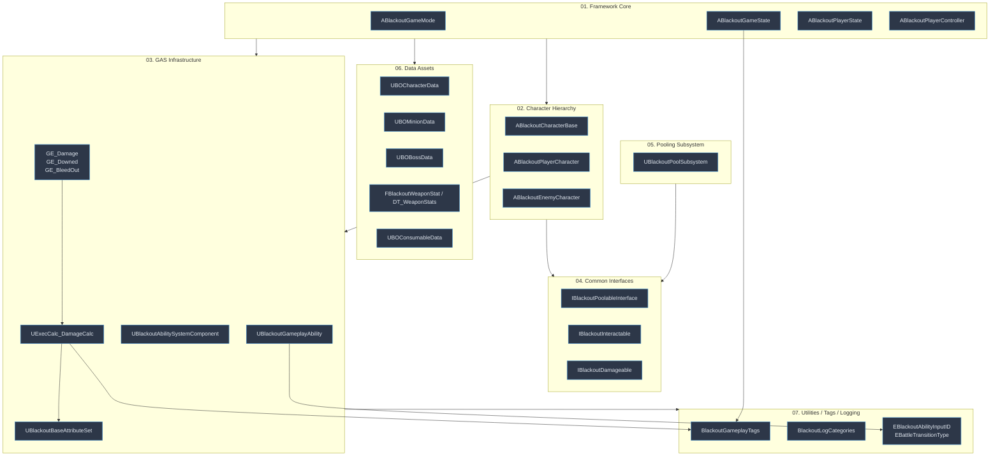

# Foundation — 08. 전체 의존 관계 개요 (Dependency Overview)

> 공통 기반 레이어 내부의 의존 흐름. 개별 에픽(Combat / AI-Boss / UI / Lobby / Battle)은 이 그래프 위에 얹혀 성장.

## 권장 구현 순서

| 단계 | 대상 | 이유 |
|---|---|---|
| 1 | **§07 유틸·태그·로깅** | 의존성 0, 모든 레이어가 `#include` |
| 2 | **§04 공통 인터페이스** | 헤더만 선언, 풀링·캐릭터보다 먼저 필요 |
| 3 | **§06 데이터 에셋 스켈레톤** | Framework/GAS가 참조하기 전에 타입 확정 |
| 4 | **§03 GAS 인프라** | ASC/AttributeSet → GA/GE/ExecCalc 순 |
| 5 | **§02 캐릭터 베이스** | GAS 인터페이스 확정 후 `InitAbilityActorInfo` 가능 |
| 6 | **§01 프레임워크 코어** | PlayerState(ASC 소유) 포함, 상위 의존 마지막 |
| 7 | **§05 풀링 서브시스템** | `IBlackoutPoolableInterface` 확정 후 착수 |

> 각 단계 완료 시 `feature/foundation-step<N>` 브랜치로 PR → `develop` 머지.
