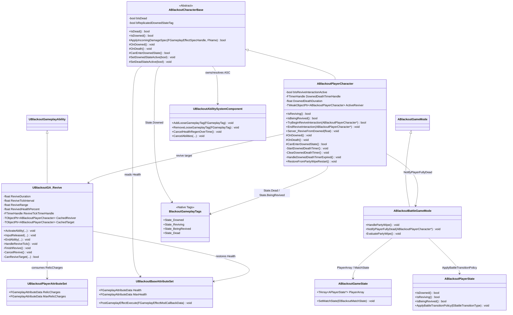

# Foundation — 09. 플레이어 다운 / 완전 사망

> HP 0 도달 시 즉시 매치 실패로 처리하지 않고, `State.Downed` 상태에서 부활 가능 시간을 제공한 뒤 타이머가 만료되면 완전 사망으로 전환하는 책임 구조입니다.
> `State.Downed`, `State.Reviving`, `State.BeingRevived`, `State.Dead`와 `UBlackoutGA_Revive`를 기준으로 다운, 부활, 완전 사망, 전멸 감지를 정의합니다.
> 완전 사망 이후 관전, 관전 대상 변경 입력, 항복 투표는 [10_Player_Spectator_Surrender.md](10_Player_Spectator_Surrender.md)를 기준으로 합니다.

## 클래스 다이어그램

## 상태 전환 책임

| 상태 | 원천 | 진입 | 이탈 |
|---|---|---|---|
| Alive | `Health > 0`, `!State.Downed`, `!State.Dead` | 부활 완료, 전멸 복귀 | HP 0 |
| Downed | `State.Downed` | `ABlackoutCharacterBase::ApplyIncomingDamageSpec` → `OnDowned` | 부활 완료 또는 다운 사망 타이머 만료 |
| BeingRevived | `State.BeingRevived` + 다운 사망 타이머 일시정지 | `TryBeginReviveInteraction` 성공 | `EndReviveInteraction`, 부활 완료, 완전 사망 |
| Reviving | `State.Reviving` | 구출자가 부활 진행 시작 | 부활 완료, 입력 해제, 피격 캔슬, 대상 완전 사망 |
| Dead | `State.Dead` + `bIsDead` | `HandleDownedDeathTimerExpired` → `OnDeath` | 전멸 복귀 / 재시작 정책 |

## 다운 상태 UI 전환

| 상태 | 유지 UI | 숨김 UI | 표시 UI | 다음 전환 |
|---|---|---|---|---|
| Downed | 팀원 상태창, 보스 체력바 | 크로스헤어, 착탄 인디케이터, 플레이어 HP/SP, 무기/탄약, 유물, 소모품, 데미지 플로팅 텍스트 | 완전 사망까지 남은 시간 프로그래스 바 | 부활 시도, 완전 사망, 부활 성공 |
| BeingRevived | 팀원 상태창, 보스 체력바 | 기본 전투 HUD, 일시정지된 사망 타이머 프로그래스 바 | 부활 완료까지 남은 시간 프로그래스 바 | 부활 성공, 부활 취소, 완전 사망 |
| Alive 복귀 | 기본 전투 HUD, 팀원 상태창, 보스 체력바 | 다운/부활 프로그래스 바 | 없음 | 일반 전투 |
| Dead | 관전 HUD | 기본 전투 HUD, 다운/부활 프로그래스 바 | 관전 대상/항복 투표 UI | 전멸 복귀 / 관전 흐름 |

다운 상태 UI는 로컬 플레이어에게만 적용됩니다. 다른 파티원에게는 기존 파티 상태창의 다운 표시(`REVIVE`, 붉은 해골 아이콘)를 유지합니다. 완전 사망 전 관전 HUD의 상세 구성은 `Foundation/10_Player_Spectator_Surrender.md`를 기준으로 합니다.

## 구현 노트

- **HP 0 분기**: 기존 `ABlackoutCharacterBase::ApplyIncomingDamageSpec`가 HP 0 도달을 감지하고, 플레이어는 `CanEnterDownedState()`를 통해 `OnDowned()`로 진입합니다.
- **다운 타이머 소유자**: 플레이어 전용 타이머는 `ABlackoutPlayerCharacter`가 소유합니다. 다운 진입 시 서버에서 `StartDownedDeathTimer()`, 부활 완료 또는 전멸 복귀 시 `ClearDownedDeathTimer()`를 호출합니다.
- **UI 타이머 데이터**: 다운 사망 타이머는 서버 권위로 유지하되, 소유 클라이언트 HUD가 남은 시간을 그릴 수 있도록 시작 시각/종료 시각 또는 남은 시간을 복제·RPC로 제공합니다. UI는 로컬 월드 시간이 아니라 서버 월드 시간 보정값을 기준으로 프로그래스를 계산합니다.
- **완전 사망 표현**: `State.Dead` 네이티브 태그를 GA 차단, UI 표시, 파티 전멸 평가의 공통 판정값으로 사용합니다. `bIsDead`는 서버 중복 처리 가드로 유지합니다.
- **GA 차단**: `UBlackoutGameplayAbility` 기본 차단 태그에 `State.Dead`를 넣어 플레이어/AI 공통으로 완전 사망 후 새 어빌리티 시작을 막습니다.
- **부활과 타이머 우선순위**: 부활 진행이 시작되면 서버는 다운 사망 타이머를 일시정지하고 정지 시점의 남은 시간을 보관합니다. 부활이 취소되면 보관한 남은 시간으로 다운 사망 타이머를 재개합니다. 부활 성공 시 타이머를 완전히 해제하고, 완전 사망 시 `UBlackoutGA_Revive`를 캔슬합니다.
- **다운 HUD 모드 복구**: 부활 성공으로 `State.Downed`와 `State.BeingRevived`가 해제되면 소유 클라이언트 HUD는 기본 전투 HUD로 복구합니다. `State.Dead`가 적용되면 다운 HUD가 아니라 관전 HUD로 전환합니다.
- **전멸 감지**: 완전 사망 전환이 발생한 서버 경로에서 `ABlackoutBattleGameMode::NotifyPlayerFullyDead`를 호출하고, `EvaluatePartyWipe()`가 `GameState->PlayerArray` 기준으로 생존자를 계산합니다.
- **전멸 복귀**: 생존자가 0명이면 기존 `HandlePartyWipe()` 경로를 재사용합니다. 이 경로는 체크포인트 텔레포트, `ApplyBattleTransitionPolicy(PartyWipeRestart)`, Ready 리셋, `InCombatReady` 복귀를 담당합니다.
- **관전 위임**: 완전 사망한 플레이어가 생존 또는 다운 상태 파티원을 관전하는 흐름은 `ABlackoutPlayerController`와 `ABlackoutBattleGameMode`가 담당하며, 상세 대상 선택 규칙은 §10 문서를 따릅니다.

## 구현 대상 파일

| 책임 | 파일 |
|---|---|
| `State.Dead` 태그 추가 | `Source/ProjectBlackout/GameplayTags/BlackoutGameplayTags.h/.cpp` |
| 다운 사망 타이머, 완전 사망 전환 | `Source/ProjectBlackout/Characters/BlackoutPlayerCharacter.h/.cpp` |
| 공통 사망/다운 가드 | `Source/ProjectBlackout/Characters/BlackoutCharacterBase.h/.cpp` |
| 완전 사망 중 GA 활성 차단 | `Source/ProjectBlackout/GAS/Abilities/BlackoutGameplayAbility.cpp` |
| 부활 진행 중 대상 사망 처리 | `Source/ProjectBlackout/GAS/Abilities/Player/BlackoutGA_Revive.h/.cpp` |
| 완전 사망 감지 후 전멸 평가 | `Source/ProjectBlackout/Framework/BlackoutBattleGameMode.h/.cpp` |
| 로컬 다운 HUD 모드 및 사망/부활 프로그래스 표시 | `Source/ProjectBlackout/UI/BlackoutHUDWidget.h/.cpp`, `Source/ProjectBlackout/UI/BlackoutHUDWidgetController.h/.cpp`, `Source/ProjectBlackout/UI/BlackoutDownedStateWidget.h/.cpp` |
| 파티원 사망 표시 | `Source/ProjectBlackout/UI/BlackoutPartyRosterWidgetController.h/.cpp` |
