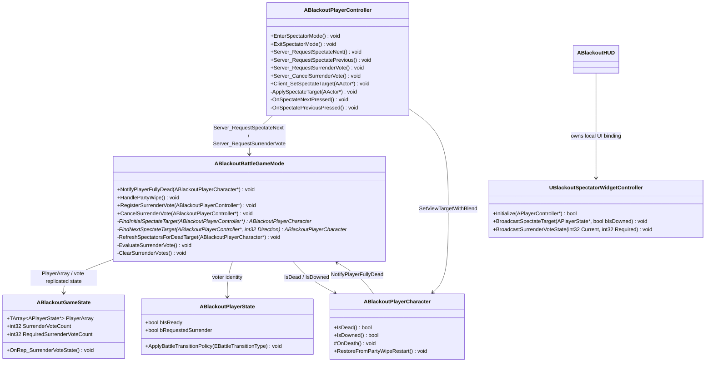
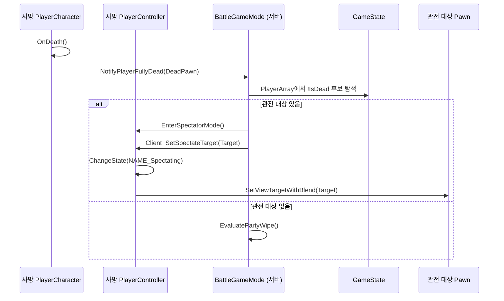
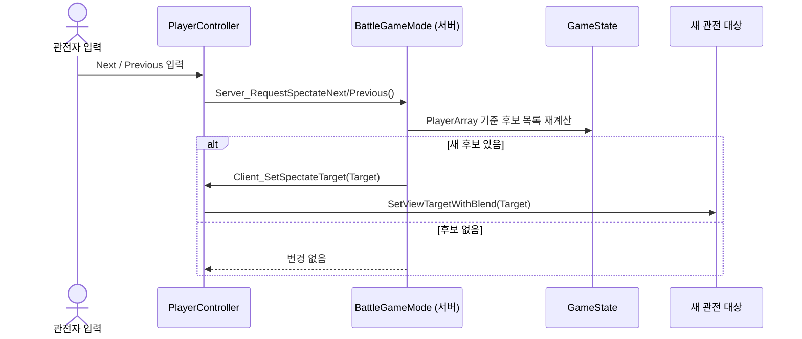
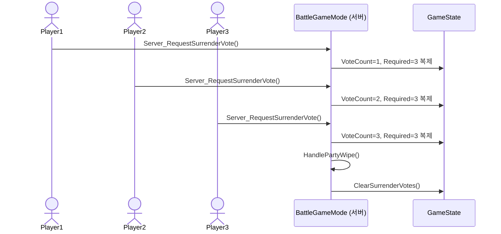

# Foundation — 10. 플레이어 관전 / 항복 투표

> 완전 사망한 플레이어가 다른 파티원을 관전하고, 파티가 전투 포기를 합의하면 기존 전멸 복귀 흐름을 재사용해 체크포인트로 돌아가는 책임 구조입니다.
> 다운 상태 플레이어도 관전 대상에 포함합니다. 즉 관전 후보는 `!IsDead()` 인 파티원이며, `State.Downed` 여부만으로 제외하지 않습니다.

## 클래스 다이어그램

## 용어와 판정

| 용어 | 정의 |
|---|---|
| Spectator | 완전 사망 후 `ABlackoutPlayerController`가 `NAME_Spectating` 상태로 전환된 플레이어 컨트롤러 |
| Spectate Target | 관전자 카메라가 따라가는 파티원 Pawn |
| Spectatable Player | 같은 전투 세션의 플레이어 중 자기 자신이 아니고 `!IsDead()`인 `ABlackoutPlayerCharacter` |
| Downed Target | `IsDowned() == true` 이지만 `IsDead() == false`인 관전 가능 대상 |
| Surrender Vote | 전투 포기 후 체크포인트 복귀를 요청하는 투표 |

## 관전 대상 규칙

| 상황 | 처리 |
|---|---|
| 플레이어 완전 사망 | 서버가 해당 컨트롤러를 관전 상태로 전환하고 첫 관전 대상을 지정 |
| 초기 관전 대상 선택 | `GameState->PlayerArray` 순서 기준으로 첫 번째 `Spectatable Player` 선택 |
| 다운 상태 파티원 | 완전 사망이 아니면 관전 대상에 포함 |
| 관전 대상이 부활 | 같은 Pawn을 계속 관전. 별도 전환 없음 |
| 관전 대상이 완전 사망 | 서버가 다음 `Spectatable Player`로 자동 전환 |
| 관전 후보가 없음 | ViewTarget을 변경하지 않고 전멸 평가 결과를 기다림. 생존자 0이면 `HandlePartyWipe()`가 복구 |
| 전멸 복귀 | 관전자 상태를 종료하고 각자의 Pawn을 ViewTarget으로 복구 |

초기 선택과 다음/이전 선택은 모두 동일한 후보 목록을 사용합니다. 후보 목록은 `PlayerArray` 순서를 기준으로 안정적으로 정렬하며, 다음/이전 입력은 현재 관전 대상의 인덱스를 기준으로 순환합니다.

## 컨트롤러와 Pawn 소유권

- 완전 사망한 플레이어의 `PlayerController`는 자기 Pawn 소유권을 유지합니다.
- 관전은 Pawn 재소유가 아니라 `ChangeState(NAME_Spectating)` + `SetViewTargetWithBlend(SpectateTarget)`로 처리합니다.
- 자기 Pawn은 사망 몽타주와 전멸 복귀에 필요하므로 즉시 Destroy하지 않습니다.
- 사망 몽타주가 끝나면 `HiddenInGame = true` / 물리 불가 처리를 적용합니다.
- 전멸 복귀 시 `ChangeState(NAME_Playing)` 또는 엔진 기본 Playing 상태 복구 경로를 호출한 뒤 `SetViewTargetWithBlend(GetPawn())`로 자기 Pawn 시점을 되돌립니다.

## 입력 설계

| 입력 | 소유 클래스 | 서버 RPC | 처리 |
|---|---|---|---|
| 다음 관전 대상 | `ABlackoutPlayerController` | `Server_RequestSpectateNext()` | 현재 대상 다음 후보를 찾아 `Client_SetSpectateTarget` 호출 |
| 이전 관전 대상 | `ABlackoutPlayerController` | `Server_RequestSpectatePrevious()` | 현재 대상 이전 후보를 찾아 `Client_SetSpectateTarget` 호출 |
| 항복 투표 | `ABlackoutPlayerController` | `Server_RequestSurrenderVote()` | 투표 등록 후 과반수 평가 |
| 항복 투표 취소 | `ABlackoutPlayerController` | `Server_CancelSurrenderVote()` | 투표 철회 후 UI 카운트 갱신 |

입력은 로컬 컨트롤러에서만 바인딩합니다. 서버 RPC는 현재 매치 상태가 전투 중인지, 요청자가 유효한 PlayerState를 가진 참가자인지 검증합니다.

## 항복 투표 규칙

| 항목 | 규칙 |
|---|---|
| 투표 발의 권한 | 오직 쓰러지거나(`IsDowned()`) 완전히 사망한(`IsDead()`) 플레이어만 투표 발의("항복 요청") 가능 |
| 투표 가능 상태 | `InCombat`, `MidBossCombat`, `MainBossCombat` 같은 전투 상태 |
| 투표권자 | 현재 접속 중인 모든 파티 참가자. Alive / Downed / Dead 모두 투표 찬성/반대 가능 |
| 중복 투표 | PlayerState 단위로 1회만 인정 (찬성 / 반대 중 선택) |
| 자동 찬성 | 항복을 최초 요청(발의)한 플레이어는 자동으로 찬성표 처리 |
| 필요 찬성 수 | `floor(ConnectedPlayers / 2) + 1` |
| 투표 성공 | `HandlePartyWipe()`를 호출해 체크포인트 복귀 흐름 재사용 |
| 투표 유효 시간 | 투표 개시 후 **30초** 제한. 제한 시간 종료 시 자동 부결 및 종료 |
| 조기 기각 (부결) | 반대표가 누적되어 남은 미투표자를 모두 합쳐도 필요 찬성 수에 도달할 수 없는 경우 즉시 기각 종료 |
| 발의 쿨다운 | 투표가 종료(성공/기각/타임아웃)된 후 **1분(60초)** 동안 신규 항복 투표 발의 제한 |
| 투표 초기화 | 전멸 복귀, 체크포인트 복귀, 매치 종료, 플레이어 이탈 시 모든 투표 데이터 초기화 |
| UI 표시 | 화면 좌측에 항복 투표 UI를 표시하며, 현재 찬성/반대 수, 필요 찬성 수, 남은 제한 시간을 실시간 동기화 |

항복 투표는 “전투 실패”와 같은 복구 경로를 사용하지만 원인은 다릅니다. 로그와 UI에는 `PartyWipe`와 구분되는 `SurrenderVote` 사유를 남겨야 합니다.

### 1인 솔로 플레이 예외 규칙
*   **부활 불가 및 즉시 사망**: 아군 파티원이 존재하지 않는 1인 플레이어 환경에서는 다운(쓰러짐) 상태를 제공하지 않고 바로 완전 사망 처리됩니다. `CanEnterDownedState()`에서 아군 플레이어 수(혹은 총 접속 수)가 1명 이하이면 `false`를 반환하도록 설계하여 즉시 `OnDeath()`를 실행하게 함으로써 즉각 패배 연출 및 체크포인트 복귀가 발생하도록 합니다.
*   **항복 투표 차단**: 1인 환경에서 항복 투표를 시작하는 것은 불필요하므로, `StartSurrenderVote()` 진입 시 접속 유저가 1명 이하인 경우에는 투표 발의가 즉각 차단됩니다.

## 완전 사망 → 관전 시퀀스

## 관전 대상 변경 시퀀스

## 항복 투표 시퀀스

## 구현 대상 파일

| 책임 | 파일 |
|---|---|
| 관전 입력, 서버 RPC, Client ViewTarget 적용 | `Source/ProjectBlackout/Framework/BlackoutPlayerController.h/.cpp` |
| 관전 대상 탐색, 자동 전환, 항복 투표 평가 | `Source/ProjectBlackout/Framework/BlackoutBattleGameMode.h/.cpp` |
| 투표 수 복제, UI 바인딩 원천 | `Source/ProjectBlackout/Framework/BlackoutGameState.h/.cpp` |
| PlayerState 단위 투표 여부 저장 | `Source/ProjectBlackout/Framework/BlackoutPlayerState.h/.cpp` |
| 완전 사망 시 관전 진입 호출 | `Source/ProjectBlackout/Characters/BlackoutPlayerCharacter.h/.cpp` |
| 관전 HUD / 항복 투표 UI 바인딩 | `Source/ProjectBlackout/UI/` |
| 입력 액션 에셋 연결 | `Content/_BP/Player/` 및 입력 매핑 에셋 |

## 구현 순서 제안

1. `ABlackoutPlayerController`에 관전 상태 진입/종료, ViewTarget 적용, 다음/이전 입력 RPC를 추가합니다.
2. `ABlackoutBattleGameMode`에 관전 후보 탐색과 사망 대상 자동 재배정 로직을 추가합니다.
3. `ABlackoutGameState` / `ABlackoutPlayerState`에 항복 투표 복제 상태를 추가합니다.
4. 관전 HUD에서 현재 대상 이름, 다운 여부, 항복 투표 수를 표시합니다.
5. 전멸 복귀와 항복 복귀가 모두 관전 상태를 정상 종료하는지 검증합니다.
