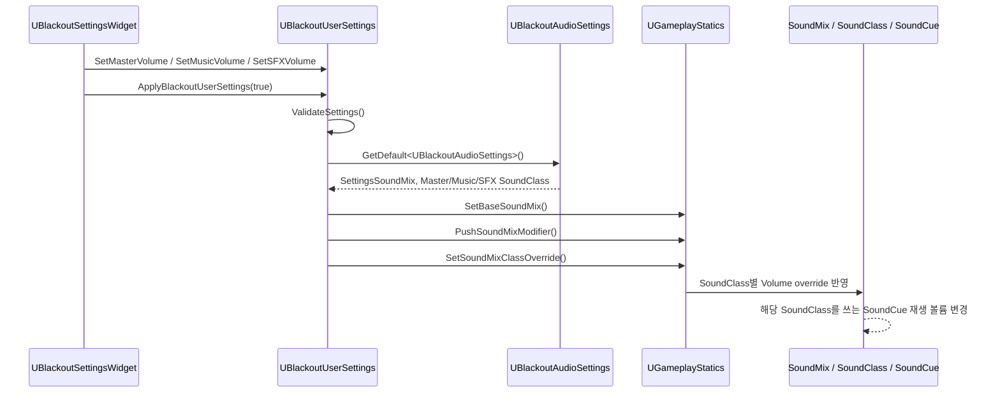

# Foundation — 11. 사용자 설정 / 오디오 볼륨 적용

> 현재 C++ 구조 기준. `UBlackoutUserSettings`가 그래픽·오디오·입력 값을 함께 저장하고, `UBlackoutAudioSettings`가 오디오 적용에 필요한 SoundMix/SoundClass 에셋 참조를 보관합니다.

```mermaid
classDiagram
    direction LR

    UGameUserSettings <|-- UBlackoutUserSettings
    UDeveloperSettings <|-- UBlackoutAudioSettings
    UBlueprintFunctionLibrary <|-- UBlackoutGraphicsBlueprintLibrary
    UUserWidget <|-- UBlackoutSettingsWidget
    USoundBase <|-- USoundCue

    class UBlackoutSettingsWidget {
        <<UserWidget>>
        -float PendingMasterVolume
        -float PendingMusicVolume
        -float PendingSFXVolume
        -USlider* MasterVolumeSlider
        -USlider* MusicVolumeSlider
        -USlider* SFXVolumeSlider
        +RefreshFromCurrentSettings() void
        -ApplyPendingSettings() void
        -HandleMasterVolumeChanged(float) void
        -HandleMusicVolumeChanged(float) void
        -HandleSFXVolumeChanged(float) void
    }

    class UBlackoutGraphicsBlueprintLibrary {
        <<BlueprintFunctionLibrary>>
        +GetBlackoutUserSettings() UBlackoutUserSettings*
        +ApplyBlackoutUserSettings(bool) bool
    }

    class UBlackoutUserSettings {
        <<GameUserSettings>>
        -float MasterVolume
        -float MusicVolume
        -float SFXVolume
        -float MouseSensitivity
        -float AimMouseSensitivityMultiplier
        +SetMasterVolume(float) void
        +GetMasterVolume() float
        +SetMusicVolume(float) void
        +GetMusicVolume() float
        +SetSFXVolume(float) void
        +GetSFXVolume() float
        +ApplyBlackoutUserSettings(bool) void
        +ApplyNonResolutionSettings() void
        -ApplyAudioSettings() void
        -ResolveSettingsWorld() UWorld*
    }

    class UBlackoutAudioSettings {
        <<DeveloperSettings, Config=Game>>
        +TSoftObjectPtr~USoundMix~ SettingsSoundMix
        +TSoftObjectPtr~USoundClass~ MasterSoundClass
        +TSoftObjectPtr~USoundClass~ MusicSoundClass
        +TSoftObjectPtr~USoundClass~ SFXSoundClass
        +GetCategoryName() FName
    }

    class UGameplayStatics {
        <<Engine API>>
        +SetBaseSoundMix(UObject*, USoundMix*) void
        +PushSoundMixModifier(UObject*, USoundMix*) void
        +SetSoundMixClassOverride(UObject*, USoundMix*, USoundClass*, float, float, float, bool) void
    }

    class USoundMix {
        <<Asset>>
    }

    class USoundClass {
        <<Asset>>
    }

    class USoundCue {
        <<Asset>>
        +USoundClass* SoundClassObject
    }

    UBlackoutSettingsWidget --> UBlackoutGraphicsBlueprintLibrary : current settings 조회
    UBlackoutSettingsWidget --> UBlackoutUserSettings : pending 값 저장 / 적용
    UBlackoutGraphicsBlueprintLibrary --> UGameUserSettings : GetGameUserSettings()
    UBlackoutUserSettings --> UBlackoutAudioSettings : GetDefault()로 에셋 참조 조회
    UBlackoutUserSettings --> UGameplayStatics : SoundMix override 적용
    UBlackoutAudioSettings o-- USoundMix : SettingsSoundMix
    UBlackoutAudioSettings o-- USoundClass : Master / Music / SFX
    UGameplayStatics --> USoundMix : base / modifier
    UGameplayStatics --> USoundClass : volume override target
    USoundMix --> USoundClass : runtime class override
    USoundCue --> USoundClass : 에셋에서 SoundClass 지정 필요
```

## 적용 흐름

## 구현 노트

- `UBlackoutUserSettings`: `DefaultEngine.ini`의 `GameUserSettingsClassName=/Script/ProjectBlackout.BlackoutUserSettings`로 엔진 사용자 설정 클래스에 연결됩니다.
- `UBlackoutAudioSettings`: 프로젝트 설정(`Project Settings > Blackout > Audio`)에서 런타임 적용 대상 `USoundMix`와 `USoundClass`를 지정하는 설정 클래스입니다.
- `UBlackoutSettingsWidget`: 슬라이더 변경값을 즉시 에셋에 쓰지 않고 `Pending*Volume`에 보관한 뒤 Apply 버튼에서 사용자 설정에 저장합니다.
- `SoundCue` 볼륨 제어의 핵심 전제는 각 `SoundCue` 에셋이 `MasterSoundClass`, `MusicSoundClass`, `SFXSoundClass` 중 적절한 `USoundClass` 계층에 연결되어 있어야 한다는 점입니다. 코드의 `SetSoundMixClassOverride`는 `SoundCue`를 직접 순회하지 않고, SoundClass 믹스 결과를 통해 간접적으로 영향을 줍니다.
- 현재 `Config`에는 `UBlackoutAudioSettings`의 기본 에셋 경로가 명시되어 있지 않습니다. 따라서 실제 적용을 보장하려면 SoundMix/SoundClass 에셋 생성 및 설정 섹션 등록 여부를 별도로 확인해야 합니다.

## 시작 시 자동 적용

- `UBlackoutUserSettingsSubsystem`(`UGameInstanceSubsystem`): `FCoreUObjectDelegates::PostLoadMapWithWorld`에 후킹해 **모든 맵 로드 완료 시점**에 `ApplyBlackoutUserSettings(false)`를 호출합니다. 게임 진입점 `LV_Entry`부터 이후 모든 월드 전환(`OpenLevel`/`ServerTravel`)마다 설정이 재적용됩니다.
- 그래픽 CVar는 엔진 전역이라 트래블 후에도 유지되지만, **오디오 SoundMix override는 `OpenLevel` 시 오디오 디바이스 flush로 소실**됩니다. 따라서 월드마다 재적용하는 본 서브시스템이 오디오 볼륨 유지의 핵심입니다.
- 전용 서버에서는 그래픽/오디오 적용이 무의미하므로 `ShouldCreateSubsystem`에서 `IsRunningDedicatedServer()`로 생성을 건너뜁니다.
- 시작 적용은 `bSaveSettings=false`로 호출하여 디스크 재저장 없이 메모리 값만 반영합니다.
