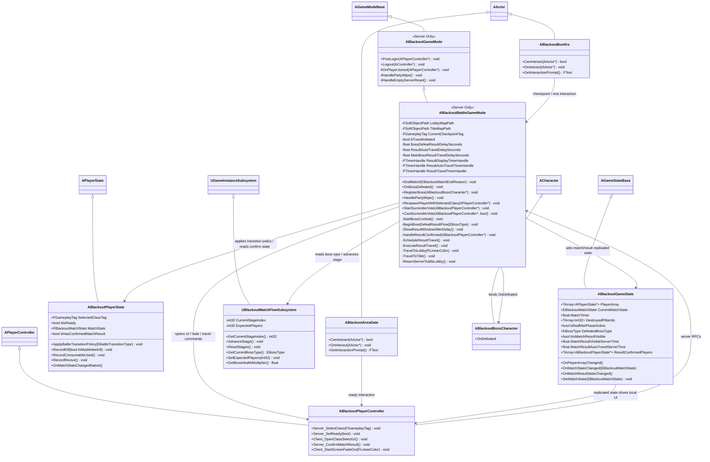
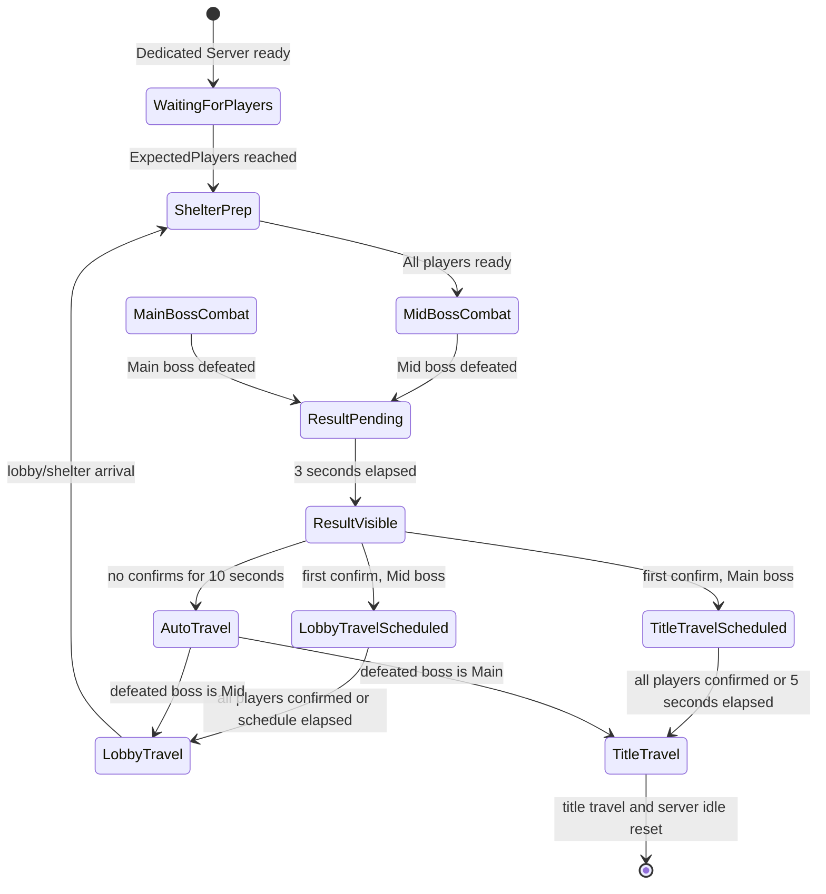
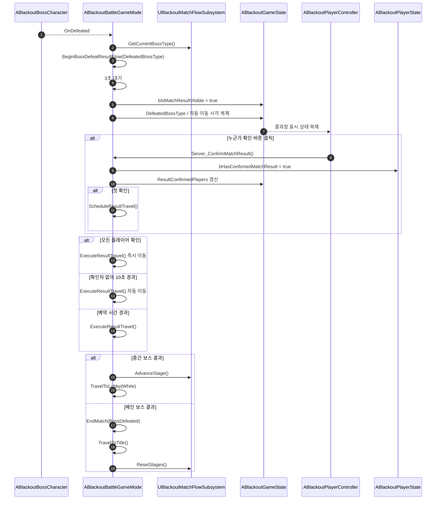

# Foundation — 12. 게임 플로우 및 결과창 이동 정책

> TDD v5 §7 전투 세션 플로우, UI §05 게임 클리어 결과 및 통계 창 기반.
> 단일 전투 맵 안에서 접속 대기 → 쉘터 준비 → 중간 보스 → 메인 보스 → 결과창 → 로비/타이틀 이동까지의 서버 권위 흐름을 정의합니다.

## 클래스 다이어그램

## 상태 플로우

## 보스 처치 결과창 이동 시퀀스

## 책임 분리

| 책임 | 소유자 | 비고 |
|---|---|---|
| 매치 생애주기 상태 전환 | `ABlackoutBattleGameMode` | 서버 권위. `ABlackoutGameState::SetMatchState`만 통해 복제 상태 변경 |
| 현재 보스 단계 판정 | `UBlackoutMatchFlowSubsystem` | `CurrentStageIndex` 기준으로 중간/메인 보스 구분 |
| 결과창 표시 여부/자동 이동 시각 복제 | `ABlackoutGameState` | UI는 서버 타이머 값을 읽어 카운트다운 표시 |
| 결과창 확인 요청 | `ABlackoutPlayerController` | 버튼 클릭을 `Server_ConfirmMatchResult` RPC로 서버 전달 |
| 플레이어별 확인 상태 | `ABlackoutPlayerState` 또는 `GameState::ResultConfirmedPlayers` | 스코어보드/결과창 행에서 확인 여부 표시 가능 |
| 통계 수집 | `ABlackoutPlayerState` | `FBlackoutMatchStats` 복제. UI 상세는 `Docs/UI/05_Game_Result_Stats_Window.md` 참조 |
| 실제 이동 | `ABlackoutBattleGameMode` | 중간 보스는 로비/쉘터, 메인 보스는 타이틀 이동 및 서버 idle 복귀 |

## 구현 노트

- **전용 문서 생성 사유**: 기존 루트 클래스 다이어그램은 GameMode/GameState 개요만 있고, NET `04_Match_State_Machine.md`는 네트워크 상태 전이 설명입니다. 보스 처치 결과창과 이동 정책까지 포함한 게임 플로우 클래스 다이어그램은 별도 문서가 없어서 이 문서로 분리합니다.
- **결과창 전용 상태**: 중간 보스 처치 결과는 매치 종료가 아니므로 `CurrentMatchState == Ended`만으로 결과창 표시를 판단하지 않습니다. `bIsMatchResultVisible`, `DefeatedBossType`, 자동 이동 시각 같은 결과창 전용 복제 상태를 `ABlackoutGameState`에 둡니다.
- **타이머 정책**: 보스 처치 후 3초 대기, 결과창 표시 후 10초 자동 이동, 메인 보스 첫 확인 후 5초 타이틀 이동 예약은 서버 타이머로만 판정합니다. 클라이언트 UI는 복제된 서버 시각으로 남은 시간을 표시합니다.
- **전원 확인 조건**: 확인 대상은 결과창 표시 시점의 `GameState::PlayerArray` 또는 접속 중인 플레이어 목록으로 고정합니다. 중도 이탈자는 `OnPlayerArrayChanged`에서 확인 필요 수를 재계산하거나, 결과창 대상에서 제외합니다.
- **현재 코드와의 차이**: 현재 `ABlackoutBattleGameMode`는 중간 보스 처치 시 `MidBossDeathDelay` 뒤 즉시 로비 이동, 메인 보스 처치 시 `EndMatch` 후 5초 타이틀 이동을 예약합니다. 이 문서의 정책을 구현하려면 결과창 표시 상태 복제, 확인 RPC, 확인자 집계, 자동 이동 타이머가 추가되어야 합니다.
- **UI 문서 연결**: 결과창 위젯/행/표시 통계 구조는 [UI 05. 게임 클리어 결과 및 통계 창](../UI/05_Game_Result_Stats_Window.md)을 기준으로 합니다. 본 문서는 서버 게임 플로우와 이동 판정만 담당합니다.
