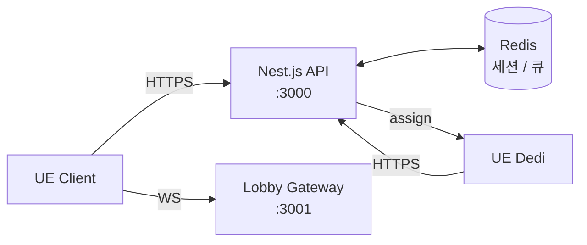

# NET — 01. 매칭 서버 (Nest.js + Redis)

> 매칭 API 서버. 세션 할당 / 데디 서버 풀 관리 / 로비 WebSocket 중개 담당. **게임 로직 없음** — 실시간 상태는 UE 데디가 전담.

## 아키텍처



3층 구조: **Client ↔ Matchmaking API ↔ Dedicated Server Pool**.

## REST 엔드포인트

| Method | Path | 용도 | 인증 |
|---|---|---|---|
| POST | `/auth/login` | JWT 발급 (24h 만료) | 없음 |
| POST | `/matchmaking/start` | 자동 합방 (대기 중인 방 우선) | JWT |
| DELETE | `/matchmaking` | 이탈 (waiting/playing 둘 다 허용 = surrender) | JWT |
| GET | `/sessions` | 전체 세션 조회 | JWT |
| GET | `/sessions/:id` | 단일 세션 조회 | JWT |
| POST | `/servers/register` | 데디 등록 | `x-server-api-key` |
| POST | `/servers/:id/idle` | 데디 idle 복귀 보고 | `x-server-api-key` |

## WebSocket 이벤트 (`:3001`)

| 이벤트 | 방향 | 용도 |
|---|---|---|
| `player_joined` | 서버 → 클라 | 로비에 플레이어 추가 |
| `player_left` | 서버 → 클라 | 로비에서 플레이어 이탈 |
| `game_start` | 서버 → 클라 | 데디 준비 완료. URL 포함 |
| `session_cancelled` | 서버 → 클라 | 세션 취소 (전원 이탈 등) |
| `matchmaking_failed` | 서버 → 클라 | 데디 할당 실패 |

## 세션 수명주기

```
waiting → playing → idle 복귀
   ↓ 이탈                  ↓ 전원 이탈
session_cancelled    서버 idle 복귀
```

- `waiting`: 4인 모집 중. 꽉 차면 자동 `playing` 전이
- `playing`: 데디 할당 완료. `game_start` 브로드캐스트
- 전원 이탈 시 데디 자동 idle 복귀 (재활용)

## 보안 레이어

- JWT 인증 (24h — R&D 편의. 프로덕션 이전 refresh token 도입 예정)
- DTO 검증 (class-validator + ValidationPipe whitelist)
- Rate Limiting (전역 30/분, 로그인 5/분)
- Helmet (기본 HTTP 보안 헤더)
- 모든 시크릿은 `.env` 분리

## R&D vs 프로덕션 경계

| 항목 | R&D 상태 | 프로덕션 전 |
|---|---|---|
| 인증 | 더미 비밀번호 + JWT | 실계정 + refresh token |
| 전송 | HTTP / WS 평문 | HTTPS / WSS (도메인 비용 이슈) |
| 재접속 | heartbeat + disconnect 감지 | 세션 상태 복구 |
| 세션 검증 | 클라 자진 신고 | `/sessions/:id/verify` 토큰 검증 |
