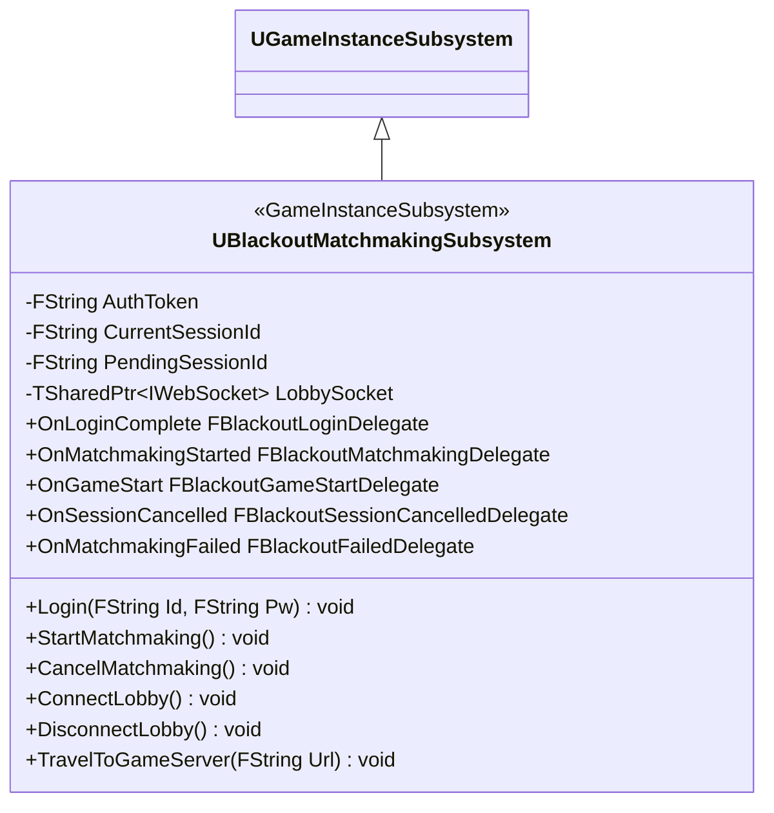

# NET — 02. UE 매칭 Subsystem

> `UBlackoutMatchmakingSubsystem` — UE 클라의 매칭 API 단일 접근점. HTTP (요청) + WebSocket (구독) 통합.

## 클래스 구조

## 책임 분리

| 기능 | 구현 방식 |
|---|---|
| 로그인 | `FHttpModule` 으로 `POST /auth/login` → JWT 저장 |
| 매칭 시작 / 취소 | HTTP. 응답은 델리게이트로 통지 |
| 로비 구독 | IWebSocket 연결 유지 + 이벤트 디스패치 |
| 맵 전환 | `game_start` 수신 시 `ClientTravel` 자동 (플래그 조건부) |

GameInstanceSubsystem 선택 이유 — 레벨 전환(`ClientTravel`) 에도 살아있어야 함. `GetGameInstance()->GetSubsystem<>()` 로 어디서든 접근.

## PendingSessionId 버퍼 패턴

WebSocket 미연결 시점에 `join_session` 요청이 도착하면 `PendingSessionId` 로 버퍼링. `HandleWsConnected` 에서 자동 flush. 비동기 초기화 race 제거.

## 델리게이트 목록

| 이름 | 시그니처 | 발생 시점 |
|---|---|---|
| `OnLoginComplete` | `(bool bSuccess, FString Token)` | `/auth/login` 응답 |
| `OnMatchmakingStarted` | `(FString SessionId)` | `/matchmaking/start` 응답 |
| `OnGameStart` | `(FString ServerUrl)` | WS `game_start` 수신 |
| `OnSessionCancelled` | `(FString Reason)` | WS `session_cancelled` 수신 |
| `OnMatchmakingFailed` | `(FString Reason)` | WS `matchmaking_failed` 수신 |

## `bAutoTravelOnGameStart`

- 기본값 `true` — R&D 편의로 `game_start` 수신 즉시 `ClientTravel`
- UI 완성 후 `false` 로 전환 예정. 카운트다운 연출 사이에 `TravelToGameServer` 수동 호출

## 분리 임계치

현재 220줄 규모. 400줄 초과 시 `MatchmakingHttpClient` / `MatchmakingLobbyClient` 두 서브 클래스로 분리 검토.

## 의존 모듈 (`Build.cs`)

- `HTTP`, `Json`, `JsonUtilities` — REST
- `WebSockets` — 로비 구독
- `DeveloperSettings` — `UBlackoutNetworkSettings` 읽기
